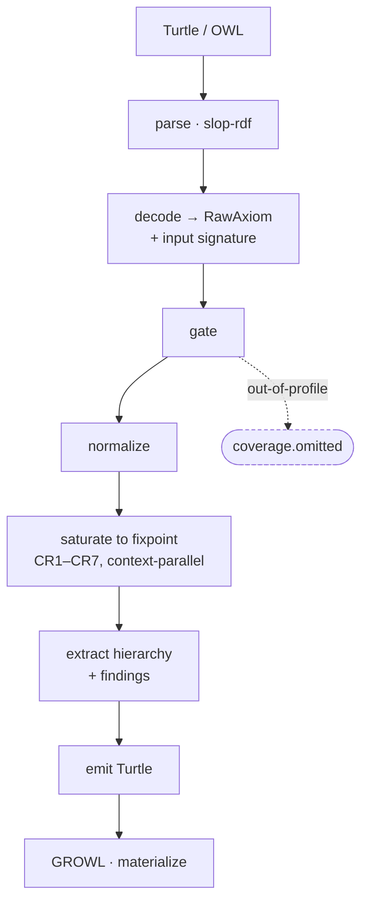
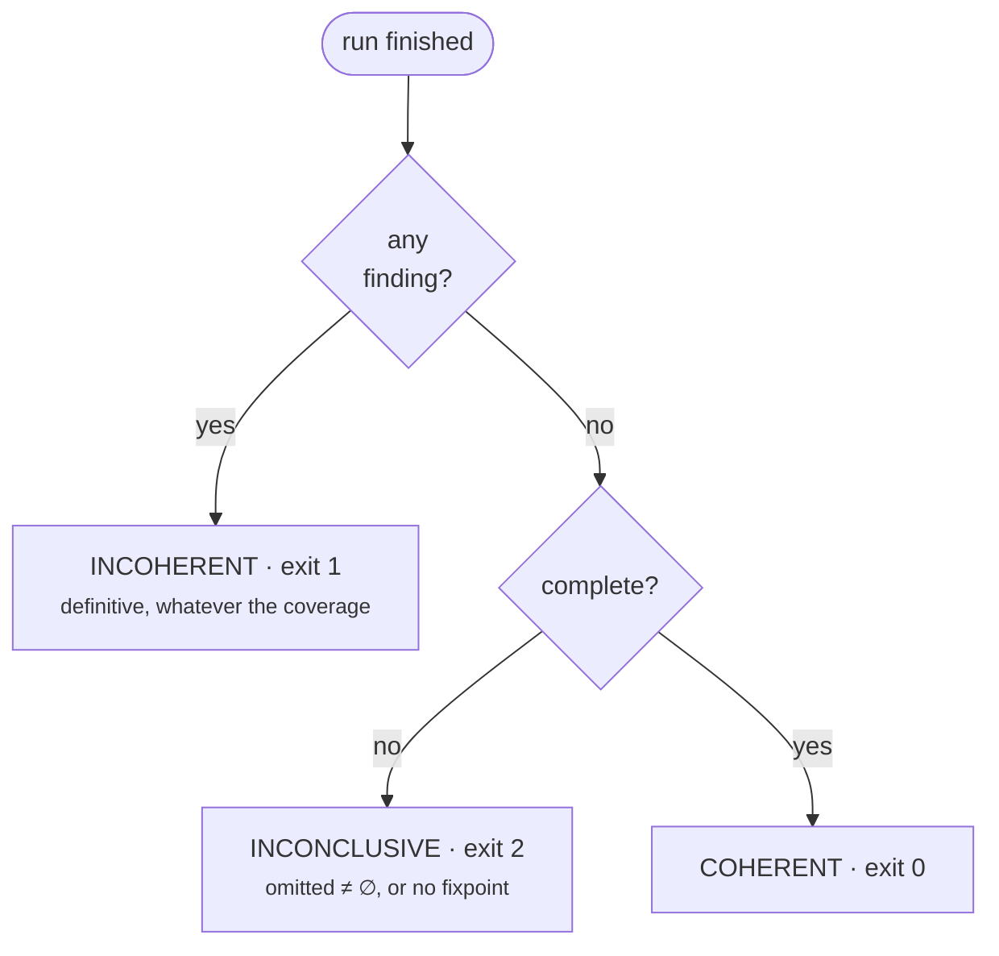
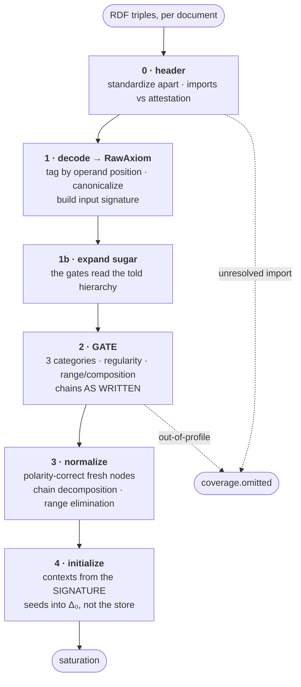
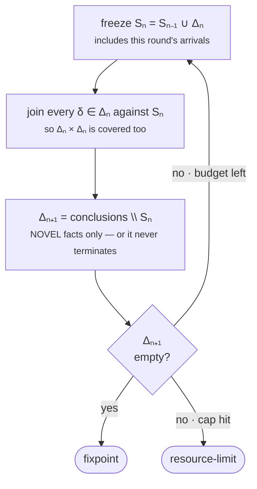
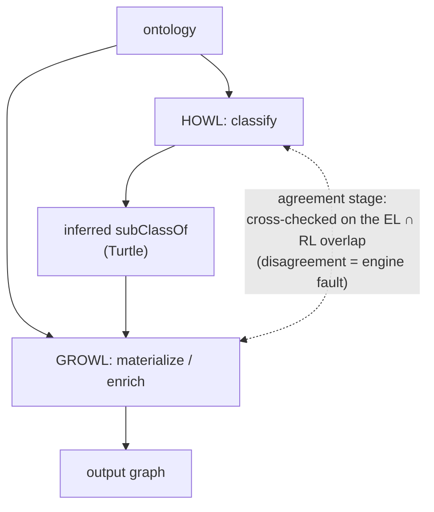
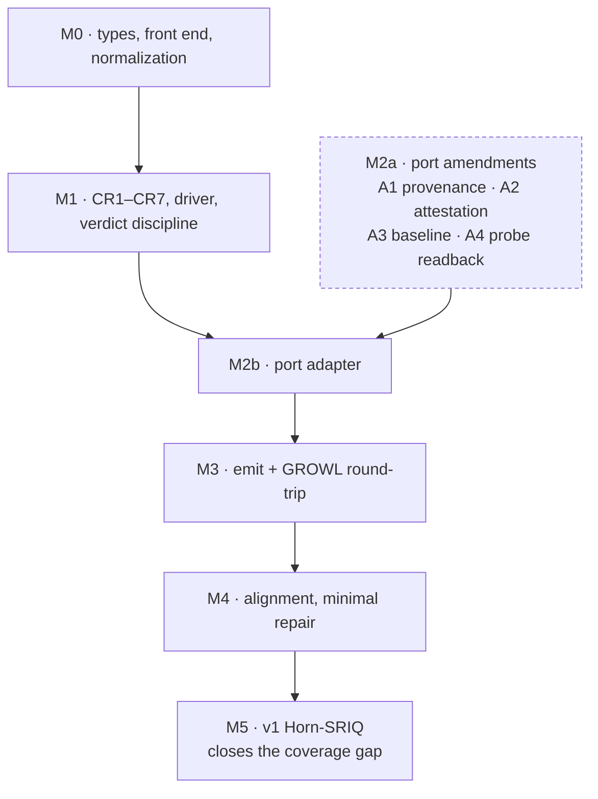

# HOWL — a consequence-based description-logic reasoner

**Status:** Design draft (2026-07-28; revised 2026-08-10). No implementation yet — but no longer a
plan on the shelf. The execution trigger has **fired**: MOOSE's Living Ontology needs the EL engine
behind its `TBoxReasoner` port, where a stub currently caps what the system can validate
([§8.4](#84-the-moose-tboxreasoner-port), [§13](#13-execution-trigger)). That consumer, not the
originally-anticipated Trivyn pipeline stages, is what v0 is now designed against.

**One line:** HOWL is a sound-and-complete, consequence-based (saturation) description-logic
reasoner written in [SLOP](https://example.invalid/slop), designed as a sibling to
[GROWL](../growl). GROWL *materializes* an OWL 2 RL ontology; HOWL *classifies* a description
logic — it computes the complete subsumption hierarchy and consistency of a TBox, including
entailments that forward-chaining materialization structurally cannot see.

> The name: **GR-OWL** and **H-OWL** both carry "OWL". GROWL is the RL materialization engine;
> HOWL is the DL classifier. "HOWL = **Horn OWL**" is also apt — the v0/v1 targets (a CB **EL**
> fragment, [§5.2](#52-the-exact-v0-language), and Horn-SRIQ) are both *Horn* fragments, the
> deterministic-saturation sweet spot this design is built around.

---

## Table of contents

1. [Overview](#1-overview)
2. [Motivation](#2-motivation)
3. [Scope, and "when is it a DL reasoner?"](#3-scope-and-when-is-it-a-dl-reasoner)
4. [Calculus: consequence-based saturation](#4-calculus-consequence-based-saturation)
5. [Fragment roadmap](#5-fragment-roadmap)
6. [Architecture](#6-architecture)
7. [Verification & contracts](#7-verification--contracts)
8. [Relationship to GROWL](#8-relationship-to-growl)
9. [CLI & interface sketch](#9-cli--interface-sketch)
10. [Testing strategy](#10-testing-strategy)
11. [Repository layout](#11-repository-layout)
12. [Milestones & acceptance criteria](#12-milestones--acceptance-criteria)
13. [Execution trigger](#13-execution-trigger)
14. [Non-goals](#14-non-goals)
15. [Open questions](#15-open-questions)
16. [Glossary & references](#16-glossary--references)

---

## 1. Overview

HOWL and GROWL are two engines that reason over the same OWL 2 ontologies but provide **different
reasoning services**:

| | GROWL | HOWL |
|---|---|---|
| Service | **Materialization** — forward-chain sound consequences (mostly ABox/schema edges) | **Classification** — complete subsumption hierarchy + consistency of the TBox |
| Method | Rule-based semi-naive fixpoint over RDF triples | Consequence-based saturation over derived axioms |
| Logic | OWL 2 RL (a DL-*derived* rule fragment / DLP) | A named description logic (EL → Horn-SRIQ → SRIQ object fragment, [§5](#5-fragment-roadmap)) |
| Completeness | Sound; deliberately incomplete for OWL-DL | Sound **and complete** for its target fragment |
| Best at | Enrichment (materializing edges), bulk ABox reasoning | Defined-class subsumption, coherence of definitions and mappings |

The two are **complementary, not competing**. HOWL classifies → emits inferred `subClassOf`
axioms as RDF → GROWL materializes/enriches over the enlarged schema. They compose **through RDF,
never through shared internal state** (see [§8](#8-relationship-to-growl)).

---

## 2. Motivation

GROWL is an excellent RL materialization engine, and for Trivyn's current, primitive-class
BFO/CCO-shaped output it is sufficient. HOWL exists to cover the one thing RL *cannot do by
construction*: reason about **defined classes** — classes whose membership is determined by
necessary-and-sufficient conditions, typically genus-differentia definitions using existential
restrictions (`C ≡ D ⊓ ∃r.E`).

RL/materialization cannot introduce existential successors and cannot compute class-level
subsumption through them, so it silently misses subsumptions of exactly this shape. HOWL is the
tool that sees them.

Where this pays off in Trivyn's pipeline (established in prior design discussion):

- **Generation QA.** Classify the *generated* ontology with a complete reasoner and **diff
  inferred-vs-intended hierarchy**. This catches generator bugs RL can't surface: unintended
  subsumptions from restriction interactions, accidental equivalences (two classes collapsing
  because their restriction sets are logically identical), and over-commitment / unsatisfiability
  beyond the RL smoke test. *Value scales with how much defining logic the generator emits.*
- **Alignment repair (the stronger case).** Alignment *combines* ontologies, which is precisely
  when latent incoherence surfaces. HOWL checks the coherence of `O₁ ∪ O₂ ∪ mappings` and supports
  reasoner-based **minimal mapping repair** (justification/MUPS computation + hitting set).
  Precedent: LogMap is built around an embedded reasoner doing exactly this. BFO/CCO's heavy
  disjointness axioms are what give the reasoner teeth here.

### 2.1 The v0 goal: validate an ontology in reasonable time

The concrete job for the first version is **fast coherence validation** — decide whether an
ontology is consistent and surface *every* unsatisfiable class — or, when the ontology turns out
inconsistent, say so and stop, since then every class is vacuously unsatisfiable
([§6.2](#62-data-model)) — and return the answer in a time
that fits an authoring/CI loop. Classification is the *mechanism*; validation is the *point*.

The EL family is the right v0 fragment precisely because it makes this achievable (the exact
sub-fragment is pinned down in [§5.2](#52-the-exact-v0-language); every property below holds for it
a fortiori, since it is a subset of EL++):

- **PTIME.** EL++ subsumption is polynomial — no exponential blow-up to tame.
- **CB scales.** The consequence-based approach is what lets ELK classify GALEN in well under a
  second and full SNOMED CT (~300k classes) in a few seconds on a laptop. That is the performance
  envelope HOWL aims into.
- **It covers the validation-relevant incoherence.** Unsatisfiability from disjointness interacting
  with existential structure — exactly what GROWL's RL smoke test cannot see — lives inside EL++.

So "validate in reasonable time" is not a goal bolted onto a classifier; it *is* the v0 deliverable,
and EL++ is chosen to hit it. Here "validate" means **semantic coherence**, not syntactic
profile-conformance — the latter is a cheap gate that also drives profile auto-selection
([§5.1](#51-profiles-are-selectable)).

> **Honest scoping.** For the *primitive*-class core (subClassOf, disjointness, inverses,
> domain/range, transitivity), GROWL's `--validate` on the merged graph already catches much of the
> disjointness-driven incoherence in **both** stages today. HOWL's *incremental* value is exactly
> (a) existential/defined-class-driven entailments RL can't see, and (b) *minimal* repair via
> justifications rather than mere witnesses. See [§13](#13-execution-trigger).

---

## 3. Scope, and "when is it a DL reasoner?"

The label "DL reasoner" is earned on the **service axis**, not the expressivity axis. Two
independent axes are often conflated:

- **Service axis:** *materialization* → *classification / consistency / satisfiability /
  realization*. **This is what flips the label.**
- **Logic axis:** EL vs Horn-SHIQ vs SROIQ. This only decides *which* DL you are a reasoner *for*.

ELK (EL) and HermiT (SROIQ) are both "DL reasoners" without qualification, because each **decides
the standard problems, completely, for a named logic**. By that standard:

- **GROWL is *not* a DL reasoner** — it materializes and is deliberately incomplete; RL/DLP is
  engineered precisely to sidestep the decision problems. Its lineage is DL; its service is not.
- **HOWL is a DL reasoner from v0** — a sound-and-complete classifier for the EL fragment named
  exactly in [§5.2](#52-the-exact-v0-language) — even though EL is the least expressive rung. Note
  the label is earned by being complete for a **named** logic, which is why §5.2 has to name it
  precisely rather than gesture at "EL++": "complete for roughly EL++" earns nothing.

### 3.1 The litmus test (also the v0 acceptance criterion)

Give the tool:

```
Parent  ≡ Person ⊓ ∃hasChild.Person
Mother  ⊑ Person ⊓ ∃hasChild.Person
```

and ask whether `Mother ⊑ Parent`. It is entailed, but only derivable *through the existential on
the defining side* — exactly what materialization cannot see. **If HOWL derives `Mother ⊑ Parent`,
it is a DL reasoner. If it can't, it is still a materialization engine.** GROWL cannot; HOWL's
CB-EL completion must.

### 3.2 Terminology discipline

- **"a DL reasoner"** — true from **v0** (complete for *some* DL).
- **"an OWL 2 DL reasoner"** — reserved for **v2**, and not earned by a SROIQ(D) calculus alone.
  OWL 2 DL is the OWL 2 *structural language* satisfying its global restrictions under Direct
  Semantics; it **closely corresponds to and extends** SROIQ, which by itself provides neither
  datatypes nor punning, while OWL 2 additionally gives semantics to constructs such as keys.
  "OWL 2 DL is SROIQ(D)" — an earlier draft's phrasing — would let a future implementer treat a
  conventional SROIQ(D) calculus as sufficient without checking the full construct surface or the
  global restrictions. Define v2 coverage construct-by-construct, not by the label.

---

## 4. Calculus: consequence-based saturation

HOWL is **consequence-based (CB)**: it derives entailed axioms *forward*, saturating a set of
consequences to a fixpoint — as opposed to **tableau**, which refutes by constructing/branching a
model.

**Why CB and not tableau:**

- CB *is* a fixpoint. GROWL's `engine-run` (semi-naive delta iteration with dedup, worker fan-out,
  iteration cap, cancellation) is already the right control skeleton — the fact type changes, the
  loop does not.
- Tableau requires model construction, non-deterministic case splits, backtracking, and blocking
  for termination — none of which fit SLOP's forward-fixpoint model or its Z3 weakest-precondition
  contract posture.
- Modern performance lives in CB: **ELK** (EL, massively parallel), **Sequoia** (CB SROIQ),
  **Konclude** (saturation-heavy hybrid, the ORE performance leader).
- CB decomposes naturally into **contexts** (one per concept), which maps directly onto GROWL's
  fork-join worker model (see [§6.6](#66-parallelism-context-based)).

---

## 5. Fragment roadmap

The **fragment** is the real decision; the calculus (CB saturation) is fixed. Staged so that
v0→v1 is a smooth ramp on the same engine, and the discontinuity (non-determinism) is isolated in
v2.

| Rung (`--profile`) | Logic | Worst case | Calculus it cites | Adds over `el` | Status |
|---|---|---|---|---|---|
| **`el`** (v0) | **ELH<sub>⊥</sub><sup>R+</sup> + domain/range + ABox** ([§5.2](#52-the-exact-v0-language)); `¬` in a superclass, domain or range is taken by rewriting, so the logic is unchanged | PTIME | [BBL05], [BBL08]; [§5.3](#53-the-abox-reduction-is-sound-and-complete) | — | **implemented; the default** |
| **`el++`** | the **OWL 2 EL object fragment**: SROEL(⊓,×) without products on the left ([§5.4](#54-the-el-calculus)) | PTIME | [Krö10] Theorem 2 (Ksc); [§5.4](#54-the-el-calculus) | nominals (`ObjectOneOf` of one, `ObjectHasValue`), `ObjectHasSelf`, reflexive roles, `SameIndividual`/`DifferentIndividuals`, negative assertions, `owl:bottomObjectProperty`. Datatypes, keys, anonymous individuals and `owl:topObjectProperty` outside a super-role stay omissions | specified ([§5.4](#54-the-el-calculus)); not built |
| **`horn-sriq`** (v1) | **Horn-SRIQ** | ExpTime | [Kaz09] + chain elimination, or the Horn slice of [Bate+18] | inverses, functionality, `∀` on the right, symmetric/asymmetric/irreflexive roles, disjoint roles, Horn number restrictions | planned (M5) |
| **`sriq`** (v2) | **SRIQ object fragment** (non-Horn) | 2ExpTime | [Bate+18] | disjunction, full negation, number restrictions | not scheduled |

**The ladder is almost a chain.** `el ⊂ horn-sriq ⊂ sriq`, because the gate already enforces
regularity, so every `el` role box is a Horn-SRIQ one. `el ⊂ el++` too. `el++` alone is incomparable
with the two above it, because of nominals. An earlier draft made v1 **Horn-SHIQ**. That logic has no
role chains, so it does not contain v0, and an ontology with both a chain and an inverse was inside
neither rung. Horn-SRIQ contains both.

**Each rung is named by its logic, never by a wider label** (Constraint f8ee2abd), and each cites
the calculus it is complete for. Adding **any one** of inverses, `∀` on the right, functionality,
`≥ 2` or disjunction to EL makes reasoning ExpTime-complete ([BBL05] Thms 6–11; [BBL08] Thm 3;
[KRH13] Thms 6.8, 6.9). So `el` and `el++` are the rungs with a fixed polynomial cost class, and
the reason `el` is the default ([§5.1](#51-profiles-are-selectable)). The consequence-based
calculi above `el++` are **pay-as-you-go** ([Bate+18] Props 11, 12; [TGH21] Prop 2): on input
inside a lower rung they cost about what that rung's calculus would.

**Why SRIQ and not SROIQ at the top.** Measured on the target ontologies (2026-09-30):

| Ontology | Smallest DL | Why it is not Horn | Nominals / counting |
|---|---|---|---|
| BFO-core | SHIF | only 22 positive unions (domain/range, `∀`-fillers) | none / ≤ 1 only |
| CCO (merged) | SRIF(D) | only 29 positive unions | none / ≤ 1 only |
| RO | SROIF(D) + 25 SWRL rules | 25 unions and one 9-individual `oneOf` (an IAO metadata class) | that `oneOf` / ≤ 1 |
| OBI | SROIQ(D) | 124 axioms | 150 Horn `hasValue` / 2 qualified `= 1` |

The BFO family needs no nominals and no counting beyond functionality. Functionality combined with
disjunction already needs equality reasoning, so **SRIQ is the least logic complete for BFO, CCO and
RO**. Full SROIQ is published ([TGH21]) and implemented (Sequoia), but not as a small-team target:
nominals need a root context and a rule that invents individuals (triple-exponential in general),
chain elimination is exponential, and no consequence-based calculus handles datatypes. SROIQ stays
unplanned until a consumer needs it, and OBI would be the first.

**The non-Horn residue before `sriq`.** An approximation mode, off by default and **not a profile**,
is the planned bridge:
- a lower bound weakens `A ⊔ B` to its least named common subsumer, and its findings are sound;
- an upper bound strengthens the theory ([PAGOdA] Thms 5.5, 5.14) and can certify *coherent*.

Letting a run with omitted axioms report *coherent* would amend the Constraint "only a complete run
may report coherent", so that decision belongs to the plan for the mode, not to this section.

**Sources.**
- [Kaz09] Kazakov, *Consequence-Driven Reasoning for Horn SHIQ Ontologies*, IJCAI 2009.
- [Bate+18] Bate, Motik, Cuenca Grau, Tena Cucala, Simančík, Horrocks, *Consequence-Based
  Reasoning for Description Logics with Disjunctions and Number Restrictions*, JAIR 63, 2018.
- [TGH21] Tena Cucala, Cuenca Grau, Horrocks, *Pay-as-you-go consequence-based reasoning for the
  description logic SROIQ*, AIJ 298, 2021.
- [KRH13] Krötzsch, Rudolph, Hitzler, *Complexities of Horn Description Logics*, ACM TOCL 14(1), 2013.
- [PAGOdA] Zhou, Cuenca Grau, Nenov, Kaminski, Horrocks, JAIR 54, 2015.
- [BBL05], [BBL08] and [KKS12] as in [§5.3](#53-the-abox-reduction-is-sound-and-complete);
  [Krö10] and [JAR14] as in [§5.4](#54-the-el-calculus). An earlier draft cited [KKS12] for `el++`;
  its completeness theorem covers ELO only, so it does not cover the rung's combination.

### 5.1 Profiles are selectable

Higher profiles must be **selectable**, not baked in. The rungs differ only in their *calculus* —
the rule set plus its normal form and saturation-state variant — while sharing the front-end
(parse, RDF→axiom), the fixpoint driver ([§6.5](#65-the-fixpoint-driver-shared-substrate)), and the
output stage. A profile is therefore a **pluggable component** behind a stable interface:

```lisp
;; What the caller asks for. `auto` is not a Profile: it resolves to one, per ontology.
(union ProfileSelection
  (auto)
  (explicit Profile))

;; The selectable unit, one per rung of §5's ladder, in the fixed tie-break order.
;; Each profile supplies its own normalization + rule set; the driver and I/O are shared.
(enum Profile
  profile-el             ; ELH⊥R+ + domain/range + ABox, exactly §5.2, positive ¬ rewritten (implemented)
  profile-el-plus-plus   ; the OWL 2 EL object fragment, §5.4 (specified, not built)
  profile-horn-sriq      ; Horn-SRIQ
  profile-sriq)          ; SRIQ object fragment, non-Horn (not OWL 2 DL: no datatypes, no nominals)

;; Threaded through config beside worker-count / max-iterations / cancel-ptr:
;;   (selection ProfileSelection)   ; default: (explicit profile-el)
;;   (strict-profile Bool)          ; refuse (vs. report) on out-of-profile constructs; CLI only

;; A request for a rung that is not built is refused, never run as another rung:
;;   Fault::unavailable Profile     ; CLI exit 3
```

**Selection:**

- **The default is `explicit el`, on every surface** (CLI, C, Rust, the port). HOWL is a runtime
  system, and `el` is polynomial. Under an `auto` default, one inverse added to an ontology would
  silently move every default run into an ExpTime calculus. And a default run's theory never
  changes under an upgrade: a new rung changes results only for callers who ask for it. Nothing is
  hidden. An ontology outside `el` is still reported *inconclusive*, with every omitted axiom listed
  ([§6.2](#62-data-model)). (An earlier draft made `auto` the default.)
- **Explicit:** `--profile el|el++|horn-sriq|sriq`, much as `robot reason --reasoner ELK|HermiT`.
  An explicit request runs **exactly** that calculus, or is refused as `unavailable` if it is not
  built. Running `el` in its place would classify a smaller theory than was asked for and report
  it under the wrong name. `select-profile`'s and `profile-implemented`'s postconditions pin both
  halves (`src/select.slop`).
- **`auto`** (an opt-in, `--profile auto`): run the cheap *syntactic* profile check first, then
  pick the **cheapest implemented calculus complete for the ontology's actual constructs**. The
  gate tests membership in **HOWL's implemented language, not in OWL 2 EL**. The two are not the
  same set ([§5.2](#52-the-exact-v0-language)), and testing the wrong one is precisely how an
  incomplete run gets reported as a complete one. With only `el` built, `auto` resolves to `el`.
- **The report states the resolved profile** (`profile el`, [§6.7](#67-output--classification)).
  A report is a function of (input, budget, profile). Its findings are complete for that rung's
  logic and no other.
- **The top rung widens the ladder; it does not make selection total.** `sriq` is complete for
  the **SRIQ object fragment**, a superset of `el` and `horn-sriq` but not of `el++`. So from then
  on, `auto` reaches a complete answer for ontologies wholly inside one rung. Nominals, datatypes,
  keys and punning stay outside it ([§14](#14-non-goals)), so those inputs remain partial runs
  under the rule below. Saying the top rung makes selection "total", as an earlier draft did,
  would license treating its presence as a guaranteed complete fallback. **With only `el` built
  there is no such rung:** an ontology outside [§5.2](#52-the-exact-v0-language) has nothing to
  escalate to, and the run is inconclusive ([§6.2](#62-data-model)), never "coherent". Once
  `horn-sriq` exists, an ontology using inverses or functionality and otherwise inside it must be
  run there **by `auto`**, not reported inconclusive. The default stays `el`.

  **Selection is whole-ontology membership in a single implemented profile — never a union.** Pick
  the cheapest implemented profile that contains *every* construct in the ontology. If none does,
  the run is partial — and **which** profile it runs under is fixed by rule, not left open: choose
  the one that leaves the fewest logical axioms omitted, breaking ties by the fixed profile order
  (el < el++ < horn-sriq < sriq). Without that rule two conforming implementations classify different
  sub-theories of the same input and return different findings — both sound, neither reproducible,
  and [§6.8](#68-determinism-binding) violated across implementations rather than across runs. It
  matters because the ladder is not quite a chain: `el++` is **incomparable** with `horn-sriq` and
  `sriq`. An ontology with both a nominal (`el++`, not `horn-sriq`) and an inverse (`horn-sriq`, not
  `el++`) is inside neither. "Escalate when constructs span fragments" would have an implementation
  pick one and silently drop the other's constructs. (Choosing Horn-SRIQ over the earlier Horn-SHIQ
  for v1 removed the worse case, where every chain-plus-inverse ontology, RO and CCO among them, was
  inside no rung.) Contrast GROWL, which has *no* complete-for-DL rung at all: RL and EL are
  incomparable islands, which is exactly why you cannot simply "switch on EL" inside an RL engine.
- **Safety.** Choosing a profile *weaker* than the ontology needs makes HOWL **incomplete** for it —
  it may miss entailments and, critically for validation, **miss an incoherence**. So an
  out-of-profile construct is never cosmetic: encountering one records the axiom in
  `coverage.omitted` ([§6.2](#62-data-model)), which no command may report as **coherent**. It may
  still report **incoherent** from that same run — a derived contradiction is definitive whatever
  the coverage ([§6.2](#62-data-model)'s verdict rule).
  `--strict` controls only whether HOWL *refuses to run* (`Fault::refused`, exit `2`) or runs and
  returns an explicitly partial result; it does **not** control whether the run counts as complete,
  and there is no flag that makes it count. This is the "fragment drift" hazard from GROWL's smoke test, made explicit and
  structurally unable to pass silently.

The selection seam is built with only `profile-el` behind it — a dispatch point left in place is
far cheaper than one retrofitted later. `prepare-decoded` (`src/howl.slop`) resolves the profile
before the gate and refuses an unbuilt one; `prepare-in-profile` is where a second rung dispatches.

### 5.2 The exact v0 language

The v0 calculus is complete for exactly the language below — no more. This is the set the syntactic
gate in [§5.1](#51-profiles-are-selectable) tests membership in, and the set
[§6.2](#62-data-model)'s `NormAxiom` can represent. Where those three disagree, this section wins.

**Concepts** (`A` a concept name, `r` a role name):

```
C, D  ::=  ⊤  |  ⊥  |  A  |  C ⊓ D  |  ∃r.C
```

**Axioms** (`C ≡ D` and `DisjointClasses` desugar during normalization, [§6.3](#63-normalization)):

```
TBox   C ⊑ D    |    C ≡ D    |    DisjointClasses(C₁, …, Cₙ)
RBox   r ⊑ s    |    r₁ ∘ … ∘ rₙ ⊑ t  (n ≥ 2)    |    domain(r) ⊑ C    |    range(r) ⊑ C
ABox   C(a)     |    r(a,b)
```

**Negation in positive positions is accepted by rewriting, before the gate.** `¬E`, with `E` a
concept of the grammar above, may be the whole filler — or a top-level conjunct of it — of a
superclass, a domain or a range. Such an axiom says only that something is *empty*, which is `⊥` on
the right of an ordinary GCI:

| Accepted input | Rewritten to (no fresh names) |
|---|---|
| `C ⊑ P ⊓ ¬E` | `C ⊑ P`, `C ⊓ E ⊑ ⊥` |
| `domain(r) ⊑ P ⊓ ¬E` | `domain(r) ⊑ P`, `∃r.⊤ ⊓ E ⊑ ⊥` |
| `range(r) ⊑ P ⊓ ¬E` | `range(r) ⊑ P`, `∃r.E ⊑ ⊥` |

`P` is the remaining conjuncts in their written order; when there are none (the filler is `¬E`
alone) no positive axiom is emitted. Several `¬E` conjuncts give several `⊥` axioms. An equivalence
is split into its two inclusions first, so `B ≡ ¬A` contributes its forward half `B ⊑ ¬A` and omits
the backward `¬A ⊑ B`.

- **The logic does not grow; the accepted syntax does.** The rewritten theory `T_¬` has the signature
  and the models of `T` ([§5.3](#53-the-abox-reduction-is-sound-and-complete) L0), and `T_¬` is
  in the grammar above. BFO, CCO and RO use exactly this shape — `domain`/`range` =
  `BFO_0000004 ⊓ ¬BFO_0000006`, *independent continuant that is not a spatial region* — and OBI
  uses `CL_0000001 ⊑ ¬∃r.E`.
- **It runs before every gate condition, and that placement is the point.** Regularity, the
  range/composition condition below and the declaration check all judge `T_¬`. A negative range
  there is the GCI `∃t.E ⊑ ⊥`, which range elimination never touches, so it imposes nothing on a
  chain's last role; only `P` is a range. Rewritten after the gate, `range(t) = A ⊓ ¬B` would demand
  `A ⊓ ¬B` of every chain into `t`, refusing chains `T_¬` admits.
- **Whole axioms or nothing.** The rewrite applies only when every piece — `C`, each `E`, each
  conjunct of `P`, and the role — is in the fragment. Anything else passes through unchanged and is
  omitted as written, so an omission always shows the user's own axiom, never a piece of it.
- **Everywhere else `¬` stays out:** under `∃`, in a union, on the left of `⊑`, as a
  `DisjointClasses` member, in `∀r.¬E` (which is `¬∃r.E` on the right, and the next equivalence of
  this kind to take), and in a class assertion `(¬B)(a)` (which is `{a} ⊓ B ⊑ ⊥` and would touch
  the ABox reduction).
- **This is outside OWL 2 EL's syntax.** `ObjectComplementOf` is not in the profile at all, so an
  input using it is no OWL 2 EL document, although `T_¬` is one. ELK is a differential oracle for it
  only as far as its capability probes show ([§10](#10-testing-strategy)).

**ABox forms are exactly those two.** The remaining assertion vocabulary is classified explicitly,
because "ABox axioms are in v0" is not a grammar:

| Assertion | Status |
|---|---|
| `C(a)`, `r(a,b)` | **in v0** — encoded as concepts, below |
| `owl:sameAs`, `owl:differentFrom`, `AllDifferent` | **out-of-profile** — equality is what the nominal-free encoding deliberately lacks |
| Negative property assertions | **out-of-profile** — `¬r(a,b)` is `{a} ⊓ ∃r.{b} ⊑ ⊥`, and the filler `{b}` is a nominal |
| Datatype property assertions | **out-of-profile** (concrete domains) |
| Annotation assertions (`rdfs:label`, `rdfs:comment`, …) | **inert** |
| Declaration triples (`rdf:type owl:Class` / `owl:ObjectProperty` / `owl:NamedIndividual`) | **inert semantically, but read** — see below |

Declarations carry no logical content, yet they are not simply discarded: they are how the front end
decides whether an occurrence of `:x` denotes a class or an individual, which is exactly what
[§6.2](#62-data-model)'s tagged `Node` needs to keep punned IRIs apart. Inert means *contributes no
axiom*, not *ignored during parsing*.

**But a missing declaration is not automatically out-of-profile — tagging is driven by structural
position first.** OWL 2 DL requires declarations for classes and properties, yet **named-individual
declarations are optional**: an IRI may be used as an individual with no `owl:NamedIndividual`
triple anywhere. Requiring one would make the everyday assertion `:p rdf:type :Person`
out-of-profile and gut the instance-bearing goal that motivates v0 at all
([§13](#13-execution-trigger)). So:

Tagging is **per operand of a decoded axiom**, not per occurrence in a triple — "subject or object
of an assertion" is too coarse, since in `ClassAssertion(C, a)` the individual is `a` while `C` is a
class expression:

| Decoded axiom | Operand tags |
|---|---|
| `ClassAssertion(C, a)` | `a` → `individual-node`; `C` → class expression (its names → `class-node`) |
| `ObjectPropertyAssertion(r, a, b)` | `r` → role; `a`, `b` → `individual-node` |
| `SubClassOf`, `EquivalentClasses`, `DisjointClasses` | all class-expression names → `class-node` |
| `SubObjectPropertyOf`, chains, domain, range | role positions → role; range/domain filler names → `class-node` |

Position and declaration are *additive*, never exclusive — an IRI appearing as both an assertion
subject and a class name yields **both** `individual-node(x)` and `class-node(x)`, which is exactly
the punning case the tags exist to keep apart.

**An undeclared property whose kind cannot be determined is an `input-error`, not an omission.**
The `missing-declaration` omission is recoverable only where **structural position uniquely fixes the
entity kind**. It often does not: `:a :p :b` with `:p` undeclared is ambiguous between an object
property assertion and an annotation assertion, and the same ambiguity affects `rdfs:subPropertyOf`,
`rdfs:domain` and `rdfs:range` triples. OWL's RDF parsing uses declarations precisely to settle
object vs. data vs. annotation, and requires that disambiguation to succeed. Guessing means either
reasoning over an intended annotation or silently dropping an intended logical assertion — and
neither can be represented as `missing-declaration(EntityKind, …)`, since there is no determinate
`EntityKind` to report. So: unique position ⇒ `missing-declaration`; ambiguous ⇒ `input-error`,
alongside the conflicting-declaration case below.

**Declaration *combinations* are checked too, not just presence.** OWL 2 DL forbids an IRI from
being typed as more than one property kind (object / data / annotation) or as both a class and a
datatype. An input violating that is not an OWL 2 EL ontology, and its RDF decoding is genuinely
ambiguous — a property both object- and data-typed has no determinate reading. These are gated as
`input-error` rather than as omissions: unlike an unsupported construct, there is no well-defined
axiom to omit and proceed without.

**Class and property declarations are still required; only individual declarations are optional.**
OWL 2 DL — and therefore OWL 2 EL — requires a declaration for every class, object property, data
property and annotation property that occurs; it explicitly does *not* require one for named
individuals. So the gate treats a **missing class or property declaration as out-of-profile**, while
inferring the individual view from operand position as above. Dropping the class/property
requirement would admit inputs that are not OWL 2 EL ontologies at all, which breaks the subset
claim in [§5.2](#52-the-exact-v0-language) and lets ELK legitimately reject something HOWL called
complete — a differential failure blamed on the wrong engine.

**The OWL built-in entities are declared implicitly, and demanding an explicit declaration for them
is a false fail.** `owl:Thing`, `owl:Nothing`, `owl:topObjectProperty`, `owl:bottomObjectProperty`
and the built-in annotation properties are declared by the OWL specification itself; ontologies do
not declare them and are not required to. The front end therefore pre-populates the input signature
with them ([§6.3](#63-normalization) step 1) before reading any declaration triple. Applying the
paragraph above literally to built-ins would reject essentially every ontology that mentions
`owl:Thing`.

**But implicit declaration is not implicit support.** `owl:topObjectProperty` (the universal role)
and `owl:bottomObjectProperty` (the empty role) carry **built-in semantics that CR1–CR7 do not
implement**, so both are **out-of-profile in v0** — recognized, never treated as ordinary role names:

| Property | Semantics | Why silence is wrong |
|---|---|---|
| `owl:bottomObjectProperty` | connects no pair of individuals | `A ⊑ ∃owl:bottomObjectProperty.⊤` entails `A ⊑ ⊥`. Treated as an ordinary role, CR3 builds an edge and `A` is reported **satisfiable** — a missed unsatisfiability, i.e. a false pass |
| `owl:topObjectProperty` | connects every pair | interacts with every existential in the ontology; nothing in the v0 calculus accounts for it |

Gating them out rather than implementing them is the [§7](#7-verification--contracts) discipline
applied consistently: the cited completeness proof covers the calculus as published, and a role with
extra semantics bolted on is outside it. `bottomObjectProperty` is admittedly tempting — a decode-time
rewrite of `∃⊥ᵣ.C` to `⊥` would cover the common case — but "the common case" is exactly the kind of
partial semantics that turns a completeness claim into a guess. Deferred with a note, not smuggled in.

**`owl:imports` is not in this table, because it is not gated.** The three categories above are
exhaustive over *logical* vocabulary, and imports are not logical vocabulary — they are **ontology
header metadata, resolved before and outside the gate**. The header pre-pass runs first, reconciles
declared imports against what the caller supplied, and only then does the gate see a triple set
([§6.3](#63-normalization) step 0). Trying to squeeze imports into "inert" or "out-of-profile" is
what produced a contradictory fourth category in an earlier draft: inert would silently drop the
completeness question, and out-of-profile would misreport a *resolved* import as an unsupported
construct.

Note the RBox production takes chains of **any** length n ≥ 2 — the gates read them as written
([§6.3](#63-normalization)), and only `NormAxiom.role-chain` is binary, after decomposition. An
earlier draft wrote the input production as binary too, which would have rejected valid n-ary
`owl:propertyChainAxiom` at the door.

Named, this is **ELH<sub>⊥</sub><sup>R+</sup>** with domain and range axioms — EL with role
hierarchies, ⊥, role composition, and property domains/ranges. It is a strict subset of EL++ *and* —
subject to the two RBox conditions below — of the OWL 2 EL profile. The gap to EL++ is **not** just
nominals and concrete domains, and describing it that way (as earlier drafts did) overclaims
coverage in exactly the way [§8.4](#84-the-moose-tboxreasoner-port) warns about for `profile()`. The
complete omitted list is the "Not in v0" table below: nominals, concrete domains/datatypes,
`ObjectHasSelf`, **reflexive role inclusions**, and the two built-in object properties. That is a claim about the **syntactic profile**, and nothing more.
The one construct accepted from *outside* OWL 2 EL, `¬` in a positive position, does not move it:
the claim is about the rewritten theory `T_¬`, which is in the grammar above.

Whether a given **ELK** build covers it is a separate, empirical question — ELK describes itself as
implementing *a fragment of* OWL 2 EL, and object-property ranges have historically been outside it.
So ELK is a differential oracle **only for the capability-probed intersection of the pinned ELK
version and v0** ([§10](#10-testing-strategy)); every other construct routes to HermiT or another
confirmed-complete oracle. The unconditional "any ontology HOWL accepts, ELK accepts" of an earlier
draft is not something this spec can assert about someone else's release, and it is load-bearing
enough that an implementer trusting it would build a differential suite certifying HOWL against an
oracle that processed a different theory.

**That subset claim is load-bearing, and two RBox conditions are what earn it.** EL++ *as a
description logic* permits arbitrary role-inclusion axioms and stays decidable and PTIME. **OWL 2 EL
as a profile does not** — being a profile of OWL 2 DL, it inherits the DL global restrictions,
including property-chain **regularity**. A gate that admitted arbitrary RIAs on the strength of the
EL++ literature would therefore accept ontologies outside OWL 2 EL, which breaks the differential
oracle (ELK implements the profile and may reject them) and quietly voids the "strict subset" claim
above. Both conditions below are gate obligations, not commentary.

**Domain and range are both in v0, and both are handled by rewriting — not by new rules.** Domain
is straightforward: `domain(r) ⊑ C` is `∃r.⊤ ⊑ C`, an ordinary `sub-some-lhs`. Range is handled by
the **published elimination construction**: range axioms are removed during normalization by
rewriting them into fresh concepts, leaving the completion rules untouched. Ranges are in v0 rather
than deferred because the engine HOWL replaces already decides domain/range coherence, so shipping
without them would be a **functional regression at the swap**
([§8.4](#84-the-moose-tboxreasoner-port)).

> **Why elimination and not a completion rule.** A draft of this spec added a range-propagation rule
> "CR8" — `(X,Y) ∈ R(r)`, `range(r) ⊑ A` ⟹ `A ∈ S(Y)` — derived from first principles. It is
> plausible and may well be correct, but the published extension of EL++ with range restrictions
> establishes tractability and completeness **by eliminating ranges through fresh concepts**, not by
> adding that rule. Shipping CR8 would therefore have meant claiming completeness from a proof that
> does not cover the calculus actually implemented — the exact failure
> [§7](#7-verification--contracts) exists to prevent, and the same error this spec already corrected
> once for the range/composition gate. The rule set stays at **CR1–CR7**, all of which are in the
> cited CEL formulation.
>
> **The construction is in *Pushing the EL Envelope **Further***, not the 2005 paper.** The 2005
> *Pushing the EL Envelope* defines EL++ without range restrictions; the range extension and its
> `X_{r,D}` rewrite are in the later OWLED paper. Citing the wrong one is how an implementer ends up
> reconstructing the transformation from scratch — which this document must not require, since M1
> depends on it.
>
> **The transformation, in the shape the paper gives it.** It runs **after** ordinary normalization
> and **after** chain decomposition, over normal-form GCIs:
>
> 1. `ran_T(r)` — the set of range fillers imposed on `r`, computed over the **told** role hierarchy
>    so `r` inherits every super-role's range. Multiple inherited ranges accumulate; they do not
>    override.
> 2. For each normal-form GCI `C ⊑ ∃r.D`, introduce `X_{r,D}` and replace the GCI with:
>
>    ```
>    C        ⊑ ∃r.X_{r,D}
>    X_{r,D}  ⊑ D
>    X_{r,D}  ⊑ A          for every A ∈ ran_T(r)
>    ```
>
> 3. `X_{r,D}` is **shared** per `(r, D)` pair — minting one per occurrence changes nothing
>    semantically but blows up the signature and makes output non-canonical.
> 4. **Complex range fillers are normalized first.** The recipe above assumes an atomic `A`, and
>    the paper likewise normalizes `ran(r) ⊑ A` to a concept *name* before eliminating. But the v0
>    grammar admits `range(r) ⊑ C` for any EL concept, so `range(r) ⊑ A ⊓ ∃s.B` is accepted with no
>    route to normal form. Handle it in an intermediate form that still carries ranges: introduce a
>    deterministic fresh `X`, emit `range(r) ⊑ X` plus the **positively** directed definition
>    `X ⊑ C`, normalize that definition like any other GCI, and only then run elimination. So
>    `NormAxiom` still has no range constructor — the intermediate form does, and it is gone by the
>    time normalization finishes.
> 5. **Asserted role edges are not GCIs and are not covered by this rewrite** — see below.
>
> Cross-check the exact families against the paper before M0 closes; the shape above is what M0 is
> specified against, so the artifact is implementable as it stands rather than deferring to a
> future reading. Ordering, sharing, and `ran_T` are fixed here because those are the choices that
> make two implementations diverge.
>
> **The ABox extension the rewrite does not give you.** The published transformation touches only
> existential GCIs. Asserted edges ([§5.2](#52-the-exact-v0-language)) are installed directly, so
> nothing propagates a range onto their target and the mandatory identity fixture — `range(r)=C`,
> `range(s)=D`, `r(a,b)`, `s(c,b)`, `Disjoint(C,D)` — would report **coherent** with ranges dropped
> and no propagation rule left. So installing `r(a,b)` must *also* seed every `A ∈ ran_T(r)` into
> `S(individual(b))`, inherited ranges included. That extension is HOWL's, not the paper's, and
> carries the same proof obligation as the rest of the ABox reduction.
>
> The admissibility condition below travels with it — it is a precondition *of that construction*,
> which is why it is a gate rather than a runtime check.

**The range/composition admissibility condition.** Ranges and role composition cannot be combined
freely. The condition is stated here algorithmically, because a gate cannot be implemented against
prose — and because the reason is derivable rather than merely cited:

> CR7 derives `(X,Z) ∈ R(t)` from `(X,Y) ∈ R(r)` and `(Y,Z) ∈ R(s)`. The target `Z` of that composed
> edge is *the same node* as the target of the `s`-edge. In the canonical model, `Z` was built as an
> `s`-successor and so satisfies `range(s)` — but as a `t`-successor it must also satisfy
> `range(t)`. Nothing constructs a different witness. So unless `range(t)` is already implied by
> `range(s)`, the model is wrong and completeness is lost.

**Condition (v0 gate) — the published one, adopted exactly.** For every RIA `r ∘ s ⊑ t`, every range
*imposed on* `t` must also be imposed on the last role of the chain, `s` — the **same** class
expression, and "imposed on" means **through the told role hierarchy on both sides**:

```
∀ (r₁ ∘ … ∘ rₙ ⊑ t) ∈ RBox.        ; the chain AS WRITTEN, any n ≥ 2
    ( ∃ t'.  t ⊑* t'  ∧  range(t') = C )   ⟹   ( ∃ s'.  rₙ ⊑* s'  ∧  range(s') = C )
```

where `⊑*` is the reflexive-transitive closure of **told** `rdfs:subPropertyOf`. This is the OWL 2 EL
global restriction on property chains and ranges, matched literally — same `C`, not a subclass of it.
The ranges are those of the theory **after** the negation rewrite above: `range(t) = C ⊓ ¬E` imposes
`C`, and `range(t) = ¬E` imposes nothing. A range the rewrite cannot take is left as written and
imposes its whole filler.

> **Both sides must be quantified, not just the consequent.** An earlier version tested only a
> *direct* `range(t) = C` while allowing the range on `s` to be inherited. That is asymmetric and
> unsound as a gate: given `r ∘ s ⊑ t`, `t ⊑ u`, `range(u) = C`, the role `t` is subject to range `C`
> through the hierarchy just as surely as if it were declared directly, so `s` must be checked — and
> the one-sided formula accepts the ontology without ever looking at `s`. Inheritance is not a
> convenience on the right-hand side; it is part of what "imposed on" means, and it has to mean the
> same thing in both positions.

> **This is deliberately stricter than the obvious relaxation, and that matters.** The derivation
> above seems to license a weaker gate: allow `range(s) = D` for any `D` with told `D ⊑ C`, since a
> node satisfying `D` satisfies `C` anyway. An earlier draft of this section did exactly that — and
> it was wrong to, not because the relaxation is necessarily unsound, but because **the completeness
> proof HOWL cites does not cover it.** [§7](#7-verification--contracts) is explicit that
> completeness rests on implementing a calculus someone has proved complete; a gate admitting
> ontologies outside the proved condition forfeits precisely that. If the relaxation is wanted later
> it needs its own proof, not a citation.
>
> The earlier draft also carried the instruction "if the published condition is weaker, relax the
> gate; never the reverse" — which had the danger backwards. The published condition is *stricter*
> than what was written, so following that instruction would have left a permanently over-permissive
> gate. **The gate matches the published condition; deviation in either direction requires a proof,
> and the permissive direction silently breaks completeness.**

**Both RBox gates run on the n-ary chain as written; decomposition comes after.**
`owl:propertyChainAxiom` permits arbitrary length, and `r ∘ s ∘ t ⊑ u` eventually normalizes to
`r ∘ s ⊑ f` and `f ∘ t ⊑ u` with `f` a `fresh-role` ([§6.2](#62-data-model)) — a distinct
constructor, not a synthesized IRI, for the same collision reason `fresh-node` exists. But the gate
does **not** wait for that. The condition above quantifies over the original chain and names `rₙ`
directly, which is what the published "last role" restriction says, and it removes an ordering
ambiguity an earlier draft had: it described the range condition as applied per binary step while
also requiring both RBox gates to run pre-decomposition. Those cannot both hold.

Checking pre-decomposition is the necessary direction for regularity — a fresh intermediate role is
unconstrained by any `≺` the original chains had to respect, so a cyclic dependency can be split
across two innocuous binary steps and vanish. Keeping the range gate on the same side of
decomposition costs nothing and means one rule about ordering rather than two. **Only accepted
chains are decomposed**, so `fresh-role` never appears in a gate question.

| RBox | Verdict |
|---|---|
| `r ∘ s ⊑ t`, `range(s) = Agent`, `range(t) = Agent` | **accepted** — same expression on the last role |
| `r ∘ s ⊑ t`, `range(t) = Agent`, `s ⊑ s'`, `range(s') = Agent` | **accepted** — inherited through the told role hierarchy |
| `r ∘ s ⊑ t`, `range(s) = Person`, `range(t) = Agent`, told `Person ⊑ Agent` | **rejected** — a *subclass* range is not the published condition, however plausible it looks |
| `r ∘ s ⊑ t`, `range(t) = Agent`, `s` has no range | **rejected** — nothing constrains the composed target |
| `r ∘ s ⊑ t`, `t ⊑ u`, `range(u) = Agent`, `s` has no range | **rejected** — `t` inherits range `Agent`, so `s` must carry it too; the one-sided formula wrongly accepted this |
| `r ∘ s ⊑ t`, no range on `t` and none inherited | **accepted** — `t` imposes nothing to violate |
| `r ⊑ s` with ranges on both | **accepted** — role *hierarchy* is unaffected; only composition shares a target |
| `p ∘ q ∘ s ⊑ t`, `range(t) = Agent`, `range(s) = Agent` | **accepted** — `s` is `rₙ`; the intermediate roles are not consulted |
| `r ∘ s ⊑ t`, `range(t) = Agent ⊓ ¬Person`, `range(s) = Agent` | **accepted** — after the negation rewrite `t`'s only range is `Agent`; `¬Person` became `∃t.Person ⊑ ⊥` |
| `r ∘ s ⊑ t`, `range(t) = Agent ⊓ ¬Person`, `s` has no range | **rejected** — the positive part is still imposed |
| `r ∘ s ⊑ t`, `range(t) = ¬Person` | **accepted** — a purely negative range imposes nothing |
| `r ∘ s ⊑ t`, `range(t) = Agent ⊓ ¬(Agent ⊔ Person)`, `range(s) = Agent` | **both rejected** — the range cannot be rewritten (a union), so it is omitted as written and still imposes its whole filler |

> **Verify before M1 — but note which way.** Check the exact formulation against
> [OWL 2 Profiles §Global Restrictions](https://www.w3.org/TR/owl2-profiles/#Global_Restrictions_2)
> and Baader et al.'s EL++-with-ranges. Row 3 is the one to watch: it is rejected here *on purpose*,
> and it is the case a well-meaning implementer will be tempted to admit because the semantics seem
> to permit it. Admitting it silently leaves the cited proof behind, which is the failure mode
> [§7](#7-verification--contracts) exists to make visible.

**The property-chain regularity condition.** The second RBox gate. Every role-inclusion axiom must
satisfy OWL 2's **property-hierarchy restriction** — there must exist a strict partial order `≺` on
object properties under which every RIA takes one of the permitted regular forms (see
[OWL 2 Structural Specification §11.2, Restriction on the Property Hierarchy](https://www.w3.org/TR/owl2-syntax/#The_Restrictions_on_the_Axiom_Closure)
for the normative enumeration; §11.1 defines the hierarchy relation and simple properties, not the
permitted chain forms). Non-regular RBoxes — mutually recursive chain definitions being the
usual culprit — are **out-of-profile**, enumerated like any other omission.

This condition is cited, not derived: per
[§7](#7-verification--contracts) the boundary is wherever the specification puts it, and regularity
is exactly the kind of restriction whose rationale (termination of the underlying automaton
construction) is easy to under-approximate by reasoning from examples.

> **Order matters: regularity is checked on the ORIGINAL RBox, before decomposition.** Binary
> decomposition rewrites `r ∘ s ∘ t ⊑ u` into steps joined by a `fresh-role`, and a fresh
> intermediate role is unconstrained by any `≺` the original chains had to respect — so a cyclic
> dependency among the original roles can be split across two innocuous-looking binary steps and
> disappear. Checking after decomposition would therefore pass RBoxes that OWL 2 rejects. The check
> runs in [§6.3](#63-normalization) step 2, on the RBox as written.

**Witness policy for collective violations.** Non-regularity is a property of an axiom *set* — no
single RIA is independently invalid — so "enumerate the omission" needs a rule saying *which*
`AxiomRef`s appear, or the report is not canonical and [§6.8](#68-determinism-binding)'s hashing
breaks. Reporting "some cycle" is not deterministic; "a minimal cycle" is not either, when several
minimal cycles exist.

The witness is taken from the **strict-order constraint graph**, which is *not* the role-inclusion
graph:

0. **Separate simple inclusions from complex chains first.** The normative case enumeration applies
   only to `ObjectPropertyChain` axioms of length ≥ 2. A simple `r ⊑ s` is *not* matched against the
   cases at all — it builds the `⊑*` hierarchy used in step 3 and nothing more. Feeding simple
   inclusions into case matching makes step 4's "matches no permitted form" reject **every ordinary
   `rdfs:subPropertyOf` axiom in existence**, which an earlier draft did, contradicting its own
   accepted-examples table two paragraphs later.
1. Match each **complex chain axiom** against the normative regularity cases. The permitted forms include genuinely
   recursive ones — `r ∘ r ⊑ r`, and chains where the composed role reappears at one end — so a role
   occurrence licensed by the form it matched generates **no** constraint.

   **The cases overlap, so "match" needs a rule — but a polynomial one.** `r ∘ r ⊑ r` matches the
   transitivity case *and* the generic `r₁ ∘ … ∘ rₙ ⊑ t` case; processed as the latter it yields
   `r ≺ r` and the RBox is falsely rejected.

   Resolve it by **dominance**, not by search: for a given axiom, the constraint sets its matching
   cases generate are ordered by ⊆, and the ⊆-least one **dominates** — fewer constraints can only
   make a global order easier to satisfy, so if any assignment works, the one picking each axiom's
   minimal set works. (Transitivity generates ∅ and so beats the generic case's `{r ≺ r}`; a
   recursive-end form omits the constraint on the repeated role and so beats the generic form's
   full set.) Each axiom therefore contributes **one** canonical constraint set, giving **one**
   constraint graph, checked in polynomial time.

   This matters beyond tidiness. An earlier draft said to try every global combination of
   alternatives and, on failure, generate every failing certificate and take the minimum — which is
   exponential in the number of chains with multiple matches, and can be forced to explore all of it
   by a single unrelated contradiction. A gate that can take exponential time in front of a PTIME
   reasoner ([§2.1](#21-the-v0-goal-validate-an-ontology-in-reasonable-time)) defeats the point of
   choosing EL.
2. Every *remaining* role occurrence generates a strict-order constraint `rᵢ ≺ t`. These edges, and
   only these, form the graph.
3. **Check the *transitive closure* of the constraints against the told role hierarchy.** `≺` is a
   strict **transitive** partial order, so compatibility must hold for every pair the order implies,
   not only for generated edges: a pair `(x, y)` in the transitive closure of the constraint graph
   is violated if `y ⊑* x`.

   Both halves of that sentence carry a counterexample. *Hierarchy compatibility at all:* given
   `r ∘ s ⊑ t` with `t ⊑ r`, the graph holds only `r ≺ t`, `s ≺ t` and is perfectly acyclic, yet
   `t` is both built from `r` and contained in it — non-regular. *Transitivity:* given chains
   generating `a ≺ b` and `b ≺ c`, with told `c ⊑ a`, every generated edge passes the direct check
   and the graph is acyclic — but transitivity forces `a ≺ c`, which `c ⊑* a` forbids. Checking
   generated edges alone accepts it.
4. A regularity failure is then any of: a **cycle in the constraint graph**; a **constraint violated
   by the hierarchy** per step 3; or an RIA matching no permitted form at all.
5. Witnesses, by failure kind, all set-valued and choice-free. Dominance gives a single canonical
   constraint graph, so there is no "which alternative failed" ambiguity to tie-break — the witness
   is read off that one graph:
   - *Constraint cycle* — every RIA contributing a constraint to a **cycle component** of the
     constraint graph, where a cycle component is *an SCC of size > 1, **or** a singleton SCC
     carrying an explicit self-edge*. The self-edge clause is not pedantry: `r ≺ r` is the failure
     step 3 explicitly looks for, and the conventional "non-trivial SCC" reading excludes exactly
     that case — leaving the most obvious violation with no witness at all. SCCs are unique for a
     given graph, so no tie-breaking is needed.
   - *Hierarchy violation* — for a violated closure pair `(x, y)`: **every** RIA contributing a
     constraint edge on some `x`-to-`y` path in the constraint graph, plus **every** told `⊑` axiom
     on some `y`-to-`x` path in the hierarchy. There may be no single offending RIA — the violation
     can be spread across a chain of them — which is why this is set-valued on both sides. Reporting
     "the path" would require choosing among paths; reporting all of them does not.
   - *Unmatched form* — the RIA itself.

   All sorted canonically. Determinism here is not cosmetic: these `AxiomRef`s are hashed into the
   consumer's verdict identity ([§6.8](#68-determinism-binding)).

> **A generic cycle detector over role inclusions is wrong in both directions, and both are
> false-fails.** Mutually inclusive roles (`r ⊑ s`, `s ⊑ r` — equivalent *simple* roles) form a
> non-trivial SCC in the inclusion graph while being perfectly regular; a naive detector rejects a
> valid ontology. Transitivity (`r ∘ r ⊑ r`) is a self-loop that the normative cases expressly
> permit; a naive detector rejects that too. An earlier draft specified exactly this naive graph. The
> constraint graph above excludes both, because neither generates a `≺` edge — equivalences are role
> inclusions, not chain constraints, and the recursive occurrence in `r ∘ r ⊑ r` is licensed by the
> form it matches.
>
> The normative case enumeration (§11.2, as above) is the authority for the case-matching — take it from
> [OWL 2 Structural Specification §11.2](https://www.w3.org/TR/owl2-syntax/#The_Restrictions_on_the_Axiom_Closure)
> rather than reconstructing it from examples, per [§7](#7-verification--contracts). Getting a case
> wrong here rejects valid ontologies rather than admitting invalid ones, so it fails loudly — but
> "loudly" means a user's correct ontology is refused, which is its own kind of broken.

Range-condition violations are per-axiom and need no such policy: the offending RIA is the witness.

**A collective RBox failure omits the whole RBox — HOWL does not classify a projected one.** The
tempting alternative is to delete a witness and carry on, but that needs a *removal set*, and a
witness is not one: a witness may contain several chains and simple inclusions, deleting any of
several alternatives can restore regularity, and each choice yields a different residual theory.
Worse, the choice is not local. Concretely:

```
a ∘ b ⊑ c        c ⊑ a        p ∘ c ⊑ t        range(t) = C        range(a) = C
```

`p ∘ c ⊑ t` initially passes the range gate because `c ⊑ a` makes `C` an inherited range of `c`.
Delete `c ⊑ a` as part of the regularity witness and the residual theory keeps `p ∘ c ⊑ t` and
`range(t) = C` while losing the range on `c` — so range elimination runs *outside its own
precondition*, and a run reported complete over the residual theory may not be. Repairing that needs
a deletion algorithm with tie-breaking, atomic removal of desugared axioms with their origin, a
combination rule for simultaneous violations, and gate re-runs to stability. Every one of those is a
choice two implementations would make differently.

So HOWL does not choose: **a collective RBox failure puts the entire RBox into `coverage.omitted`**,
the run is inconclusive, and the witness is reported as diagnostics for a human to act on. This
gives up findings a projected theory might still have proven — accepted deliberately, because a
deterministic, reproducible refusal is worth more here than a larger set of results nobody can
reproduce. TBox-only omissions are unaffected; this rule is about the RBox, whose axioms interact
through two gates at once.

**Not in v0.** Each of these must be **enumerated** on the out-of-profile path
([§5.1](#51-profiles-are-selectable)) — never silently dropped, and never merely counted:

| Construct | Status |
|---|---|
| Inverse, functional, qualified cardinality | **v1** (`horn-sriq`) — the largest real gap, see [§8.4](#84-the-moose-tboxreasoner-port) |
| Concrete domains / datatype properties, XSD ranges | out-of-profile; the consumer partitions them and keeps a told-coherence side-check rather than HOWL growing a concrete domain ([§14](#14-non-goals)) |
| `ObjectHasSelf` | in the **OWL 2 EL profile**, but *not* in the cited EL++ class-constructor syntax — deferred |
| **Reflexive role inclusions** (`ReflexiveObjectProperty`) | covered by the updated EL++ paper (global reflexive roles) and by OWL 2 EL — deferred |
| `owl:topObjectProperty`, `owl:bottomObjectProperty` | built-in role semantics CR1–CR7 do not implement — see below |
| Nominals `{a}`, `ObjectHasValue` | deferred, and now **answered no** for the first consumer ([§15 Q3](#15-open-questions)) |
| `⊔`, `∀`, and `¬` outside a positive position | **v2** (`sriq`) — `¬` in a positive position is in v0 by rewriting (above) |

**Every recognized OWL construct has exactly one disposition, and this table is the authority.** The
grammar above says what v0 *reasons over*; it does not say what the front end *does with everything
else*, and constructs the grammar can express are reachable from OWL syntax the decoder must
therefore recognize. A construct absent from this table is a spec bug, not an implementer's
judgement call.

| OWL construct | Disposition |
|---|---|
| `SubClassOf`, `EquivalentClasses`, `DisjointClasses` (**including n-ary**) | desugar to binary `⊑` / `⊓ ⊑ ⊥` |
| `ObjectIntersectionOf`, `ObjectSomeValuesFrom`, `owl:Thing`, `owl:Nothing` | in v0 |
| `SubObjectPropertyOf` (**simple**), `ObjectPropertyChain` | in v0 — *different* axiom kinds for the regularity gate, below |
| **`EquivalentObjectProperties`** | desugar to two simple inclusions |
| **`TransitiveObjectProperty`** | desugar to the chain `r ∘ r ⊑ r` |
| `ObjectPropertyDomain`, `ObjectPropertyRange` | in v0 (range via elimination) |
| `ClassAssertion`, `ObjectPropertyAssertion` | in v0, per the ABox encoding below |
| `ObjectComplementOf` as the whole filler, or a top-level conjunct, of a superclass, domain or range | in v0 — **rewritten before the gate** into `⊥` GCIs (above) |
| `ObjectComplementOf` anywhere else, `ObjectUnionOf`, `ObjectAllValuesFrom`, cardinalities, `ObjectOneOf`, `ObjectHasValue`, `ObjectHasSelf`, `ReflexiveObjectProperty`, inverse/functional properties | **out-of-profile** |
| **Anonymous individuals** (blank-node individuals) | **out-of-profile** — excluded by OWL 2 EL, and unrepresentable by `individual-node IRI` |
| **Reserved-vocabulary IRIs as entity names** (e.g. `owl:Nothing` as an individual) | **out-of-profile** — OWL 2 forbids reserved IRIs as named individuals; not a punning case to support |
| `DisjointUnion` | **out-of-profile** — union |
| `DisjointObjectProperties`, `IrreflexiveObjectProperty`, `SymmetricObjectProperty`, `AsymmetricObjectProperty`, `FunctionalObjectProperty`, `InverseFunctionalObjectProperty` | **out-of-profile** |
| `HasKey`, `DatatypeDefinition`, `SubDataPropertyOf`, `EquivalentDataProperties`, `DisjointDataProperties`, `FunctionalDataProperty`, `DataPropertyDomain`/`Range`, `DataPropertyAssertion`, `NegativeDataPropertyAssertion` | **out-of-profile** |
| `InverseObjectProperties` | **out-of-profile** — v1 |
| `SameIndividual`, `DifferentIndividuals`, `NegativeObjectPropertyAssertion` | **out-of-profile** |
| Datatype properties, data ranges, literals in class positions | **out-of-profile** |
| `AnnotationAssertion`, `SubAnnotationPropertyOf`, `AnnotationPropertyDomain`, `AnnotationPropertyRange` | **inert** — annotation axioms are semantically inert in OWL 2; treating them as unsupported returns false inconclusive on ordinary documentation |
| **SWRL rules** (`swrl:Imp`, `swrl:AtomList`, `swrl:ClassAtom`, `swrl:IndividualPropertyAtom`, …) | **out-of-profile** — see below |
| Declarations | **consumed** (below) — not "ignored" |
| `owl:imports`, ontology header, axiom-annotation reification | **header pre-pass** ([§6.3](#63-normalization) step 0) |

**SWRL is out-of-profile, and will not be implemented at any rung.** It is not an omission to fix
later. SWRL is a 2004 W3C Member *Submission*, not a Recommendation, and is in neither OWL 2 DL nor
OWL 2 EL — so omitting it costs nothing against the completeness claim, and ELK does not support it
either. Decisively: **unrestricted SWRL is undecidable**, so implementing it would forfeit
[§3.1](#31-the-litmus-test-also-the-v0-acceptance-criterion)'s claim to be complete for a *named*
logic, which is the whole basis for calling HOWL a DL reasoner. DL-safe SWRL is decidable but sits
outside the cited EL++ completeness results and would need its own proof, while silently restricting
rule variables to named individuals — a change in what the author's rules mean.

This is not hypothetical: **RO ships 25 SWRL rules**, so the decoder meets them in a mainstream OBO
ontology. Their shapes, measured:

| Shape | Count | Note |
|---|---|---|
| Plain v0 role chains | 6 | already in the fragment — written as rules rather than `owl:propertyChainAxiom` |
| Require inverses | 5 | v1 territory |
| **Derive `owl:Nothing`** | 2 | unsatisfiability conditions — exactly what `validate` exists to catch |
| Class-guarded chains, 3+ atoms | 12 | no DL in the roadmap expresses these |

The two `owl:Nothing` rules are the real cost, and they are why the disposition must be
**out-of-profile and enumerated** rather than inert: dropping them silently would let an ontology
whose authors *encoded* an incoherence come back `coherent`. Enumerated, the run is inconclusive —
HOWL says it could not check, which is true.

**Lint opportunity, not a rewrite.** Since 6 of the 25 are role-chain-shaped, the omission diagnostic
should say whether an equivalent v0 axiom exists — turning a dead end into advice for the author.
HOWL must never perform that rewrite itself: transforming input to enlarge coverage would break
[§6.8](#68-determinism-binding)'s input-determined reports and decide a modelling question that
belongs to the ontology's owner.

**If rules are wanted, GROWL is where they go.** DL-safe rules are Datalog, and GROWL is already a
forward-chaining RL materializer; the [§8.2](#82-composition--via-rdf-never-shared-state) composition
seam gives them a home without touching HOWL's calculus or its completeness claim.

Two rows are easy to miss because the *abstract grammar* already covers them while the *RDF surface*
has its own vocabulary: `owl:equivalentProperty` and `owl:TransitiveProperty` are ordinary v0
content written a different way, and failing to decode them drops axioms an accepted ontology
depends on.

**The matrix is a total function over `RawAxiom`, and should be generated from it rather than
maintained by hand.** Every variant of the decode union gets exactly one disposition, the table and
its gate tests are derived from that mapping, and exhaustiveness becomes a compile-time property
instead of a proofreading exercise — which is the only way "one gate test per row" stays true as
`RawAxiom` grows. Grouped catch-all rows are a convenience for reading, not the source of truth.
The two failure modes are opposite and both silent: a permissive decoder drops an unsupported *logical* axiom and returns a false coherent,
while a conservative one marks *annotation* axioms out-of-profile and returns false inconclusive on
every documented ontology. `RawAxiom` cannot be "lossless over every OWL 2 axiom"
([§6.3](#63-normalization)) while any row is missing.

**Inert vocabulary is not out-of-profile.** This distinction is load-bearing: every real ontology is
annotation-heavy, so a gate that treats annotations as unsupported returns *inconclusive on
everything* and the reasoner is useless. **Four disjoint dispositions** — the gate proper decides
three, while `Consumed` is a *preprocessing* disposition settled before the gate runs
([§6.3](#63-normalization) step 1). Not a fourth gate branch, but a distinct outcome an
implementation must represent: collapsing it into `Inert` loses declarations, and with them every
declared-but-unused class.

| Category | Examples | Gate behaviour |
|---|---|---|
| **In-profile** | the grammar above | classified |
| **Inert** | `rdfs:label`, `rdfs:comment`, SKOS labels, `owl:versionInfo`, annotation axioms | **ignored** — contributes nothing and costs nothing |
| **Consumed** | declaration triples (`rdf:type owl:Class` / `owl:ObjectProperty` / `owl:NamedIndividual`) | **produces no `NormAxiom`, but is read**: supplies entity typing and populates the input signature ([§6.3](#63-normalization) step 1). Discarding these loses declared-but-unused classes, which M0 explicitly requires — so they are *not* "ignored" |
| **Out-of-profile** | the table above | enumerated in the report; verdict inconclusive |

**Inertness is structural, not an IRI whitelist.** *Any* successfully decoded `AnnotationAssertion`
whose property is a declared annotation property is inert — ordinary ontologies annotate with their
own properties, and an IRI whitelist would make routine custom metadata out-of-profile, returning
false-inconclusive on entirely valid documents. Separately enumerated, and *consumed* rather than
inert, are the RDF-mapping and header predicates that are syntax scaffolding
([§6.3](#63-normalization) step 0).

The fallback covers what is left: a triple typable as neither a supported logical axiom nor an
annotation assertion is **out-of-profile**, never dropped. Getting that default backwards in either
direction is fatal — permissive drops logical axioms silently, strict never classifies anything.

**Anonymous class expressions gate deterministically.** A blank node in an operand position — an
`owl:Restriction` HOWL cannot represent, an unsupported list structure — is out-of-profile with a
**deterministic description** of what was rejected. No skolemization, no partial interpretation, no
crash. The description must be a function of the input alone, since it is hashed into the consumer's
verdict ([§6.8](#68-determinism-binding)).

**⊤ and ⊥ are reserved nodes.** `Concept`'s `(top)`/`(bottom)` constructors normalize to
`(class-node owl:Thing)` and `(class-node owl:Nothing)` ([§6.2](#62-data-model)). They are
*class*-tagged, so a punned IRI cannot collide with ⊥ — and `owl:Nothing` can never be an
individual anyway, since OWL 2 forbids reserved IRIs as named individuals. From `NormAxiom`
onward they are ordinary nodes needing no special case in the rule code — which is *why* normal-form
operands are flat identities rather than `Concept`s: `A ⊓ B ⊑ ⊥` is simply `(sub-and A B ⊥)`.

**ABox axioms are in v0. Class assertions become GCIs; role assertions become EDGES.** The
asymmetry is essential, not incidental:

| Assertion | Encoding |
|---|---|
| `C(a)` | the pre-normalization GCI `individual(a) ⊑ C` — `C` stays a full `Concept`, so `(B ⊓ ∃r.D)(a)` normalizes like any other right-hand side |
| `r(a,b)` | an edge emitted into **Δ₀** via `emit-edge` on the `LogicalEdge` (individual(a), r, individual(b)), plus `derived-sub(A)` to `individual(b)` for every `A ∈ ran_T(r)` — *not* the GCI `individual(a) ⊑ ∃r.individual(b)` |

> **Why role assertions are edges, not `individual(a) ⊑ ∃r.individual(b)`.** As semantics the
> existential reading is weaker: it says only "some member of `individual(b)`", so two assertions
> naming the same `b` may be witnessed by *different* members. But the calculus alone would not lose
> that identity — CR3 sends `∃r.individual(b)` to the one `individual(b)` context. What loses it is
> **range elimination** ([§6.3](#63-normalization)): it rewrites `C ⊑ ∃r.D` into
> `C ⊑ ∃r.X_{r,D}`, one fresh `X` **per role**, so `r(a,b)` and `s(c,b)` would reach two contexts,
> `X_{r,b}` and `X_{s,b}`, each carrying only its own role's range. Concretely:
>
> ```
> DisjointClasses(C, D)    range(r) = C    range(s) = D    r(a,b)    s(c,b)
> ```
>
> This ontology is **inconsistent**: `b` is in both `C` and `D`. Under the existential encoding the
> two ranges land on `X_{r,b}` and `X_{s,b}`, neither becomes unsatisfiable, and HOWL reports
> **coherent**. Installing the edge directly points both assertions at the one `individual(b)`
> context, the seeds put both ranges on it, and the disjointness fires. The direct edge with its
> seeds is exactly the eliminated form collapsed back onto `individual(b)`, and
> [§5.3](#53-the-abox-reduction-is-sound-and-complete) (L4) shows that collapse is exact, because
> `individual(b)` stands for one element.
>
> An earlier draft used the existential form and justified it by noting that nothing in a
> nominal-free fragment can force two *distinct* individuals to be equal. That is true and
> irrelevant: the failure is a single name occurring twice, not two names merging.
>
> **The reduction is proved in [§5.3](#53-the-abox-reduction-is-sound-and-complete)**, by reduction to
> the published EL++ calculus on a nominal-free CBox and its range-restriction extension; the ABox's
> nominals are discharged by a canonical-model argument, since the published nominal completeness
> fails ([KKS12]). The example above stays a
> **mandatory regression fixture** ([§10](#10-testing-strategy)): it is the smallest case that
> distinguishes the two encodings.

**Asserted edges enter through the delta, not the store — and they carry their ranges with them.**
Two things follow from the row above and neither is optional:

- **`emit-edge` into `Δ₀`, not a direct write to `succs`/`preds`.** An edge written straight into the
  store is invisible to the rules, exactly as a subsumer written straight into `S(·)` is
  ([§5.2](#52-the-exact-v0-language)'s seeding): CR4 and CR7 fire on edge deltas, through the role
  closure, so role hierarchies and chains would never apply to *asserted* edges while applying fine
  to derived ones. That
  asymmetry is invisible in any fixture whose assertions happen not to interact with an RIA.
- **Range seeds, because the elimination rewrite cannot reach an assertion.** The published
  construction rewrites existential GCIs only ([§6.3](#63-normalization)); an installed edge is not
  a GCI, so with range axioms eliminated and no propagation rule left, nothing would put `C` into
  `S(individual(b))` — and the identity fixture above would report *coherent* for a second,
  completely different reason. Seeding `ran_T(r)` at installation closes it.

Both encodings treat each individual as a concept name **in a separate tagged namespace**. (An earlier draft wrote
the first rewrite as `individual(a) ⊑ class(C)`, which is ill-typed for every non-atomic `C`: there
is no `class` constructor for a `Concept`, only `class-node` over an IRI. The rewrite happens
*before* normalization precisely so it does not have to.) The tag is not decoration: OWL permits class/individual punning, so
without it a class `:x ⊑ ⊥` and an unrelated individual `:x` merge into one context and the encoding
manufactures a false inconsistency ([§6.2](#62-data-model)'s `Node`). This is sound *and* complete
here precisely because the fragment has no nominals, functionality, or cardinality — nothing can
force two individuals to be equal, so no equality machinery is needed. It also means v0 answers
**TBox coherence plus assertion-driven clashes**, not full OWL consistency: without equality and
nominals there are OWL-inconsistent ontologies v0 cannot detect, which is why anything outside this
section is out-of-profile rather than best-effort.

This encoding is not a rounding-out of the fragment — it is **the feature that unblocks the first
consumer**. Under the engine HOWL replaces, any instance-bearing change is inconclusive, so the
whole promotion path is restricted to annotation-only changes until a real engine lands
([§8.4](#84-the-moose-tboxreasoner-port)). Nine lines of encoding in normalization is what lifts
that ceiling. It stays in v0.

**Saturation is initialized, and the seeds go in the DELTA — not the store.** For every node `N`
occurring in the normalized ontology, including fresh nodes ([§6.3](#63-normalization)):

```
S₋₁(N) := ∅                                        ; the store starts EMPTY
Δ₀(N)  := { derived-sub(N), derived-sub(⊤) }       ; the seeds are the first delta
```

so round 0 forms `S₀ = S₋₁ ∪ Δ₀ = {N, ⊤}` and joins `Δ₀` against it
([§6.4](#64-completion-rules)). Every context therefore starts *active*.

The distinction is not pedantry — putting the seeds straight into the store is a bug that disables
the entire reasoner. Semi-naive rules fire only on facts arriving in a delta; if `S₀` already holds
`{N, ⊤}` and every queue is empty, then `active` is empty at round 0, the driver reports `fixpoint`
immediately, and CR1–CR3 never see `N` or `⊤` at all. The result is a run that terminates instantly
and reports a complete, empty classification — sound, catastrophically incomplete, and it looks like
success. Seeding `⊤` this way is also what lets a `⊤ ⊑ C` axiom reach every context via CR1.

### 5.3 The ABox reduction is sound and complete

This section discharges [§12](#12-milestones--acceptance-criteria) M1 (f): the argument that the
[§5.2](#52-the-exact-v0-language) direct-edge encoding of the ABox is sound and complete. It is a
**reduction to published results** — EL++'s completion calculus on a **nominal-free** CBox, and
EL++'s range-restriction extension — plus the steps where HOWL's encoding differs from theirs, each
proved here because no citation covers it. The ABox enters as nominals (L1) and leaves them again
(L5, L8): the calculus is only ever applied where its completeness is undisputed.

> **Review status.** Written 2026-09-30.
> - **Adversarial review (Codex, four passes, 2026-09-30): signed off.** Its findings, each fixed in the
>   text: the theorem quantified over every class name, not the input signature; `⊥` as a premise,
>   filler and range filler lay outside [BBL05]'s normal form, and the "sink" claim needed a
>   dependency invariant; L5 ignored the removed `{a}` contexts' outgoing edges; L4 needed the
>   operational fixpoint argument, the `{a}`-to-`I_a` substitution and the empty-range case; L7 needed
>   the no-unregistered-address invariant; L1 overattributed the reduction; L9 stated soundness over
>   internal symbols; Lemma 3 was applied to names occurring in no axiom.
> - **Project owner: accepted, 2026-09-30.** M1 (f) is discharged ([§12](#12-milestones--acceptance-criteria)).
> - **Added 2026-09-30 (L0):** negation in positive positions ([§5.2](#52-the-exact-v0-language)) enters
>   as a model-preserving rewrite ahead of L1; L1–L9 are unchanged and apply to the rewritten theory.
>   Adversarial review (Codex, 2026-09-30): **signed off** — no counterexample to the equivalence
>   (including `E = ⊤`/`⊥`, no `P`, several `¬E`, a conjunctive `C`), to a negative range imposing
>   nothing under [BBL08]'s condition, to L0's fit with L1–L9, or to `expand-negation`. It found two
>   places where the independent census disagreed with the gate: `rdf:type` in its structural key
>   (fixed, with a test), and a complement node shared by a positive and a negative use, where the
>   census is deliberately stricter (documented). **Project owner: accepted, 2026-09-30.**
> - **Revised 2026-09-30 (L1, L5, L8):** the accepted text applied [BBL05] Lemma 3 to a CBox with
>   nominals, whose completeness [KKS12] refutes. The theorem is unchanged; the route now runs the
>   calculus on the nominal-free `T_H′` and recovers the nominals by a canonical model (L8), using
>   L5's invariant. Adversarial review of the revision (Codex, two passes, 2026-09-30): **signed off**,
>   no counterexample; two minor findings fixed (an unneeded, overstated aside about CR6 on `T_H`; "is [BBL05]'s calculus"
>   overstated, given L2's `⊥` forms). **Project owner: re-accepted, 2026-09-30.**

**Sources.** [BBL05] Baader, Brandt, Lutz, *Pushing the EL Envelope*, IJCAI 2005: EL++, whose basic
concepts include nominals `{a}` (§2 notes that ABox consistency reduces to subsumption, citing its
technical report; the reduction used here is elementary and given in L1); its **Lemma 3** states the completion rules CR1–CR11 sound and complete for a normalized CBox —
`A ⊑ B` iff `S(A) ∩ {B, ⊥} ≠ ∅` or `⊥ ∈ S({a})` for some nominal `{a}`. **Its completeness fails
with nominals:** [KKS12] Kazakov, Krötzsch, Simančík, *Practical Reasoning with Nominals in the EL
Family of Description Logics*, KR 2012, show that "this procedure is not complete for nominals" —
their Example 5, `A ⊑ ∃R.(B ⊓ {o})`, `A ⊑ ∃S.{o}`, `∃S.B ⊑ B`, entails `A ⊑ B`, which the rules do
not derive. So this argument uses Lemma 3's soundness (which [KKS12] confirms) on any CBox, but its
completeness only through the nominal-free canonical model of L8, checked here axiom by axiom.
[BBL08] Baader, Brandt,
Lutz, *Pushing the EL Envelope Further*, OWLED 2008: EL++ with range restrictions under the §3
syntactic restriction HOWL's gate enforces ([§5.2](#52-the-exact-v0-language)); its **Lemma 1**
eliminates ranges through fresh `X_{r,D}` and proves subsumption between concept names preserved.

**Setting.** `O = T ∪ A` is an ontology the gate accepts: `T` in the §5.2 language (nominal-free)
once L0 has rewritten its positive negations, `A` a set of `C(a)` and `r(a,b)`. From L1 on, `O`
and `T` name the rewritten theory, which L0 shows has the same models. Write `I_a` for `individual(a)`. HOWL (i) normalizes
`T ∪ {I_a ⊑ C | C(a) ∈ A}`, decomposes chains and eliminates ranges; (ii) seeds every context with
`{self, ⊤}`, installs each `r(a,b)` as the edge `(I_a, I_b)` stored under `r`, and seeds every
`A ∈ ran_T(r)` into `S(I_b)`; (iii) saturates with CR1–CR5 and CR7 (published CR11), matching role
inclusions through the told closure ([§6.4](#64-completion-rules)); (iv) reports.

**Theorem.** If `coverage.omitted = ∅` and termination is `fixpoint`, then:
`inconsistent true` iff `O` is inconsistent; for consistent `O`, `unsat A` iff `O ⊨ A ⊑ ⊥`, and
`entails-sub(A, B)` iff `O ⊨ A ⊑ B`, for all class names `A`, `B` **of the input signature** (the
names the report is about; a name the input never mentions has no context, and `entails-sub` does not
answer for it). Under partial coverage or a capped run, every finding reported is still **entailed**
by `O` (L9) — which is what lets an *incoherent* verdict stand whatever the coverage
([§6.2](#62-data-model)). "Complete" is relative to the input HOWL was given: with `owl:imports`, it
trusts the caller's attestation that the supplied documents are the import closure
([§6.2](#62-data-model)'s trust boundary), which no omission list can check.

**The route.** Seven theories, each shown to agree with the next on everything the report reads:

```
O  ─L0→  O_¬  (positive ¬E rewritten to ⊥ GCIs)  ─L1→  T_ν  (ABox as nominal GCIs)  ─L2→  T_n  (normal form)  ─L3→  T_e  (ranges eliminated)
   ─L4→  T_H  (X_{r,{b}} collapsed: HOWL's edges and seeds)  ─L5, L6, L7→  HOWL's saturation  ─L8→  report
```

**L0 — negation in positive positions is an equivalence** (elementary). Let `O_¬ = T_¬ ∪ A`, where
`T_¬` replaces each axiom §5.2's negation rewrite takes by its pieces. For every interpretation `I`
and concepts `C`, `P`, `E`:

1. `(P ⊓ ¬E)^I = P^I ∖ E^I`, so `C^I ⊆ (P ⊓ ¬E)^I` iff `C^I ⊆ P^I` and `C^I ∩ E^I = ∅`, that is
   `(C ⊓ E)^I = ∅`. Several `¬Eᵢ` conjuncts give one such conjunct each. With no `P`, the
   condition `C ⊑ P` becomes `C^I ⊆ Δ^I`, which always holds, so it is dropped.
2. `domain(r) ⊑ D` says `(∃r.⊤)^I ⊆ D^I`: case 1 with `C = ∃r.⊤`.
3. `range(r) ⊑ D` says every `r`-successor is in `D^I`. For `D = P ⊓ ¬E` that is: every
   `r`-successor is in `P^I` (`range(r) ⊑ P`), and none is in `E^I`, which is `(∃r.E)^I = ∅`.

The rewrite introduces no symbol, so `Mod(O) = Mod(O_¬)`, and every entailment the report reads is
the same for both. The gate evaluates **all** its conditions on `O_¬`, because the rewrite runs
first ([§5.2](#52-the-exact-v0-language)): regularity is untouched (no role axiom changes), the
range/composition condition reads `O_¬`'s ranges, and the rewrite applies only when every piece is in
the fragment, so `T_¬` is in the §5.2 grammar. That is the setting of L1–L9, verbatim, with `O_¬`
for `O`. The ABox is untouched, so `I_a` still occurs only where L1 puts it and L5's invariant is
unaffected.

**L1 — the ABox as nominals** (elementary). Let `T_ν = T ∪ {{a} ⊑ C | C(a) ∈ A} ∪
{{a} ⊑ ∃r.{b} | r(a,b) ∈ A}`. For every interpretation, `a ∈ C` iff `{a} ⊆ C`, and
`(a, b) ∈ r` iff `{a} ⊆ ∃r.{b}`; so `O` and `T_ν` have the same models. Name each nominal with a
fresh `I_a` (`I_a ⊑ {a}`, `{a} ⊑ I_a`), a conservative extension, and then **replace `{a}` by `I_a`
in every other axiom** — a substitution of equivalents, which preserves the models. From here on the
ABox axioms read `I_a ⊑ C` and `I_a ⊑ ∃r.I_b`, and a nominal occurs **only** in the two axioms
`I_a ⊑ {a}` and `{a} ⊑ I_a`. (That is HOWL's input: `I_a` is `individual(a)`.) Consistency is
decided in L8 by a model, not reduced to a subsumption: the reduction [BBL05] §2 gestures at would
route through Lemma 3's nominal arm, which [KKS12] refutes.

**L2 — HOWL's preprocessing yields [BBL05]'s normal form, conservatively.** HOWL's six `NormAxiom`
shapes (`A ⊑ B`, `A₁ ⊓ A₂ ⊑ B`, `A ⊑ ∃r.B`, `∃r.A ⊑ B`, `r ⊑ s`, `r₁ ∘ r₂ ⊑ t`) are [BBL05]'s normal
form. Each step introducing them is a conservative extension — every model of the output is one of
the input, and every model of the input extends to one of the output:
- **Definitional fresh names.** A fresh `X` stands for one expression `E`, defined `X ⊑ E` where `E`
  occurs positively, `E ⊑ X` where negatively, or both; extend by `X := E`. This needs the keys to be
  **injective** — two expressions sharing an `X` would give it both definitions — and HOWL's are:
  `concept-key` brackets every IRI (no IRI contains `<`, `>` or a space) and tags each form, the
  range key and the chain key separate their parts with spaces. (Each was once not injective; the
  fixtures `thing-key-collision`, `range-key-collision` and `chain-prefix-collision` pin it.)
- **Sugar and special forms.** `dom(r) ⊑ C` becomes `∃r.⊤ ⊑ X`, `X ⊑ C`. A complex range filler
  becomes `ran(r) ⊑ X`, `X ⊑ C`. `EquivalentClasses` becomes a star of inclusions, `DisjointClasses`
  pairwise `Cᵢ ⊓ Cⱼ ⊑ ⊥` — for two or more operands only, as OWL 2 requires (a list of fewer is
  decoded as unrecognized, `out-of-profile/disjoint-arity`). `TransitiveObjectProperty(r)` is
  `r ∘ r ⊑ r`.
- **Chains, decomposed left-associated.** `r₁ ∘ … ∘ rₙ ⊑ t` becomes `r₁ ∘ r₂ ⊑ u₂`,
  `uᵢ ∘ rᵢ₊₁ ⊑ uᵢ₊₁`, `uₙ₋₁ ∘ rₙ ⊑ t` with fresh `uᵢ`; extend by `uᵢ := r₁ ∘ … ∘ rᵢ`, and any model
  of the output satisfies the input by monotonicity of composition. The fresh `uᵢ` have no range
  and no super-role, so `ran_T(uᵢ) = ∅`.
- **The range restriction survives.** [BBL08] §3 requires: `r₁ ∘ … ∘ rₙ ⊑ s` (`n ≥ 1`) and
  `T ⊨ ran(s) ⊑ C` imply `T ⊨ ran(rₙ) ⊑ C`, over the told hierarchy. For `n = 1` it holds by
  construction (`ran_T` inherits along `⊑*`). For a chain as written, the gate enforces it with
  **the same** `C`, and the same expression gets the same fresh name, so `ran_T(t) ⊆ ran_T(rₙ)` as
  sets of names. After decomposition, the last piece keeps `rₙ` last, and every other piece's
  super-role is a fresh `u` with `ran_T(u) = ∅` — vacuous. (Right-association would put a fresh role
  last and break it.)
- **`⊥` where [BBL05]'s normal form has none.** [BBL05] allows `⊥` only as a conclusion; HOWL also
  lets it appear as a premise (`A ⊓ ⊥ ⊑ D`, `∃r.⊥ ⊑ D`), as an existential filler
  (`C ⊑ ∃r.⊥`) and as a range filler (`ran(r) ⊑ ⊥`), and gives `⊥` a context `S(⊥) = {⊥, ⊤}`. Each
  is the normal form of a [BBL05] axiom: a premise-`⊥` axiom is a tautology, dropped there;
  `C ⊑ ∃r.⊥` is `C ⊑ ⊥`, which HOWL derives by CR3 then CR5 (`⊥ ∈ S(⊥)`); `ran(r) ⊑ ⊥` is
  `ran(r) ⊑ Z`, `Z ⊑ ⊥`, which HOWL gets by using `⊥` itself as the filler. The two calculi then
  agree on every context that does not contain `⊥`, and on which contexts contain it. Let `B` be the
  contexts whose `S` contains `⊥` at the fixpoint. Every conclusion about a context `X` — a subsumer
  of `X`, or an edge leaving `X` — depends only on `S(X)`, `X`'s edges, and the `S` and edges of
  `X`'s successors (CR4, CR5, CR11); none depends on a predecessor, so a fact never moves forwards
  along an edge (in HOWL a CR4 or CR5 application is *triggered* in the successor, but its conclusion
  is about the predecessor). If a successor `Y` of `X` is in `B`, CR5 puts `X` in `B` too. So every
  conclusion about a context outside `B` depends only on contexts outside `B`,
  and there an extra form never fires: a premise-`⊥` axiom needs `⊥` in the context or in a successor.
  Hence outside `B` the facts are [BBL05]'s, and `B` is the same set in both — an extra form adds `⊥`
  only where [BBL05]'s counterpart does. Inside `B` the report reads only "`⊥` is here"
  (bottom-compression, [§6.7](#67-output--classification)), so whatever else HOWL derives there —
  outgoing CR3 edges included — changes nothing it reports.

**L3 — range elimination, in the stronger form its proof gives** ([BBL08] Lemma 1). Let `T_e` be
`T_n` with its range restrictions dropped and each `C ⊑ ∃r.D` with `ran_T(r) ≠ ∅` replaced by
`C ⊑ ∃r.X_{r,D}`, `X_{r,D} ⊑ D` and `X_{r,D} ⊑ A` for each `A ∈ ran_T(r)` (one `X` per `(r, D)`).
(a) Every model of `T_n` extends to one of `T_e`, with `X_{r,D} := {d ∈ D | ∃e. (e, d) ∈ r}`.
(b) Every model `J` of `T_e` yields a model `I` of `T_n` with **the same domain and the same concept
and nominal extensions**, by keeping only the `r`-edges whose target lies in every `A ∈ ran_T(r)`.
The proof is [BBL08]'s, case by case: `C ⊑ ∃r.D` survives because the witness is in `X_{r,D}`;
`∃r.C ⊑ D` because edges were only removed; `s ⊑ r` because `ran_T(r) ⊆ ran_T(s)`; `r₁ ∘ r₂ ⊑ r`
because `ran_T(r) ⊆ ran_T(r₂)` (L2); every range because of the filter. Nominal axioms and `I_a ⊑ C`
mention no role and are untouched. [BBL08] states the conclusion for subsumption between concept
names; (b) keeps every concept and nominal extension, so it also preserves `A ⊑ ⊥`, the `{a}`
subsumptions and, with (a), consistency.

**L4 — collapsing `X_{r,{b}}` gives HOWL's edges and seeds.** If `ran_T(r) = ∅`, L3 leaves
`I_a ⊑ ∃r.I_b` as it is (HOWL skips the rewrite for a role with no range, as the elimination itself
would impose nothing): it is already `T_H`'s form, CR3 yields exactly the asserted edge, and there is no
seed. Otherwise, in `T_e`, each `r(a,b)` has become
`I_a ⊑ ∃r.X`, `X ⊑ I_b`, `X ⊑ A` (`A ∈ ran_T(r)`), with `X = X_{r,I_b}` shared only by other
assertions `r(c, b)`. Let `T_H` replace each `I_c ⊑ ∃r.X` by `I_c ⊑ ∃r.I_b` and each `X ⊑ A` by
`I_b ⊑ A`, dropping `X`. In any model of `T_e`, `I_a = {a}` is non-empty, so `a` has an
`r`-successor in `X ⊆ I_b = {b}`: hence `X = I_b`, and the model satisfies `T_H`. Conversely a model
of `T_H` extends to `T_e` with `X := I_b`. So `T_e` and `T_H` are equisatisfiable and agree on every
name (for an inconsistent theory the first direction is vacuous and the second still gives it).

*Operationally.* HOWL holds `T_H`'s two new forms as facts rather than GCIs: `I_a ⊑ ∃r.I_b` as the
edge `(I_a, I_b)` stored under `r`, and `I_b ⊑ A` as the seed `A ∈ S(I_b)`. These reach the same
fixpoint because each GCI fires in exactly one context — L5 confines `I_a` to `S(I_a)` and `I_b` to
`S(I_b)` — so CR3 on `I_a ⊑ ∃r.I_b` produces exactly that one edge, and
CR1 on `I_b ⊑ A` exactly that one fact, and both premises hold from initialization. An asserted edge
is delivered like any derived one: `emit-edge` addresses its successor half to `I_a` and its
predecessor half to `I_b`, the two messages through which CR4, CR5 and CR11 see a CR3 edge
([§6.4](#64-completion-rules)). And `T_H` has **no** range restrictions left: no edge — asserted,
existential, or composed by CR11 — needs a range seed beyond these.

**L5 — HOWL runs the nominal-free calculus, and each `I_a` stays in its own context.** Let `T_H′` be
`T_H` without its nominal axioms `I_a ⊑ {a}` and `{a} ⊑ I_a`, reading each `I_a` as a plain class
name. `T_H′` is nominal-free: HOWL has no `{a}` contexts and no nominal rule (CR6) to omit. Its
standard forms run under [BBL05]'s rules; the additional `⊥` forms have the soundness and report
equivalence established in L2; and L8 checks every form directly in the canonical model. The invariant the rest
of the argument turns on: **`I_a ∈ S(C)` only if `C = I_a`.** By induction over rule applications:
the initial sets hold `{C, ⊤}`; no GCI of `T_H′` has an `I_a` on the right — `T` never mentions
individuals, ABox GCIs put `I_a` only on the left (`I_a ⊑ C`) or as an existential filler
(`I_a ⊑ ∃r.I_b`, whose CR3 conclusion is an **edge**, not a subsumer), and seeds add class names; so
CR1, CR2 and CR4 add only right-hand-side names, and CR5 adds only `⊥`.

**L6 — role inclusions through the told closure equal CR10.** HOWL stores each edge under the role it
was derived for and reads `(C, D) ∈ R(s)` as `(C, D)` stored under some `e ∈ sub*(s)`; call that
`R*(s)`. `R*` is closed under CR10 by transitivity of `⊑*`. HOWL's CR7 composes an arriving edge
stored under `e₁` for every `r₁ ∈ sup*(e₁)` with stored edges under every `e₂ ∈ sub*(r₂)`, and
stores `(C, E)` under `r₃` — CR11 over `R*`; CR4 and CR5 read `R*` the same way. Every stored edge
is a CR3 conclusion, an asserted edge, or a CR11 conclusion over `R*`, so `R*` is the published least
`R`. ([§6.4](#64-completion-rules); AD 017b993e.)

**L7 — every context a rule can address exists, seeded, from the start.** [BBL05] keeps
`S(C) = {C, ⊤}` initially for every basic concept. HOWL seeds a context for every node
`signature-nodes` returns — declared classes and individuals, both ends of every asserted edge, every
class-assertion subject, every seed target, every fresh node — and for `⊤` and `⊥`
(`make-initial-saturation`). The invariant needed is that no rule ever addresses anything else, and it
holds on complete input. A rule's conclusion goes to its own context, to a CR3 filler (a node of a
normal axiom), or to the endpoint of an existing edge (CR4, CR5, CR11), so every address is a node of
a normal axiom or of an asserted edge. Every such node is in the registry: a fresh node by its id, `⊤`
and `⊥` always, an individual because it is an assertion operand, and a class node because a class
used in an accepted axiom but not declared is a missing-declaration omission — excluded by
`coverage.omitted = ∅`. So `ensure-context`, which creates a context mid-run without seeds, is never
reached on complete input; it exists for the partial runs of L9 (`hazards/undeclared-filler`).
`T_H′` has no nominal basic concepts, so there are no `{a}` contexts to seed (L5).

**L8 — the report: soundness, and a canonical model in place of Lemma 3's nominal arm.** By L1–L7,
HOWL's `S` and `R*` are the closure of the nominal-free `T_H′` under [BBL05]'s rules, with L2's
`⊥` forms.
- **Sound.** Every fact HOWL holds is entailed by `T_H′` (Lemma 3's if-direction: each rule preserves
  [BBL05]'s invariants (I1)/(I2); L2 for the `⊥` forms), and `T_H′ ⊆ T_H`, so by `T_H` — and so, on input names, by `O`
  (L1–L4).
- **The canonical model.** Let `I` have domain `Δ = {d_C | C a context, ⊥ ∉ S(C)}`, interpret each
  name `A` — input, fresh or `I_a` — as `A^I = {d_C ∈ Δ | A ∈ S(C)}`, and each role as
  `r^I = {(d_C, d_D) ∈ Δ × Δ | (C, D) ∈ R*(r)}`. Because `S` and `R*` are closed under the rules,
  `I` satisfies every axiom of `T_H′`, form by form:
  - `A ⊑ B` and `A₁ ⊓ A₂ ⊑ B`: CR1, CR2. `⊤ ∈ S(C)` for every `C`, so `⊤^I = Δ`, and an axiom with a
    `⊤` premise holds too.
  - `A ⊑ ⊥`: `A ∈ S(C)` puts `⊥` in `S(C)` (CR1), so `A^I = ∅`. A premise-`⊥` axiom holds because
    `⊥^I = ∅`.
  - `A ⊑ ∃r.B`, and each asserted edge `I_a ⊑ ∃r.I_b`: `(C, B) ∈ R*(r)` (CR3, or the edge itself)
    and `B ∈ S(B)`; and `d_B ∈ Δ`, since `⊥ ∈ S(B)` would put `⊥` in `S(C)` by CR5. (This also covers
    L2's `C ⊑ ∃r.⊥`: such a `C` is never in `Δ`.)
  - `∃r.A ⊑ B`: CR4. `r ⊑ s`: `R*(r) ⊆ R*(s)`. `r₁ ∘ r₂ ⊑ r₃`: CR11 over `R*` (L6).

  By L5, `I_a^I ⊆ {d_{I_a}}`, with equality when `⊥ ∉ S(I_a)`. So **if `⊥ ∉ S(I_a)` for every
  `a`**, reading `{a}` as `{d_{I_a}}` satisfies `I_a ⊑ {a}` and `{a} ⊑ I_a`, and `I` is a model of
  `T_H` itself. That is the step [BBL05]'s nominal completeness was meant to supply, obtained here
  from L5 instead.
- **Inconsistency.** If `⊥ ∈ S(⊤)`, then `T_H′ ⊨ ⊤ ⊑ ⊥`. If `⊥ ∈ S(I_a)`, then `T_H′ ⊨ I_a ⊑ ⊥` while
  `T_H` makes `I_a = {a}` non-empty. Either way `O` is inconsistent. Otherwise `d_⊤ ∈ Δ`, so `Δ` is
  non-empty and `I` is a model of `T_H`, and `O` is consistent (L1–L4). So `O` is inconsistent iff
  `⊥ ∈ S(⊤)` or `⊥ ∈ S(I_a)` for some `a` — `detect-inconsistent`, exactly.
- **Consistent `O`.** If `S(A) ∩ {B, ⊥} = ∅` for input names `A`, `B` (`A` has a context, L7), then
  `d_A ∈ A^I` and `d_A ∉ B^I` in a model of `T_H`, so `O ⊭ A ⊑ B`; the converse is soundness. So
  `O ⊨ A ⊑ B` iff `S(A) ∩ {B, ⊥} ≠ ∅` — `entails-sub`, and the `sub`/`unsat` lines
  ([§6.7](#67-output--classification)). Under inconsistency every subsumption holds, which is
  `entails-sub`'s first arm.
- **Class answers do not depend on the ABox.** Edges into an `I_b` context start only at individual
  contexts (asserted edges; CR3 targets are never individuals; a CR11 edge ends where a stored edge
  ends), and CR4/CR5 propagate backwards along edges, so no class context sees an individual's
  facts. That matches the semantics: for consistent `O`, `O ⊨ A ⊑ B` iff `T ⊨ A ⊑ B`, since a disjoint
  union of a model of `O` and a countermodel of `T` is a model of `O`.

**L9 — soundness needs none of the completeness conditions.** On partial coverage HOWL reasons over
the accepted subset `O′ ⊆ O_¬`, and a capped run stops below the fixpoint. Soundness is stated over the
translated theory, where HOWL's internal symbols have a meaning: every fact HOWL holds is entailed by
`O′`'s translation `T_H(O′)` read with `I_a = {a}` and each fresh name as the expression it stands
for — `B ∈ S(C)` means `C ⊑ B`, an edge `(C, D)` under `r` means `C ⊑ ∃r.D`. That holds without the
completeness conditions: the definitional names and L1, L4 are conservative; L3 (a) — the direction
soundness uses — needs no range restriction, since `X_{r,D} := D ⊓ ⨅ran_T(r)` works for any chains;
the seeds use `ran_T` over `O′`, a subset of the ranges `O` imposes; and each rule preserves
[BBL05]'s invariants (I1)/(I2) (Lemma 3's if-direction). Only findings about **input** names are
projected back: `⊥ ∈ S(⊤)` or `⊥ ∈ S(I_a)` means `O′` is inconsistent, and `B ∈ S(A)` or
`⊥ ∈ S(A)` for input classes means `O′ ⊨ A ⊑ B` or `O′ ⊨ A ⊑ ⊥`. Every axiom of `O_¬` is entailed by
`O` (L0), so by monotonicity those are `O`'s consequences too, so an *inconsistent*, *unsatisfiable* or *subsumption* finding is sound whatever
the coverage.

**What (f) asked for, and where it is.**

| (f) subject | Lemmas |
|---|---|
| Repeated-name identity (one `b` in two assertions) | L4, L5, L8 (each `I_a` a singleton) |
| Asserted edges | L1, L4, L6 |
| Range seeding | L3, L4 |
| Interaction with role inclusions and chains | L2 (restriction survives decomposition), L3, L6 |
| Every node the encoding introduces has a seeded context | L7 |
| Negation in a superclass, domain or range (not an (f) subject; added with it) | L0 |

**What is not claimed.** Instance retrieval and realization (not part of the report); OWL consistency
beyond the §5.2 language (equality, nominals and the rest are out of profile, so their input is
*inconclusive*, never *coherent*); completeness under omissions or a cap (L9 is soundness only).

**Evidence beside the proof.** The argument is about the calculus; the fixtures and the differential
check the code against it. One fixture per lemma is diffed against HermiT
([§10](#10-testing-strategy)), and a randomized ABox differential (`make abox-fuzz`) compares HOWL
with HermiT over generated v0 ontologies with ABoxes.

### 5.4 The el++ calculus

The `el++` rung ([§5](#5-fragment-roadmap)) adds nominals, `ObjectHasSelf`, reflexive roles,
equality and inequality of individuals, negative assertions and the empty role to `el`. Its
completeness rests on **one** published proof that covers that whole combination:
**[Krö10] Theorem 2**, Krötzsch's materialisation calculus **Ksc** for classification in
SROEL(⊓,×). The other candidates do not cover it:
- [KKS12] Theorem 4 (ELK's nominal calculus) is proved for **ELO only**: no `⊥`, role hierarchies,
  chains, ranges or Self. Its claim that the results "can be applied to other logics from the EL
  family" is not a proof.
- [JAR14] (*The Incredible ELK*) proves EL<sup>+</sup><sub>⊥</sub> complete and handles nominals
  only where they are *safe* (its Theorem 4, Remark 2).
- [BBL05]'s completion rules are incomplete with nominals ([KKS12] Example 5,
  [§5.3](#53-the-abox-reduction-is-sound-and-complete)).

HOWL implements Ksc as published, with one change of representation that needs no new proof
(K2, sharing by monotonicity) and one that needs a paragraph (K3). Everything else here is the
translation from OWL into [Krö10]'s language and the bookkeeping around it.

> **Review status.** Written 2026-09-30.
> - **Adversarial review (Codex, 2026-09-30): signed off.** It found no counterexample to K0's
>   translation (reflexivity, the empty role, the dropped top-role inclusions, assertions, domains),
>   to the gate conditions after reflexive-role introduction and chain decomposition, to shared
>   definitional and range-filler names, to leaving out rules (19)–(22), to K2 under punning, or to
>   inconsistency through the `owl:Thing` run. It confirmed the Fig. 2 erratum. Three findings,
>   each fixed in the text: the `el`/`el++` report equality failed under a cap (now claimed for
>   complete runs only); a run stopped on `⊥` is complete for its answers but not its facts (K3);
>   and K5 conflated the raw queries with the report's exclusions (`owl:Nothing`, inconsistency).
> - **Project owner: accepted, 2026-09-30** (PR #8; spec approval recorded as AD 465af4c0).
>   `--profile el++` exits 3 until slice 6 wires the rung in.

**Sources.** [Krö10] Markus Krötzsch, *Efficient Inferencing for the Description Logic Underlying
OWL EL*, Technical Report 3005, Institute AIFB, KIT, 2010 (the long version of *Efficient
Inferencing for OWL EL*, JELIA 2010). Used here: the SROEL(⊓,×) restrictions (§2), Definition 1
(normal form), Fig. 1 and Proposition 1 (normalisation), Fig. 2 (input translation), Fig. 3
(rules (1)–(29)), Theorem 1 with Lemmas 1–3 (Kinst complete for instance checking) and Theorem 2
(Ksc complete for classification). [JAR14] Kazakov, Krötzsch, Simančík, *The Incredible ELK*,
J. Automated Reasoning 53(1), 2014. [KKS12] as in [§5.3](#53-the-abox-reduction-is-sound-and-complete).

**The language.** `el++` accepts [§5.2](#52-the-exact-v0-language)'s language, the negation rewrite
included, plus the constructs below, translated into SROEL(⊓,×):

| OWL | SROEL(⊓,×) |
|---|---|
| `ObjectHasValue(R a)` | `∃R.{a}` |
| `ObjectOneOf(a)`, one individual | `{a}` |
| `ObjectHasSelf(R)`, `R` simple | `∃R.Self` |
| `ReflexiveObjectProperty(R)` | `⊤ ⊑ ∃S_R.Self`, `S_R ⊑ R`, with `S_R` a fresh role |
| `SameIndividual(a₁ … aₙ)` | `{a₁} ⊑ {aᵢ}`, `{aᵢ} ⊑ {a₁}` for each `i` |
| `DifferentIndividuals(a₁ … aₙ)` | `{aᵢ} ⊓ {aⱼ} ⊑ ⊥` for each `i < j` |
| `NegativeObjectPropertyAssertion(R a b)` | `{a} ⊓ ∃R.{b} ⊑ ⊥` |
| `owl:bottomObjectProperty` | a role name `N` with the axiom `∃N.⊤ ⊑ ⊥` |
| `R ⊑ owl:topObjectProperty`, `R₁ ∘ … ∘ Rₙ ⊑ owl:topObjectProperty` | dropped: tautologies |
| `ObjectPropertyRange(R D)` | `R ⊑ ⊤ × D` — native; `el++` eliminates no ranges |
| `ObjectPropertyDomain(R C)` | `∃R.⊤ ⊑ C` — **not** `R ⊑ C × ⊤`, see the gate conditions |
| `ClassAssertion(C a)`, `ObjectPropertyAssertion(R a b)` | `C(a)`, `R(a, b)` — native; no I_a encoding |
| every other construct of §5.2 | as in §5.2 |

**Out of profile in `el++`:**
- **anonymous individuals** — OWL 2 EL excludes them (Profiles §2.2.1), and so does a `sameAs`,
  `differentFrom` or `AllDifferent` with a blank-node member;
- `ObjectOneOf` with more than one individual (a disjunction);
- data: datatypes, data properties, a literal-valued `owl:hasValue`, `HasKey`;
- `owl:topObjectProperty` in any other position (`∃U.C`, `U ⊑ R`, `U` as a chain step, ranges,
  domains, assertions) — its consumers need their own lemma before they are taken;
- `ObjectHasSelf` on a role that is not simple;
- everything §5.2 omits for other reasons: inverses, `∀`, unions, cardinalities, `¬` outside a
  positive position, SWRL.

**Gate conditions.** Each is at least as strict as [Krö10]'s restrictions, never looser:
- **Regularity** ([§5.2](#52-the-exact-v0-language)), which OWL 2 requires and [Krö10] does not.
- **Range/composition** ([§5.2](#52-the-exact-v0-language)), which is [Krö10]'s
  `ran(T) ⊆ ran(S)` for every `R ∘ S ⊑ T` once K1 has named equal range fillers alike. The
  ranges are those after the negation rewrite. That is why **domains are not products**:
  [Krö10]'s `ran(R)` collects the right factor of every product above `R`, so `R ⊑ C × ⊤` would put
  `⊤` into `ran(R)` and refuse chains whose last role has no `⊤` range. `∃R.⊤ ⊑ C` is the same
  axiom semantically and puts nothing into `ran(R)`.
- **Self on simple roles only**, with "simple" as OWL 2 Structural Specification §11.1 defines it
  over the expanded RBox (transitivity as `R ∘ R ⊑ R`). That is [Krö10]'s condition, made stricter by
  treating the built-in roles as composite. `S_R` is simple by construction: nothing is below it.
- **Role conjunctions and products on the left** have no OWL syntax here, `U` being dropped, so
  [Krö10]'s restrictions on them hold vacuously.

**K0 — the translation preserves every entailment the report reads** (elementary, row by row).
- `∃R.{a}`, `{a}`, `∃R.Self`, `R ⊑ ⊤ × D`, `∃R.⊤ ⊑ C`, `C(a)` and `R(a,b)` are the Direct Semantics of
  the OWL constructs, read off.
- `SameIndividual`, `DifferentIndividuals` and the negative assertion: `a^I = b^I` iff
  `{a}^I ⊆ {b}^I` and `{b}^I ⊆ {a}^I`; `a^I ≠ b^I` iff `({a} ⊓ {b})^I = ∅`; and
  `(a^I, b^I) ∉ R^I` iff `({a} ⊓ ∃R.{b})^I = ∅`.
- `owl:bottomObjectProperty`: the Direct Semantics fixes `N^I = ∅`, and with `N` an ordinary role
  name, `∃N.⊤ ⊑ ⊥` holds iff `N^I = ∅`. The models coincide.
- `owl:topObjectProperty`: the Direct Semantics fixes `U^I = Δ × Δ`, so `R ⊑ U` and every chain into
  `U` hold in every interpretation. Dropping them removes nothing.
- `ReflexiveObjectProperty(R)` is a **conservative extension**. A model of the translation has
  `(x, x) ∈ S_R^I ⊆ R^I` for every `x`, so `R` is reflexive. Conversely, a model of the original,
  extended with `S_R^I := {(x, x) | x ∈ Δ}`, satisfies `⊤ ⊑ ∃S_R.Self` and `S_R ⊑ R`. `S_R` occurs
  nowhere else, so entailments over the input signature agree.
- The positive-`¬` rewrite is [§5.3](#53-the-abox-reduction-is-sound-and-complete)'s L0, which
  holds in any description logic.

**K1 — the normal form.** HOWL normalises by [Krö10] Fig. 1, which Proposition 1 proves conservative
over the input signature, with the choices [§5.3](#53-the-abox-reduction-is-sound-and-complete)'s
L2 already justifies for `el`:
- one definitional name per (expression, polarity), not one per occurrence;
- n-ary chains decomposed left-associatively through fresh roles. A fresh role has no range, so
  `ran(f) = ∅ ⊆ ran(S)` holds for `R ∘ S ⊑ f`, and `ran(T) ⊆ ran(Rₙ)` holds for the last step by the
  gate.
- **Equal range fillers get the same name.** The gate compares range fillers as class expressions,
  and the normaliser names them by the same key. So the input's condition is [Krö10]'s condition on
  the normal form.
- `⊤` and `⊥` become the names `owl:Thing` and `owl:Nothing`, with `top(owl:Thing)` and
  `bot(owl:Nothing)` — OWL's own `⊤ ⊑ owl:Thing` and `owl:Nothing ⊑ ⊥`.
- **Definition 1 is a type in HOWL**, not a check: every position it reserves for a class name
  takes a name that cannot be an individual, only `subClass` and a role assertion take a nominal,
  and a witness is a fresh id (`KName`, `KTerm`, `KscAxiom` in `src/types.slop`). An axiom
  outside the normal form cannot be built, so the type checker enforces it at every construction.
- **An erratum in [Krö10] Fig. 2.** It prints `R(a, b) ↦ subEx(a, R, b, b)`. `subEx` is ternary
  and encodes `∃R.A ⊑ C`; the four-place predicate is `supEx`, which encodes `A ⊑ ∃R.B` with its
  witness. So `R(a, b) ↦ supEx(a, R, b, b)`: "`a ⊑ ∃R.b`, witnessed by `b`". Rules (9) and (10)
  then give `triple(a, R, b)` and `inst(b, b)`, which is `R(a, b)` read through Theorem 1's output.

**The calculus.** HOWL's rules are [Krö10] Fig. 3's rules (1)–(29), each carrying the assumption
parameter of Theorem 2's Psc. Rules (19)–(22) are not implemented. Their EDB predicates,
`subRConj` and `subProd`, are empty for every ontology K0 produces, because OWL has no role
conjunction here and the only product on the left would be `U`'s definition, which K0 drops. A rule
with an empty body predicate never fires, so leaving it out changes no closure.

**K2 — sharing by monotonicity.** For every class name `q` that the report asks about, Ksc's facts
under `q` are exactly `closure(G ∪ {inst(q, q)})`, where `G` is the closure of Kinst over the
translated ontology:
1. Every Psc rule joins IDB atoms that carry **one** assumption variable, and Pinst has no
   constants. So Ksc's closure is the disjoint union, over `q`, of independent closures. Theorem 2's
   proof identifies the one for `q` with Kinst run on `I(KB) ∪ {inst(q, q)}`.
2. A class name never occurs in the first position of a Kinst fact: rule (1) seeds individuals,
   and the witnesses are fresh. Theorem 2's proof needs exactly that ("the same results as the
   assertion q(c) for a new individual c"). HOWL keeps a class and an individual spelled by the same
   IRI apart ([§6.2](#62-data-model)'s tagged `Node`), so this holds under punning too.
3. The least fixpoint is monotone and idempotent, and `I(KB) ⊆ G ⊆ closure(I(KB) ∪ {inst(q, q)})`.
   So `closure(G ∪ {inst(q, q)}) = closure(I(KB) ∪ {inst(q, q)})`.

So HOWL computes `G` once, then runs each `q` from `G ∪ {inst(q, q)}`, storing only the facts not
already in `G`. It keeps that run's answers (below) and discards the rest. Runs for names the report
never reads — fresh names, witnesses — are not made, because no output reads them.

**K3 — rule (4) as a flag; inconsistency.**
- Rule (4) is `bot(z) ∧ inst(u, z) ∧ inst(x, z′) ∧ cls(y) → inst(x, y)`. Under `q`, once some element
  `u` holds a class `z` with `bot(z)`, every element that holds anything holds every class.
  `inst(q, q)` is always present, so `q` then holds every class. HOWL represents that state by a
  flag, `unsat(q)`, and stops the run: every answer under `q` is then *yes*, which is what the
  materialised rule (4) would give.
- `u` is **any** element, not only `q`. Under `q`, `⊥` can arise at a nominal or a witness. For
  example, with `q ⊑ ∃R.(A ⊓ {a})`, `B(a)` and `A ⊓ B ⊑ ⊥`, the witness for `q` is `a` (rule 27), so
  `a` gains `A` and `⊥` arises at `a`, not at `q`. The flag tests every element.
- Without the flag, rule (4) has not fired, so the represented facts are the whole closure.
- **A flagged run is complete for its answers, not for its facts.** It may stop before deriving facts
  the closure contains: with `A ⊑ ⊥`, `A ⊑ C` and `C ⊑ B`, `A`'s run can raise the flag before
  `inst(A, B)`. That is harmless because the flag already makes every answer about `q` *yes*, and
  no answer reads the stored facts of a flagged run.
- **Inconsistency is `unsat(owl:Thing)`.** The ontology is inconsistent iff it entails
  `owl:Thing ⊑ owl:Nothing`, which Theorem 2 decides through the run for `q = owl:Thing`. Reading
  inconsistency from `G` alone would be wrong: with no individuals, `⊤ ⊑ ⊥` makes `G` empty. A `⊥`
  in `G` flags every run (by K2), so it is a shortcut, not a second definition.

**K4 — soundness under omissions and caps.** [Krö10] Lemma 1 shows every fact the rules derive is
entailed, rule by rule. A capped run stops at a subset of the closure. An omitted axiom leaves an
accepted subset `O′ ⊆ O_¬`, every axiom of which `O` entails (K0, and
[§5.3](#53-the-abox-reduction-is-sound-and-complete)'s L0). So every *inconsistent*, *unsat* and
*sub* finding is a consequence of `O` whatever the coverage, which is
[§6.2](#62-data-model)'s "partial results are sound".

**K5 — what the report reads.** Two layers, kept apart as [§6.7](#67-output--classification) keeps
them for `el`. The **raw queries**, for class names `A` and `B`, are:
- `unsat(A)`, K3's flag for `A`'s run;
- `holds(A, B)` iff `unsat(A)` or `inst(A, B)` holds in `A`'s run (`inst_sc(A, B, A)`, Theorem 2's
  output);
- `inconsistent` iff `unsat(owl:Thing)`.

The **report** is then extracted exactly as `el`'s is, from [§6.2](#62-data-model)'s three reportable
sets, with these raw queries in place of `⊥ ∈ S(·)` and `B ∈ S(A)`:
- `unsatisfiable` covers input classes other than `owl:Nothing`, which satisfies `unsat(owl:Nothing)`
  by construction and is never a finding;
- an inconsistent ontology reports no unsatisfiable classes and no hierarchy;
- `entails-sub(A, B)` iff `inconsistent`, or `unsat(A)`, or `holds(A, B)`;
- the taxonomy is bottom-compressed.

So **on input inside `el`, when both runs are complete** (`fixpoint`, nothing omitted), the two
rungs print the same report except for the `profile` and `rounds` lines. Capped runs carry no such
claim: the two calculi spend their rounds differently, so a cap that lets `el` derive `A ⊑ B` in its
first round can stop `el++` in phase G before `A`'s run starts. Both are still sound (K4, L9).

**Rounds and the cap.** A round is one semi-naive step of all rules over the previous round's new
facts. Phase G runs first; phase Q then runs each `q` from `G`.
- `rounds` = `rounds(G)` + the most rounds any single `q` took.
- `--max-iterations n` bounds that same sum: phase Q's runs get `n − rounds(G)` each, and none if G
  was capped. Any run stopped by the bound makes the termination `resource-limit`.
- A run stopped by `unsat(q)` counts as finished, not capped: its answers are complete (K3).
- Runs are independent, so the report is the same at every worker count
  ([§6.8](#68-determinism-binding)).

**Cost, stated plainly.** Every `q` re-derives the witnesses reachable from it, because Ksc shares
nothing between assumptions except `G`. The total work is roughly the number of classes times the
size of a class's existential cone. `el`'s per-concept contexts avoid this, and so does ELK. Sharing
witness contexts between assumptions where no nominal or `⊥` reaches them is the known optimisation;
[Krö10] Theorem 3's construction is where its proof would start. It needs that proof before it is
used. `el` stays the default ([§5.1](#51-profiles-are-selectable)).

**Measured (slice 4's single-threaded prototype, `src/kscsat.slop`; arm64, this repo's corpus).**
- OBI, el++ projection: all 5,241 classes in 1.6 s, a mean of 178 facts per class run.
- GO: 0.6 ms per class on a 1-in-20 sample, about 31 s projected for its 51,988 classes.
- EL-GALEN: 1.8 s per class on 11 sampled classes, about 11.5 h projected, 7.9 GB peak. The cost is
  bimodal: a class needs under 400 facts, or about 3.8M (594k `inst`, 3.2M `triple`) when its
  existential cone reaches the anatomy part. Every such class re-derives that cone, which is exactly
  what sharing witness contexts would remove.

**What is not claimed.**
- Instance retrieval is not in the report, although Kinst decides it (Theorem 1).
- Datatypes, keys, anonymous individuals, multi-member `ObjectOneOf` and `owl:topObjectProperty`
  outside a super-role position are out of profile, so their input is *inconclusive*, never
  *coherent*.
- There is no completeness under omissions or a cap: K4 is soundness only.
- **Not `ElPlusPlus`.** EL++ [BBL05] includes concrete domains, which `el++` omits. So the rung
  registers as `BoundedDl`, naming its logic ([§8.4](#84-the-moose-tboxreasoner-port)).

---

## 6. Architecture

### 6.1 Pipeline overview



Note the first two stages (parse, RDF→axiom) and the last (emit Turtle) are the composition
seam with GROWL — everything crossing the boundary is RDF.

### 6.2 Data model

Concept and role expressions are SLOP unions; the fact store is a context-indexed evolution of
GROWL's `Delta`.

```lisp
;; Concept expressions (pre-normalization form). Atoms carry a `Node`, not a bare IRI, so the
;; tags assigned at decode (§6.3 step 1) survive into normalization — otherwise the ABox
;; encoding cannot say `individual(a) ⊑ C` at all, and the "punning is no longer representable
;; downstream" claim is false because the only tagged type appears after normal form.
(union Concept
  (top)
  (bottom)
  (atom Node)                     ; class-node, individual-node, or fresh-node
  (and  (List Concept))
  (some RoleId Concept))          ; ∃r.C  — v0


;; Internal identity — declared BEFORE the normal form, because the normal form is
;; expressed in terms of it. NOT a bare IRI: OWL permits punning, so the same IRI can
;; denote a class AND an individual in one ontology, and the §5.2 ABox encoding would
;; otherwise merge them — given `:x ⊑ ⊥` for the class and an unrelated individual `:x`,
;; the merged context derives ⊥ ∈ S(:x) and reports a FALSE inconsistency. Tagging keeps
;; the populations disjoint by construction rather than by convention, and `fresh-node`
;; makes normalization's generated symbols collision-proof: "pick an unused IRI" is a
;; convention an adversarial or unlucky input defeats, a separate constructor is a proof.
(union Node
  (class-node      IRI)
  (individual-node IRI)
  (fresh-node      (Int 0 ..)))       ; introduced by normalization (§6.3)

;; Roles need the same treatment, for the same reason: decomposing an n-ary property
;; chain into binary steps (§5.2) introduces fresh intermediate roles, and a synthesized
;; role IRI could collide with a real one. Role punning against a class or individual
;; name stays harmless — roles never share an index with nodes — so only freshness needs
;; representing here, not the class/individual split.
(union RoleId
  (named-role IRI)
  (fresh-role (Int 0 ..)))            ; binary-decomposition step (§6.3)

;; ⊤ and ⊥ are reserved NODES, not reserved IRIs.
;;   ⊤ = (class-node owl:Thing)      ⊥ = (class-node owl:Nothing)
;; They are class-tagged; owl:Nothing can never name an individual (OWL 2 reserves it), so
;; the ⊥ node has no punning hazard at all.

;; EL normal form — the output of the normalization pass (§6.3).
;; Every input axiom is rewritten into one of these shapes. Operands are Node/RoleId
;; rather than Concept/Role: eliminating *structure* is the job of normalization, while
;; preserving *identity* is the job of the tags — an earlier draft flattened both at once
;; and reintroduced the punning bug the tags exist to prevent. So `A ⊓ B ⊑ ⊥` is
;; (sub-and A B ⊥) with ⊥ the reserved node above — still no special case in rule code.
(union NormAxiom
  (sub-name     Node Node)             ; A ⊑ B
  (sub-and      Node Node Node)        ; A₁ ⊓ A₂ ⊑ B
  (sub-some-rhs Node RoleId Node)      ; A ⊑ ∃r.B
  (sub-some-lhs RoleId Node Node)      ; ∃r.B ⊑ A
  (sub-role     RoleId RoleId)         ; r ⊑ s
  (role-chain   RoleId RoleId RoleId)) ; r ∘ s ⊑ t
;; No range constructor: ranges are ELIMINATED during normalization by the published
;; construction (§5.2), so they never reach the normal form. Domain needs none either —
;; domain(r) ⊑ A desugars to (sub-some-lhs r ⊤ A).

;; Saturation state — the DL analog of GROWL's Delta.
;; ELK's decomposition (§6.6) makes the *context* — one concept plus everything derived
;; about it — the unit of both storage and parallel work. So per-concept facts live in
;; the context that owns them; there are no global S(·)/R(·) maps to contend on.
(type Context (record
  (root      Node)                      ; the concept this context reasons about
  (subsumers (Set Node))                ; S(root)
  (succs     (Map RoleId (Set Node)))   ; outgoing role edges: role → target nodes
  (preds     (Map RoleId (Set Node))))) ; incoming role edges: role → source nodes

;; `preds` is not redundant bookkeeping. CR4/CR5 take a premise about Y (B ∈ S(Y)) to a
;; conclusion about X (A ∈ S(X)), so a context that learns a new subsumer must be able to
;; notify its predecessors. This is ELK's backward link, and it is why edges are stored twice.

;; Δₙ for one context — its inbox for the round about to run.
(type Queue (record
  (items (List Derived))))

;; The global state owns no per-concept facts — only the registry, the current round's
;; deltas, and run bookkeeping.
(type Saturation (record
  (contexts     (Map Node Context))
  (queues       (Map Node Queue))     ; Δₙ, keyed by destination context
  (active       (Set Node))           ; contexts with a non-empty Δₙ — the frontier
  (active-count (Int 0 ..))           ; |active|, so the fixpoint test is cheap and provable
  (iteration    (Int 0 ..))))

;; THE QUEUE LIVES IN `Saturation`, NOT IN `Context`, and the reason is representational
;; rather than conceptual. An earlier draft of this section gave `Context` a
;; `(queue (List Derived))` field. In SLOP, `(Set T)` and `(Map K V)` compile to POINTERS
;; while `(List T)` compiles to a VALUE STRUCT — so in a record stored in a
;; `(Map Node Context)`, `set-put` through a retrieved copy is visible in the map and
;; `list-push` through the same copy is not. Four fields needing no write-back and one
;; needing it, one keystroke apart, failing silently as a dropped conclusion.
;;
;; Splitting them makes `Context` uniformly aliased-by-pointer, so "a Context read out of
;; the map IS the one in the map" holds without exception. It also unwelds two lifetimes:
;; `subsumers`/`succs`/`preds` are the monotone result that survives into
;; `Outcome.saturation`, while a queue is per-round scratch — which is what §6.4 already
;; says by making the frontier a property of the ROUND (`active := contexts with a
;; non-empty Δₙ₊₁`) rather than of the concept.
;;
;; `active-count` is redundant with `active` and earns it: `set-elements` allocates the
;; whole frontier array and is uninterpreted to the WP checker, so testing emptiness
;; through it costs a copy per round and a proof. Both are written by the same loop at the
;; barrier, and the commit carries a postcondition tying them together.

;; A derived conclusion in transit, always addressed to exactly one context.
;; The destination rides in the envelope, so it is not repeated in every payload;
;; delivery strips it and the bare `Derived` lands on that context's queue.
(union Derived
  (derived-sub  Node)             ; add this node to the target's S(·)
  (derived-succ RoleId Node)      ; target gains a successor:   (role, node)
  (derived-pred RoleId Node))     ; target gains a predecessor: (role, node)

(type Addressed (record (to Node) (what Derived)))

;; EDGE-PAIR INVARIANT. A logical edge (X,Y) ∈ R(r) is ONE fact, but the context
;; decomposition stores it twice — as a successor at X and a predecessor at Y — and
;; `Derived` can only address one context at a time. So deriving an edge is never a
;; single message. Any rule concluding (X,Y) ∈ R(r) MUST emit both, into the same
;; next-round delta:
;;
;;     (addressed X (derived-succ r Y))
;;     (addressed Y (derived-pred r X))
;;
;; Emitting only one half is a silent under-derivation: CR4/CR5 read `preds` and CR7 reads
;; both sides, so the edge simply does less work than it should, with no error.
;; Splitting the pair across ROUNDS is weaker than that — stored facts persist and every
;; multi-premise rule triggers from either premise (§6.4), so a half arriving in round n+1
;; still joins the half stored in round n. Delayed, not lost. Same-round emission is
;; therefore an OPERATIONAL invariant (bounded latency, simpler reasoning about a round's
;; output) rather than a completeness requirement — worth keeping, not worth mis-justifying.
;; Rules emit edges via a single `emit-edge` helper rather than by hand.
;; It returns an EdgePair record, so "both halves exist" is a type guarantee, and its
;; postconditions pin each half's destination and payload - proved by `slop verify`.
(fn emit-edge ((arena Arena) (e LogicalEdge))
  (@intent "Derive the logical edge (e.from, e.to) ∈ R(e.role) as its two stored halves")
  (@spec ((Arena LogicalEdge) -> EdgePair))
  (@alloc arena)
  (@post {(. (. $result succ-half) to) == (. e from)})
  (@post {(. (. $result pred-half) to) == (. e to)})
  ;; @property rather than @post: a @post is also a runtime check under SLOP_DEBUG, and the
  ;; transpiler mis-lowers a multi-payload match there (slop-lang/slop#171).
  (@property succ-says-edge
    (match (. (. $result succ-half) what)
      ((derived-succ r y) (and (== r (. e role)) (== y (. e to))))
      (_ false)))
  (@property pred-says-edge
    (match (. (. $result pred-half) what)
      ((derived-pred r x) (and (== r (. e role)) (== x (. e from))))
      (_ false)))
  (record-new EdgePair
    (succ-half (record-new Addressed (to (. e from))
                 (what (union-new Derived derived-succ (. e role) (. e to)))))
    (pred-half (record-new Addressed (to (. e to))
                 (what (union-new Derived derived-pred (. e role) (. e from)))))))

;; How a run terminated. THREE INDEPENDENT AXES — an earlier draft made these exclusive
;; variants of one union, which is wrong: a run can perfectly well be BOTH out-of-profile
;; (the input carried axioms outside §5.2) AND resource-limited (the in-profile subset
;; still blew the cap). Collapsing them forces the report to lie about one of them, and
;; loses exactly what §8.4's consumer models independently.
;; Why coverage can be incomplete. EMPTY means full coverage; anything here means the
;; run saw less than the intended theory, whatever the reason.
(union Omission
  (out-of-profile InputRef)       ; a construct outside §5.2 — wrapped, e.g.
                                  ; (out-of-profile (owl-axiom ref)). InputRef, not IRI: an axiom
                                  ; is not a name, and the consumer must be told WHICH.
                                  ; For COLLECTIVE violations (a non-regular RBox is a
                                  ; property of an axiom set, not of one axiom) the witness
                                  ; policy in §5.2 fixes which refs appear — otherwise the
                                  ; report is not canonical and §6.8's hashing breaks.
  (unresolved-import IRI)         ; declared owl:imports the caller did not attest to
                                  ; supplying. Same disposition as out-of-profile — axioms
                                  ; are missing — reached by a different route.
  (missing-declaration            ; a class/property used without the declaration OWL 2 DL
    EntityKind IRI (List AxiomRef)))  ; requires. NOT an out-of-profile AxiomRef: the missing
                                  ; declaration is by definition not an input axiom, so there
                                  ; is nothing to reference. Carries the entity and every
                                  ; referring axiom (canonically sorted) instead.

;; AxiomRef — the identity of an input axiom. Load-bearing: it is what omissions name, what
;; repairs remove, and what gets hashed into the consumer's verdict identity (§6.8), so it
;; needs a representation and a canonical order, not just a name.
;;   - `source`   : the document IRI the axiom was read from, so imports stay distinguishable.
;;                  OPTIONAL, because the frozen port flattens all documents into one
;;                  unlabelled buffer and the information is simply not there (§8.5, A1).
;;                  The CLI populates it — align-check reads three separate files — so
;;                  source-sensitive repair works there and degrades to text-only identity
;;                  through the port. A real capability difference, not a formatting one.
;;   - `text`     : the axiom in canonical OWL functional syntax, with the §6.3 step-1
;;                  canonicalization already applied (flattened/deduped/sorted operands) and
;;                  annotations stripped. Blank nodes are rendered by their position in the
;;                  canonical serialization, never by parser-assigned label — two runs over
;;                  byte-identical input must produce byte-identical refs.
;; CANONICAL ORDER, defined exhaustively — every one of these feeds a hash (§6.8), so an
;; unstated case is a cross-implementation hash divergence:
;;   - Text/IRI compare by UTF-8 BYTE sequence (not Unicode scalar, not locale collation).
;;   - Option: None < Some(x); Some(x) vs Some(y) by x vs y.
;;   - Node: class-node < individual-node < fresh-node (tag order), then by payload.
;;   - Concept (needed to sort `and` operands and pick the least equivalence operand — its
;;     operands are Concepts, not Nodes): recursively, by tag in the order
;;       top < bottom < atom < and < some
;;     then by payload — `atom` by Node, `and` by element-wise comparison of its already-sorted
;;     operand list (shorter list first on a prefix tie), `some` by (RoleId, Concept).
;;   - Fresh-symbol allocation traverses in canonical AXIOM order (§6.2 AxiomRef order), and
;;     within an axiom by deterministic PREORDER, left operand before right. "First occurrence"
;;     is meaningless without both.
;;   - RoleId: named-role < fresh-role, then by payload.
;;   - InputRef: owl-axiom < rdf-fragment < synthetic, then by payload.
;;   - Omission: out-of-profile < unresolved-import < missing-declaration, then by payload;
;;     missing-declaration compares (EntityKind, IRI, referring-list) with the list compared
;;     element-wise after its own canonical sort.
;;   - EntityKind: class < object-property < data-property < annotation-property < individual
;;     < datatype.
;;   - AxiomRef: lexicographic by (source, text) under the rules above.
;;   - Blank nodes are labelled by a named RDF canonicalization algorithm (pin the algorithm
;;     and its version in the repo) before any of this applies — parser-assigned labels are
;;     never compared.
;; Equality is equality of the pair; ordering is lexicographic by (source, text). An anonymous
;; or n-ary axiom therefore has a stable identity without needing an IRI of its own.
;;
;; ANNOTATED OCCURRENCES COLLAPSE, DELIBERATELY. OWL permits the same logical axiom to appear
;; several times with different annotations, each with its own reification in RDF. Since `text`
;; strips annotations, all of them share one AxiomRef. That is the intended semantics — HOWL
;; reasons over logical content, and two identically-worded mappings are one constraint — but it
;; fixes what a REPAIR means: removing an AxiomRef removes EVERY annotated serialization of that
;; logical axiom in that document, not one occurrence. Stated because the alternative reading
;; ("remove one occurrence") silently leaves an equivalent mapping active and the repair does not
;; repair. If a consumer ever needs occurrence-level edits, that is an AxiomRef change plus a
;; redefinition of the repair action — not a detail to settle in an adapter.
(type AxiomRef (record (source (Option IRI)) (text Text)))

;; What an omission can point AT. Not every out-of-profile input is an OWL axiom: RawAxiom
;; must carry well-formed-but-unrecognized RDF, and a triple decodable as neither a supported
;; axiom nor an annotation is out-of-profile — but it has NO canonical OWL functional syntax
;; to put in AxiomRef.text. Forcing it through AxiomRef leaves the front end choosing between
;; inventing nonconforming text, rejecting valid input, and dropping it silently.
(union InputRef
  (owl-axiom   AxiomRef)      ; repairs (§12 M4) require THIS variant specifically
  (rdf-fragment Text)         ; canonical N-Triples of the offending triples, sorted
  (synthetic   Text))         ; the reserved forms below (unresolved-import, missing-declaration)
;; Ordering across variants is by tag in the order declared, then by payload.

;; Crossing to the frozen port (§8.4), out_of_profile_axioms is Vec<AxiomRef>, so EVERY Omission
;; variant — including the InputRef payloads that are not OWL axioms — needs an encoding. The
;; mapping is total and injective, with source = None and these RESERVED prefixes (a real
;; axiom's canonical text can never begin with them):
;;     out-of-profile(owl-axiom r)      -> r                       (unchanged)
;;     out-of-profile(rdf-fragment t)   -> "rdf-fragment:<len>:<t>" (length-prefixed, so a
;;                                          fragment containing ':' cannot forge another form)
;;     out-of-profile(synthetic t)      -> "synthetic:<len>:<t>"
;;     unresolved-import(iri)           -> "unresolved-import:<iri>"
;;     missing-declaration(k,iri,refs)  -> "missing-declaration:<k>:<iri>:<len>:<refs ';'-joined,
;;                                          canonically sorted>"
;; Specified here rather than left to the adapter because these are hashed into the consumer's
;; verdict identity: two adapters spelling them differently produce different verdict ids for
;; identical input. Dropping an unencodable variant — the other tempting shortcut — turns an
;; incomplete run into a false pass.

(type Coverage (record
  (omitted (List Omission))))

;; NOTE cancellation is NOT here. A cancelled run stops at a scheduler-dependent point,
;; so its partial state is not reproducible (§6.8) and must never be serialized or hashed.
;; Modelling it as a Termination variant forced Outcome to carry maybe-absent findings AND
;; maybe-absent saturation, and still left "are cancelled findings returned?" ambiguous.
;; So cancellation leaves the result type entirely: it is a Fault on the error path.
;; Consequence: every Outcome that EXISTS is report-bearing and fully populated.
(union Termination
  (fixpoint)                      ; the frontier emptied — saturation is closed
  (resource-limit (Int 0 ..)))    ; max-iterations reached with a non-empty frontier

(type Outcome (record
  (coverage    Coverage)
  (termination Termination)
  (findings    Findings)          ; what WAS derived — always present, always meaningful
  (saturation  Saturation)))      ; always present; PARTIAL unless the run was complete

;; The error path. Distinct from an Outcome: these produce no result to report on.
(union Fault
  (cancelled)                     ; cancel-ptr observed at a round boundary — no payload
  (input-error Text)              ; unparseable / structurally malformed input
  (refused (List Omission)))      ; --strict: the gate found omissions and the caller asked
                                  ; to refuse rather than run partially. Carries WHAT was
                                  ; refused over, so the message is actionable; carries no
                                  ; findings, because nothing was classified.

;; classify : ... -> (Result Outcome Fault)

;; Findings are separated from the raw saturation because they are the part that stays
;; meaningful under partial coverage: monotonicity means a derived ⊥ is definitive even
;; when axioms were omitted (§6.7).
(type Findings (record
  (inconsistent        Bool)             ; see the three definitions below
  (unsatisfiable       (List IRI))       ; sorted; a LOWER BOUND unless complete
  (subsumptions        (List SubPair))   ; SubPair = (record (sub Node) (super Node)), sorted
                                         ; by (sub, super). An unsatisfiable C is stored as the
                                         ; single pair (C, ⊥) — NOT as C against every class —
                                         ; and serialization renders that one pair as
                                         ; `C owl:equivalentClass owl:Nothing` (§6.4). So the
                                         ; compressed taxonomy is a pair list after all, and
                                         ; equivalence is a serialization concern, not a
                                         ; second in-memory shape.
                                         ; CONTENT is an exact set, not a description. Let P be
                                         ; the named classes occurring in the input DOCUMENT (NOT
                                         ; the signature, which is pre-populated with built-ins —
                                         ; otherwise owl:Nothing heads a pair with every class).
                                         ; When findings.inconsistent: subsumptions = ∅ (§6.4).
                                         ; Otherwise exactly:
                                         ;   { (A,⊥) | A ∈ P, A ≠ owl:Nothing, ⊥ ∈ S(A) }
                                         ; ∪ { (A,B) | A ∈ P, A ≠ owl:Nothing, ⊥ ∉ S(A),
                                         ;             B ∈ S(A), B ≠ A, B a class node }
                                         ; An unsatisfiable A contributes EXACTLY (A,⊥), never the
                                         ; cross-product; a satisfiable A contributes its
                                         ; non-reflexive class subsumers, ⊤ included. owl:Nothing
                                         ; is never a SUBJECT: "⊥ is below everything" is a fact
                                         ; about entailment (entails-sub), synthesized at
                                         ; serialization if wanted, never stored. Asserted pairs
                                         ; are included, not only newly inferred ones.
                                         ; `--reduce` is a SERIALIZATION-only transform
                                         ; and never feeds baseline diff or hashing — a reduced
                                         ; baseline against an unreduced candidate manufactures
                                         ; representation-only "new" edges (§6.7).
                                         ; Complete only when complete. Produced by
                                         ; §6.4's EXTRACTION pass, not by reading S(·):
                                         ; ⊥ ∈ S(A) entails A ⊑ B for every B. EMPTY when
                                         ; `inconsistent` — undefined, not "nothing follows".
  (imports-seen        (List IRI))))     ; sorted owl:imports targets observed. Reported
                                         ; for diagnostics ONLY — the completeness effect
                                         ; goes through Coverage.omitted, because a field
                                         ; the consumer has to remember to read is not a
                                         ; safety mechanism (§8.4).
```

**Inconsistent, unsatisfiable, incoherent — three things, defined separately.** The flagship service
is *coherence* validation, and coherence is the weakest of the three: an ontology with an
unsatisfiable named class is incoherent whether or not it is inconsistent. Conflating them either
under-reports (missing the unsatisfiable class that is the whole point of §2.1) or over-reports.

```
inconsistent  :=  ⊥ ∈ S(⊤)   or   ∃ individual a.  ⊥ ∈ S(individual(a))

unsatisfiable :=  ∅                                          when inconsistent  (see below)
                  { iri | class-node(iri) ∈ input signature,   otherwise
                          iri ≠ owl:Nothing,
                          ⊥ ∈ S(class-node(iri)) }            ; excludes fresh-node by construction

incoherent    :=  inconsistent  ∨  unsatisfiable ≠ ∅
```

**Under inconsistency the set is empty *because it is undefined*, not because nothing is
unsatisfiable.** An inconsistent ontology has no model, so under Direct Semantics **every** class is
unsatisfiable — yet raw `⊥ ∈ S(A)` finds none of them when the inconsistency arrived through an
individual context (`C(a)`, `C ⊑ ⊥` leaves every class context untouched). Reporting that set would
be a lower bound so misleading it is worse than nothing: `inconsistent: true` alongside
`unsatisfiable: []` reads as "consistent classes". So it follows `subsumptions`
([§6.4](#64-completion-rules)) — empty and documented as *undefined-because-inconsistent*, with
differential tests skipping unsatisfiable-set comparison for inconsistent inputs. `incoherent`
is unaffected: `inconsistent` alone already makes it true.

**`owl:Nothing` must be excluded explicitly, or every ontology reports itself incoherent.**
Initialization seeds `Δ₀(N) = {N, ⊤}` for *every* node ([§5.2](#52-the-exact-v0-language)), so
`⊥ ∈ S(⊥)` holds by construction the moment `owl:Nothing` appears — which any disjointness axiom
guarantees. Without the exclusion, `unsatisfiable` is non-empty for essentially every real
ontology, `incoherent` is always true, and `howl validate` returns exit 1 universally. That is a
**false fail** — the mirror image of the false pass everything else here guards against, and it
would be discovered immediately by being uselessly noisy rather than dangerously quiet. It is still
a bug, and the fix is one predicate. (The statement `⊥ ∈ S(⊥)` is perfectly *true*; it is simply
not a finding.)

Individual and fresh contexts are excluded from `unsatisfiable` for the same reason
[§6.7](#67-output--classification) keeps them out of the hierarchy: a fresh node is a normalization
artifact with no input counterpart, and an unsatisfiable individual context is an *inconsistency*,
which the first definition already carries.

**Reading the axes.** A run is **complete** exactly when `coverage.omitted` is empty *and*
`termination` is `fixpoint`. That conjunction — not a status tag — is what licenses a **coherent**
verdict, a complete hierarchy, or a minimal repair. Everything else is a partial run whose
`findings` are still sound and whose silences mean nothing. Cancellation is not on this scale at
all: it yields `Fault::cancelled` and no `Outcome`, so there is nothing to read.

> **The verdict rule — stated once here, referenced everywhere else.** Every rule is *faithful*
> ([§7](#7-verification--contracts)), so anything in `findings` is sound whatever the coverage or
> termination. And because inference is **monotone**, restoring an omitted axiom can only *add*
> conclusions, never retract one — so a `⊥` derived from a subset of the ontology is a `⊥` in the
> whole ontology. A finding is **definitive**; the *absence* of a finding is what carries no
> information. The verdict therefore is not a function of a status tag but of both together:
>
> | Findings | Coverage + termination | Verdict |
> |---|---|---|
> | `incoherent` (see [above](#62-data-model)) | *anything* | **incoherent** — definitive, even under partial coverage |
> | not `incoherent` | `omitted` non-empty, or termination ≠ `fixpoint` | **inconclusive** |
> | not `incoherent` | `omitted` empty **and** `fixpoint` | **coherent** |
>
> [§8.4](#84-the-moose-tboxreasoner-port)'s fault precedence and [§9](#9-cli--interface-sketch)'s
> exit codes are both *this table*, in their own dialects — neither may restate it differently. The
> asymmetry between the first and second rows is not a compromise; it falls out of monotonicity.
> That same monotonicity is why a partial run may still never report a **complete** hierarchy or a
> **minimal** repair: those are claims about absence, and a hitting set computed over an incomplete
> justification set is not minimal.



*The verdict rule of §6.2, as a decision procedure. §8.4's fault precedence and §9's exit codes are
this diagram in their own dialects.*

> **v2 generalization.** For non-Horn, `Derived`/`NormAxiom` generalize to **clauses**
> (disjunctions of literals) and `Saturation` gains a clause store; the completion rules become
> ordered-resolution inferences. The Horn shapes above are the deterministic special case.

### 6.3 Normalization



A preprocessing pass — structurally analogous to GROWL's `schema-materialize`. **The stage order is
load-bearing**, and two of its constraints pull against each other: the RBox gates must see chains
*before* decomposition, but they must also compare *class expressions*, which only exist after RDF
has been decoded. Decoding first resolves both, on the observation that **decoding an axiom is not
accepting it** — the gate can still enumerate an unsupported AST variant as out-of-profile.

0. **Reconcile the ontology header, and merge documents properly.** Collect every `owl:imports`
   target and compare it against the caller's closure attestation
   ([§8.4](#84-the-moose-tboxreasoner-port)). Each declared import the caller did **not** attest to
   supplying is appended to `coverage.omitted` as `(unresolved-import IRI)`. Runs outside the
   three-category gate because imports are header metadata rather than logical vocabulary
   ([§5.2](#52-the-exact-v0-language)).

   **Documents are parsed separately and standardized apart before flattening.** Blank-node labels
   are document-scoped, so concatenating the triples of two documents that both use `_:x` merges two
   unrelated nodes — silently welding one ontology's restriction onto another's, or corrupting an
   RDF list mid-decode. This is RDF merge, not concatenation: rename blank nodes apart per source
   document first. The flat `Vec<Triple>` the port hands over is the *result* of that merge, so a
   caller that flattens carelessly has already destroyed the information — which is why the
   per-document manifest is the hardening path in [§8.4](#84-the-moose-tboxreasoner-port).

   The pass also consumes the rest of the **ontology header and axiom-annotation scaffolding** —
   `owl:Ontology`, `owl:versionIRI`, `owl:priorVersion`, and the reification vocabulary for
   annotated axioms (`owl:Axiom` with `owl:annotatedSource` / `owl:annotatedProperty` /
   `owl:annotatedTarget`, plus the annotations hanging off it). These are standard RDF-mapping
   structure, not unsupported logical constructs: an annotated `rdfs:subClassOf` is an ordinary
   subclass axiom that happens to carry provenance. Reconstruct the axiom, keep the annotations for
   `AxiomRef` if useful, and discard them semantically. Leaving this scaffolding to the gate would
   mark every versioned, annotation-heavy ontology out-of-profile — contradicting M0's acceptance
   criterion outright.

   The same holds for an **annotation on an annotation**: a node typed `owl:Annotation`, with the
   same three properties. It annotates an annotation assertion, never a logical axiom, so it is
   consumed and nothing is rebuilt from it.

   Consumption is by subject, since the signature doesn't exist yet at this stage, but it is
   **not consumption of everything**. A *logical* triple on a header node passes through to the
   decoder, where it becomes an omission instead of vanishing. Logical means an OWL/RDFS axiom or
   class-expression predicate, or an `rdf:type` other than ontology, axiom or annotation; for
   example, `rdfs:subClassOf` on an `owl:Annotation` node (`hazards/logical-triple-on-header-node.ttl`).

   What stage 0 can't see: a *user-defined* object property used on a header node is
   indistinguishable from an annotation property without the signature, so it is still consumed.
   OWL 2 DL gives a header node no such assertion.
1. **Decode RDF into a *raw* structural axiom AST** — `RawAxiom`, a **lossless** representation of
   every OWL 2 axiom and class/property expression form, *including the ones v0 does not support*.
   This layer is deliberately wider than [§6.2](#62-data-model)'s `Concept`/`NormAxiom`: those types
   hold only v0 constructs, so a union, a cardinality restriction, or a nominal has **no
   representable value** in them — and the gate cannot enumerate as out-of-profile something it
   cannot hold. Without `RawAxiom` an unsupported-but-well-formed axiom has nowhere to go but a
   parse error or the floor, and "never silently drop an axiom" becomes unimplementable.

   `RawAxiom` also carries a well-formed-but-unrecognized case, so a future profile's axiom decodes
   and gates rather than failing to parse. Lowering into `Concept`/`NormAxiom` happens **after**
   gating, over accepted axioms only.

   The RDF-to-structure mapping follows the OWL 2 RDF mapping, resolving list structure and blank
   nodes. **Every IRI is tagged here**, by **operand position in the decoded
   axiom**, with declarations supplying the class/property view and validating that the required
   ones are present ([§5.2](#52-the-exact-v0-language)). This is the only pass that may tag; once
   tagged, an **untyped or ambiguous** occurrence is no longer representable downstream — punning
   itself remains represented, as two distinct tagged nodes, which is what `Node` exists for. Decoding is *total over recognized shapes and non-committal*: an
   unsupported variant decodes to an AST node the gate will reject, it is not accepted by being
   decoded.

   Decoded expressions are **canonicalized on the way out**, because OWL intersections are
   *unordered* while `Concept.and` holds a `List`: flatten nested `and`s, deduplicate, and sort
   operands by a canonical node order. Structural equality is then plain list equality, and
   `A ⊓ B` compares equal to `B ⊓ A` however the RDF lists were serialized. Skipping this makes the
   step-2 range gate order-sensitive and rejects valid ontologies; it also makes normalization mint
   two different `fresh-node`s for one expression, and puts RDF serialization order into a report
   that [§6.8](#68-determinism-binding) requires to be input-determined.

   This pass also builds the **input signature**: every class, role, and individual IRI that appears
   either in a declaration or in a structural position, **pre-populated with the OWL built-ins**
   — the **complete** OWL 2 built-in declaration set, not only the ones v0 reasons over:
   `owl:Thing`, `owl:Nothing`, `owl:topObjectProperty`, `owl:bottomObjectProperty`,
   `owl:topDataProperty`, `owl:bottomDataProperty`, `rdfs:Literal`, every datatype in the OWL 2
   datatype map, and the built-in annotation properties. All are declared by the specification and
   no ontology is required to declare them; omitting the data-side entries would hang a spurious
   `missing-declaration` omission on an unsupported data axiom *in addition to* its real
   out-of-profile disposition, changing both diagnostics and hashed verdict identity.
   **Implicitly declared is not supported** — these gate exactly as
   [§5.2](#52-the-exact-v0-language) says, which for the data-side entries is out-of-profile ([§5.2](#52-the-exact-v0-language)). The signature — not the set of axioms — is what
   "occurs in the input" means everywhere else in this document ([§6.2](#62-data-model)'s
   `unsatisfiable`, [§6.7](#67-output--classification)'s output projection).
2. **Expand structural sugar the gates depend on, then gate the AST** against
   [§5.2](#52-the-exact-v0-language).

   The RBox gates run before normalization but read the **told role hierarchy**, so any sugar that
   *contributes hierarchy edges* must be expanded before them — otherwise the gate reasons over an
   incomplete `⊑*` and can accept a non-regular RBox, or miss an inherited range and apply the
   elimination construction outside its own precondition. Concretely:

   - `EquivalentObjectProperties(r₁ … rₙ)` → **canonically sort the operands, then emit a
     bidirectional star around the least**: `rᵢ ⊑ r₁` and `r₁ ⊑ rᵢ` for every i > 1, i.e. `2(n−1)`
     inclusions. Bidirectional because OWL's normative property-hierarchy relation includes
     equivalent properties both ways; *one fixed* expansion because "star or all pairs, either is
     fine" gives different axiom sets, different derivation depths, and therefore different partial
     findings under a round budget — and leaves M0's canonical fixtures with no unique expected
     answer.
   - `TransitiveObjectProperty(r)` → the chain `r ∘ r ⊑ r`, which then enters case matching as a
     complex RIA.
   - `EquivalentClasses(C₁ … Cₙ)` → the same canonical bidirectional star around the least operand.
   - n-ary `DisjointClasses(C₁ … Cₙ)` → all pairs `Cᵢ ⊓ Cⱼ ⊑ ⊥`, i < j, in canonical order.

   Only after that does the gate see a stable hierarchy. Anything outside the language is
   appended to `coverage.omitted` as `(out-of-profile AxiomRef)`; the gate never silently drops an
   axiom, since a dropped axiom is an incoherence the reasoner subsequently cannot see — the
   fail-silent hazard of [§5.1](#51-profiles-are-selectable).

   The two **RBox conditions** — property-chain regularity and the range/composition restriction —
   are checked here, over chains **as written** and before step 3's binary decomposition, which
   would otherwise introduce `fresh-role` steps that hide a non-regular dependency among the
   original roles. Because this runs on the AST rather than on triples, "the same class expression"
   in the range condition is *structural equality of decoded expressions*, not RDF node identity —
   two syntactically identical range expressions written with different blank nodes compare equal,
   as they must. Gating before decoding would have made that comparison either wrong (bnode
   identity) or a second copy of the structural mapper.
3. **Normalize accepted axioms** into `NormAxiom` form. Fresh symbols are `fresh-node` /
   `fresh-role` constructors, not synthesized IRIs, so freshness is a type guarantee rather than a
   naming convention a hostile or unlucky input could collide with.

   **Polarity decides the direction of every fresh definition, and getting it wrong loses the
   defining litmus.** For a subexpression `E` replaced by fresh `X`:

   | Position | Emit | Why |
   |---|---|---|
   | **negative** (left of `⊑`) | `E ⊑ X` | `X` must be *implied by* `E`, so a context that satisfies `E` acquires `X` |
   | **positive** (right of `⊑`) | `X ⊑ E` | `X` must *imply* `E`, so a successor built for `X` satisfies `E` |

   A one-sided "definitional" rewrite is conservative but incomplete, and
   [§3.1](#31-the-litmus-test-also-the-v0-acceptance-criterion) is exactly the case it breaks:
   `Person ⊓ ∃hasChild.Person ⊑ Parent` has the existential in **negative** position, so it needs
   `∃hasChild.Person ⊑ X` (a `sub-some-lhs`) before `Person ⊓ X ⊑ Parent` is in normal form. Emit
   only `X ⊑ ∃hasChild.Person` and `Mother ⊑ Parent` is never derived — the implementation fails the
   one test that defines the project while looking like it followed the spec's example.

   **The recursive rules**, applied to a GCI `C ⊑ D` (both sides walked with the polarity above):

   | Form | Rewrite |
   |---|---|
   | `C₁ ⊓ … ⊓ Cₙ ⊑ D`, n > 2 | left-associate into binary `sub-and`s via fresh nodes |
   | `… ⊓ E ⊓ … ⊑ D`, `E` complex | `E ⊑ X` (negative), replace `E` by `X` |
   | `∃r.E ⊑ D`, `E` complex | `E ⊑ X` (negative), then `sub-some-lhs r X D` |
   | `C ⊑ D₁ ⊓ … ⊓ Dₙ` | split into n GCIs `C ⊑ Dᵢ` — no fresh node needed |
   | `C ⊑ ∃r.E`, `E` complex | `X ⊑ E` (positive), then `sub-some-rhs C r X` |
   | `C ⊑ D`, `C` complex, `D` complex | introduce for both sides independently, each at its own polarity |
   | `C ≡ D` | two GCIs, normalized independently; n-ary equivalence is the canonical star above |
   | `DisjointClasses(C₁…Cₙ)` | all pairs `Cᵢ ⊓ Cⱼ ⊑ ⊥`, i < j |
   | `r₁ ∘ … ∘ rₙ ⊑ t`, n > 2 | **left-associated** decomposition: `r₁ ∘ r₂ ⊑ f₁`, `f₁ ∘ r₃ ⊑ f₂`, …, `f_{n−2} ∘ rₙ ⊑ t` |

   **Fresh symbols are keyed by canonical expression alone — one node, up to two definitions.** Each
   distinct canonicalized subexpression gets **one** `fresh-node`, carrying a negative-definition
   bit and a positive-definition bit; an expression occurring at both polarities gets that single
   node with *both* directions emitted, not two nodes. IDs are assigned in order of first occurrence
   under the canonical axiom ordering ([§6.2](#62-data-model)'s `AxiomRef` order).

   Both halves matter. Keying by `(expression, polarity)` — which an earlier draft's wording implied
   while its last sentence contradicted — would mint two nodes for one expression and change fresh
   IDs, saturation size, derivation depth, and therefore capped-run reports. And without
   deterministic allocation the "expected canonical `NormAxiom` fixtures" of M0 are untestable and
   [§6.8](#68-determinism-binding) is violated, since normal forms would depend on traversal order.
4. **Initialize the context registry — from the signature, not from the axioms.** One `Context` per
   `Node` in the input signature, plus every fresh node introduced in step 3, each with an **empty
   `subsumers` set** and its queue pre-loaded with `derived-sub(N)` and `derived-sub(⊤)`
   ([§5.2](#52-the-exact-v0-language)). `active` therefore starts as *every* context.

   Keying this on the signature rather than on occurrence-in-a-normalized-axiom is what gives a
   **declared-but-unused class a context at all**. `:C a owl:Class .` with no other mention
   contributes no axiom, so an axiom-driven registry would never create `class-node(:C)` — and HOWL
   could then not answer `C ⊑ ⊤`, could not list `C` in a hierarchy, and could not serve a probe
   naming it ([§8.4](#84-the-moose-tboxreasoner-port)'s agreement stage). Not an error, just a class
   the reasoner silently does not know exists.

   Writing the seeds into `subsumers` *instead of* the queue would leave every queue empty and the
   driver would report `fixpoint` before firing a single rule.

   **"Empty `subsumers`" describes S₋₁, not the state the driver first sees.** [§6.4](#64-completion-rules)
   defines the round-0 snapshot as S₀ = S₋₁ ∪ Δ₀ = Δ₀, so the seeds must be visible in the store
   *as well as* queued by the time round 0 joins — in an implementation that commits Δ at the
   preceding barrier, initialization **is** that barrier. Reading this step as "queue only" is silent
   and total: S(N) stays empty throughout round 0, so CR2 can never find the other conjunct of a
   `sub-and` and CR4 can never satisfy `B ∈ S(Y)` against a seed. The [§3.1](#31-the-litmus-test-also-the-v0-acceptance-criterion)
   litmus needs exactly that — CR4 joins the arriving edge against `Person ∈ S(Person)`, which is a
   seed — so `Mother ⊑ Parent` is never derived and the engine silently reverts to a materializer.

Normalization makes **two different guarantees**, and conflating them overstates the weaker one:

- **Definitional normal-form introduction** (fresh nodes for nested subexpressions) is a genuine
  *conservative extension* — every model of the result restricts to a model of the original.
- **Left-associated n-ary chain decomposition** (fresh *roles*, [§6.3](#63-normalization)) is a
  separate obligation with its own theorem, not a corollary of the fresh-concept one: it introduces
  role-level symbols and interacts with both range elimination and the direct-edge ABox extension.
  Listed explicitly because the input grammar admits arbitrary-length chains, so completeness for
  the accepted language depends on it.
- **Range elimination** is **not**. Models of the range-free result need not satisfy the original
  range axioms; the published proof establishes preservation of *subsumption between original
  concept names*, constructing a model of the original by deleting offending role edges. That is
  strictly weaker, and it is what v0 may rely on.

So the preserved-query list is explicit: subsumption between input concept names, unsatisfiability of
input concept names, and unsatisfiability of the individual-proxy concepts (which is what makes the
[§5.2](#52-the-exact-v0-language) ABox encoding usable). Anything outside that list — realization,
explanation over the rewritten theory, arbitrary model-level claims — must not assume preservation.
A later service that needs more must re-derive it, not inherit it.

Both guarantees split across the [§7](#7-verification--contracts) boundary the same way: the
*structural* half — fresh names really are fresh, every accepted axiom is *accounted for* — is a
per-function contract obligation, while preservation itself is model-theoretic and comes from the
published proofs plus differential testing.

### 6.4 Completion rules

Each completion rule is a `match` producing `Addressed` conclusions — structurally identical to
GROWL's `apply-cax-rules` / `apply-prp-rules` groups, except that a rule reads only the context it
is given and *emits* rather than mutates ([§6.6](#66-parallelism-context-based)).

#### Delta triggers: every rule fires on every premise

Semi-naive evaluation is only complete if a **multi-premise rule is re-triggered by each premise
independently**. CR4 joins `(X,Y) ∈ R(r)` with `B ∈ S(Y)`. If the subsumer arrives first and the
predecessor edge later, a handler that only fires on new subsumers never revisits the pair and the
conclusion is silently lost — and *which* order occurs is a scheduling artifact, so this is both an
incompleteness and a determinism bug. Every multi-premise rule below has this two-sided shape.

The trigger table is therefore part of the calculus, not an implementation detail. For each incoming
`Derived`, the receiving context runs exactly these handlers, each scanning the *stored* side of the
join against the *new* fact:

| Rule | Premises joined | On `derived-sub b` | On `derived-pred (r,x)` | On `derived-succ (r,y)` |
|---|---|---|---|---|
| CR1 | `B ∈ S(X)` × axiom | scan axioms `B ⊑ A` | — | — |
| CR2 | `B₁ ∈ S(X)` × `B₂ ∈ S(X)` | intersect stored `S(X)` with the **other** conjuncts of `B₁`'s conjunctions | — | — |
| CR3 | `B ∈ S(X)` × axiom | scan axioms `B ⊑ ∃r.A` | — | — |
| CR4 | `B ∈ S(Y)` × `(X,Y) ∈ R(r)` | scan stored `preds(e)`, `e ∈ sub*(r)` | for each `r ∈ sup*(e)`, intersect stored `S(Y)` with the fillers `B` of `∃r.B ⊑ A` | — |
| CR5 | `⊥ ∈ S(Y)` × `(X,Y) ∈ R(r)` | if `b = ⊥`, scan stored `preds` | if `⊥ ∈ S(Y)`, emit to the new `x` | — |
| CR7 | `(X,Y) ∈ R(r)` × `(Y,Z) ∈ R(s)` | — | for each `r ∈ sup*(e)`, scan stored `succs(e₂)`, `e₂ ∈ sub*(s)`, for the second leg | for each `s ∈ sup*(e)`, scan stored `preds(e₁)`, `e₁ ∈ sub*(r)`, for the first leg |

Here `e` is the role the arriving edge is stored under, and `sup*`/`sub*` are the told role
hierarchy's reflexive-transitive closure and its inverse (`premise.slop`'s `RoleClosure`).

**There is no role-hierarchy rule (M1 slice 6b D2).** `R(r)` is read through the told hierarchy: an
edge is stored under the role it was derived with, and `(X,Y) ∈ R(s)` whenever it is stored under
some `e` with `s ∈ sup*(e)`. The consumers of `R` apply the closure, as ELK does (Kazakov, Krötzsch &
Simančík, *The Incredible ELK*, 2014): CR4 and CR7 in the dispatcher, while CR5 ignores roles. The rule functions are unchanged. The dispatcher hands each
one a concrete role, and a stored-side walk gets the axiom rewritten to name each `e ∈ sub*(r)` of
the walked role, so every proved contract still applies. The fixpoint's subsumptions are those of the
materializing rule it replaces, `(X,Y) ∈ R(r), r ⊑ s ⟹ (X,Y) ∈ R(s)`: that rule added exactly the
edges `(X,Y):s` for `s ∈ sup*(e)`, and every reader of `R(s)` now sees them through the closure.
- **Why.** Those copies were about 1.6M of EL-GALEN's 1.8M new edges, each queued, joined and
  committed.
- **Cycles.** `sup*` is a breadth-first walk with a visited set, because equivalent properties make
  the hierarchy cyclic.
- **Transitivity is not in the closure.** `Trans(r)` is the chain `r ∘ r ⊑ r`, which CR7 applies,
  with both legs matched through `sup*`.
- **Reports.** The rounds figure drops where a hierarchy was in play: a super-role consequence no
  longer waits a round per level. Every other report line is unchanged, on every fixture and corpus.

Two rows are narrower than a literal reading of the calculus, each deliberately (M1 slice 6b):
- **"Intersect" means the smaller side is walked and the other probed** (ELK's lazy set
  intersection; `premise.slop`'s two-level buckets). Either side yields the same conclusions.
  Walking one side always was the costly part: on GO, CR2 walked every conjunction a general class
  takes part in, 77M rule calls for 131k conclusions. On EL-GALEN, CR4 walked S(Y) against every
  role's fillers, 27.8M calls for 579k conclusions.
- **A logical edge is admitted once, through its successor half** (`admit`). Every predecessor half
  that reaches the driver arrives with its successor sibling in the same rule output, because
  `emit-edge` builds both.



**What the "stored side" means, precisely.** Naming the wrong snapshot loses conclusions just as
surely as omitting a handler. Round *n* proceeds:

```
Sₙ   :=  Sₙ₋₁ ∪ Δₙ                      ; freeze at round start — INCLUDING this round's arrivals
for δ ∈ Δₙ:  join δ against Sₙ          ; so Δₙ × Δₙ pairs are seen, as well as Δₙ × Sₙ₋₁
Δₙ₊₁ :=  canonicalize(conclusionsₙ) \ Sₙ   ; NOVEL facts only — see below
active := contexts with a non-empty Δₙ₊₁
```

**The `\ Sₙ` is not an optimization — without it the loop does not terminate.** Conclusions must be
subtracted from the *accumulated store*, not merely deduplicated within the batch. Take
`A ⊑ B, B ⊑ A`: every round CR1 re-derives `B ∈ S(A)` and `A ∈ S(B)`, both already stored, and a
batch-only dedup keeps them because they are distinct *within* the batch. The frontier never empties,
the run burns its budget, and a perfectly coherent cyclic hierarchy — two mutually-subclassing
classes, which is ordinary in real ontologies — returns `resource-limit` and exit `2` forever. The
termination argument in [§7](#7-verification--contracts) assumes monotone growth toward a finite cap;
re-emitting stored facts satisfies "monotone" while never growing, so the argument does not apply.

The same novelty test governs **edges**, and it is applied to the *logical edge* before `emit-edge`
expands it into its two halves ([§6.2](#62-data-model)) — testing the halves separately would let a
half already present in one context re-enter because the other was novel.

The snapshot must include Δₙ. An earlier draft said to scan the *pre-round* state Sₙ₋₁, which is
wrong in a way that is silent and permanent: if a CR4 subsumer and its matching predecessor edge
both arrive in round *n*, neither sees the other, and in round *n+1* neither is in the delta any
more — so the conclusion is never derived, by any handler, ever. CR2 and CR7 have the same exposure,
and being self-joins they are *more* likely to hit it. Scanning Sₙ rather than Sₙ₋₁ fixes it without
weakening determinism: Sₙ is frozen before any joining begins and Δₙ is fully known at that point,
so the round's result is still a pure function of its input.

Conclusions must still be held for Δₙ₊₁ rather than folded into Sₙ as they are produced — that part
of the earlier statement was right, and it is what keeps a round's own output from re-entering the
same round and making the result order-dependent.

Two further notes. **CR2 and CR7 are self-joins**, so the Δₙ × Δₙ term above is not a corner case
for them but the main path. And a pair with both elements in Δₙ is visited twice, once from each
side; that is harmless because the target is a set, but it is worth knowing when reading a profile.

Representative rule — CR4's `derived-pred` handler, one of its two, with the faithfulness pair
[§7](#7-verification--contracts) requires, as `slop verify` proves it (`src/rules/el.slop`):

```lisp
;; CR4:  (X,Y) ∈ R(r),  B ∈ S(Y),  (∃r.B ⊑ A) ∈ O   ⟹   add A to S(X)
;; Runs in context Y when the edge (x, r, Y) arrives, and scans the STORED subsumers of Y.
;; THIS IS ONE OF CR4'S TWO HANDLERS. The companion, cr-exists-lhs-on-sub, fires when a new
;; subsumer B arrives and scans the stored predecessors instead. Omitting either loses every
;; conclusion whose premises arrive in the other order - see the trigger table.
(fn cr-exists-lhs-on-pred ((arena Arena) (ctx Context) (r RoleId) (x Node) (ax NormAxiom))
  (@spec ((Arena Context RoleId Node NormAxiom) -> (List Addressed)))
  (@alloc arena)
  ;; (a) nothing unlicensed is emitted
  (@property sound
    (forall (m $result)
      (and (== (. m to) x)
           (match ax
             ((sub-some-lhs r2 b a)
               (and (role-eq r r2)
                    (set-has (. ctx subsumers) b)
                    (match (. m what) ((derived-sub y) (== y a)) (_ false))))
             (_ false)))))
  ;; (b) nothing licensed is omitted - the direction a disabled engine fails
  (@property complete
    (match ax
      ((sub-some-lhs r2 b a)
        (or (not (role-eq r r2))
            (not (set-has (. ctx subsumers) b))
            (exists (m $result)
              (and (== (. m to) x)
                   (match (. m what) ((derived-sub y) (== y a)) (_ false))))))
      (_ true)))
  (let ((mut result (list-new arena Addressed)))
    (do (match ax
          ((sub-some-lhs r2 b a)
            (when (role-eq r r2)
              (when (set-has (. ctx subsumers) b)
                (list-push result
                  (record-new Addressed (to x) (what (union-new Derived derived-sub a)))))))
          (_ (do)))
        result)))
```

Three things about how the pair is written, each forced by what a contract can express:
- **The premises are the body's own terms.** `role-eq`, `node-eq` and `set-has` are opaque
  predicates to the prover, so the contract states the premise with the same calls the body
  tests, and the pair proves the body *faithful to that test*. That `role-eq` is role equality
  is its own module's business.
- **A premise the function does not establish is the driver's.** `ctx` is the round snapshot
  Sₙ, and that the arriving edge is really in R(r) is how the driver delivers it. Neither is a
  `@pre`: the rule is correct for whatever it is handed.
- **Completeness is an `exists` over field equalities, not `list-contains` of a constructed
  message.** A `record-new` in a contract is a fresh value that no emitted element can equal.

The four rules with a **loop** - CR4 and CR5 on an arriving subsumer, which walk the stored
predecessors, and CR7 in both directions - state neither direction yet: the prover's exact model of
an emitted list does not follow loops, so a quantified property over them comes back *unknown*.
[§7](#7-verification--contracts) carries them as owed.

> **These local numbers are HOWL's, not the paper's.** In the cited 2005 calculus, role hierarchy
> and role composition are **CR10** and **CR11**; its CR6 is nominal propagation and CR7–CR9 are
> concrete domains — none of which v0 has. Calling the set below "CR1–CR7 from the published
> formulation", as an earlier draft did, sends an implementer cross-referencing the proof to the
> wrong rules, and invites the assumption that the ABox proxy scheme is covered by the published
> nominal rule. It is not ([§5.2](#52-the-exact-v0-language)). The map:
>
> | HOWL | Published | |
> |---|---|---|
> | CR1–CR5 | CR1–CR5 | same rules |
> | — (was CR6) | CR10 | role hierarchy: realized by the role closure at CR4 and CR7, not by a rule |
> | CR7 | CR11 | role composition |
> | — | CR6 | nominals: not in v0 |
> | — | CR7–CR9 | concrete domains: not in v0 |

The complete v0 rule set, applied to the initialized state from
[§5.2](#52-the-exact-v0-language) — the `Δ₀ = {N, ⊤}` seeding is part of the calculus, and seeding
the *delta* rather than the store is what makes CR1 fire at all:

| Rule | Premise | Conclusion |
|------|---------|------------|
| CR1  | `B ∈ S(X)`, `B ⊑ A` | `A ∈ S(X)` |
| CR2  | `B₁,B₂ ∈ S(X)`, `B₁ ⊓ B₂ ⊑ A` | `A ∈ S(X)` |
| CR3  | `B ∈ S(X)`, `B ⊑ ∃r.A` | `(X,A) ∈ R(r)` |
| CR4  | `(X,Y) ∈ R(r)`, `B ∈ S(Y)`, `∃r.B ⊑ A` | `A ∈ S(X)` |
| CR5  | `(X,Y) ∈ R(r)`, `⊥ ∈ S(Y)` | `⊥ ∈ S(X)` (bottom propagation) |
| CR7  | `(X,Y) ∈ R(r)`, `(Y,Z) ∈ R(s)`, `r ∘ s ⊑ t` | `(X,Z) ∈ R(t)` (role composition) |

`R(r)` in every premise above is read through the told role hierarchy, as described under the
trigger table; the number CR6 is left unused, so CR7 keeps its name.

**The two edge-concluding rules go through `emit-edge`.** CR3 and CR7 conclude
`(X,Y) ∈ R(r)`, which is one logical fact stored as two halves — a successor at `X` and a
predecessor at `Y` ([§6.2](#62-data-model)'s edge-pair invariant). Each must emit *both* messages;
same-round delivery is the operational default rather than a completeness requirement. Writing only the successor half is the most tempting version of this
bug, because it looks complete from the deriving context's point of view and fails only in the
*consuming* rules: CR4 and CR5 read `preds`, and CR7 reads both sides. The symptom is under-derivation with no error.

**Ranges add no rule.** They are eliminated during normalization by the published construction
([§5.2](#52-the-exact-v0-language)), so the rule set is exactly the cited CEL formulation. Domain
adds none either: `domain(r) ⊑ A` desugars to `∃r.⊤ ⊑ A` and is handled by CR4. The
range/composition admissibility condition is a **precondition of that elimination construction**,
which is why it lives in the gate rather than in rule code.

Unsatisfiability is read off directly — `⊥ ∈ S(C)` — but the *reportable* sets are the three defined
in [§6.2](#62-data-model), not the raw predicate: `unsatisfiable` covers input-occurring class nodes
excluding `owl:Nothing` (which satisfies `⊥ ∈ S(⊥)` by construction and is never a finding), while
`inconsistent` covers `⊥ ∈ S(⊤)` and unsatisfiable individual contexts.

**Subsumption is NOT raw `S(·)` membership, and reading it that way is incomplete.** If
`⊥ ∈ S(A)` then `A ⊑ B` is entailed for **every** class `B`, yet nothing puts those `B`s into
`S(A)` — the completion rules have no reason to. The published formulation reads subsumption as
`B ∈ S(A) **or** ⊥ ∈ S(A)`, with global inconsistency as a separate case, and the extraction step
must implement that disjunction rather than the first half of it:

```
entails-sub(A,B)  iff   findings.inconsistent     (the ONTOLOGY is inconsistent — everything follows)
                    or  ⊥ ∈ S(A)                  (A is unsatisfiable — everything follows from A)
                    or  B ∈ S(A)
```

The first disjunct is not redundant with the second. Inconsistency can arrive through an **individual**
context — `C(a)` with `C ⊑ ⊥` gives `⊥ ∈ S(individual(a))`, which is `inconsistent`
([§6.2](#62-data-model)) — while leaving every *class* context untouched. Omitting it makes an
unrelated probe `A ⊑ B` answer **false** on an ontology that entails everything, and it does so
precisely when the inconsistency came from the ABox encoding that v0 exists to support. The prose
already called global inconsistency "a separate case"; this is that case, in the formula.

**Two different outputs follow from that disjunction, and they must not be confused.** The
*predicate* and the *serialized taxonomy* are different artifacts:

| Artifact | Definition | Used by |
|---|---|---|
| `entails-sub(A,B)` — the **probe** | `findings.inconsistent ∨ ⊥ ∈ S(A) ∨ B ∈ S(A)` — all three disjuncts, as above | the agreement stage's per-probe comparison ([§8.4](#84-the-moose-tboxreasoner-port)), `explain`, differential testing, `subsumption_delta` |
| `Findings.subsumptions` — the **taxonomy** | the compressed form below: unsatisfiable classes as `≡ owl:Nothing`, not enumerated against every `B` | Turtle emission |

They agree semantically and differ as data. A probe for `A ⊑ B` where `A` is unsatisfiable must
answer **true**; the taxonomy must *not* contain that pair, or every unsatisfiable class explodes the
list by the size of the signature. Reading one paragraph and implementing the other produces either
false negatives on probes or a quadratic hierarchy — and a differential test that reports mismatches
which are artifacts of representation.

So hierarchy extraction ([§6.7](#67-output--classification)) is a defined pass producing the
*taxonomy*, not a projection of the store:

1. **Unsatisfiable classes collapse into ⊥.** Every `C` with `⊥ ∈ S(C)` is emitted as
   `owl:equivalentClass owl:Nothing`, not as a class with whatever accidental subsumers it accrued.
2. **⊥ is below everything**, ⊤ above everything, by construction rather than by derivation.
3. **On ontology inconsistency** (`inconsistent` true) the hierarchy is **not emitted at all** — the
   entailed hierarchy is the full cross-product, which is useless to serialize and misleading to
   truncate. The report carries `inconsistent: true` and an empty `subsumptions`, explicitly
   documented as *undefined-because-inconsistent* rather than *empty-because-nothing-follows*.

Without step 1 a partially-collapsed hierarchy leaks into the output and into `subsumption_delta`;
without step 3 an inconsistent ontology yields a small, plausible, entirely meaningless hierarchy.
Both are silent — the classification looks fine. Both readings are **positively** valid on any run, complete or
not — monotonicity makes a derived `⊥` definitive ([§6.2](#62-data-model)'s verdict rule). It is the
*negative* reading that needs completeness: on a partial run the absence of `⊥` means nothing was
derived, not that nothing is derivable.

### 6.5 The fixpoint driver (shared substrate)

GROWL's `engine-run` is a semi-naive fixpoint: apply rule groups to the delta, collect new facts,
dedup/merge, iterate until the delta is empty (bounded by `max-iterations`, cancellable via
`cancel-ptr`). HOWL's saturation is *the same loop* with `Fact = Derived` instead of `Fact =
Triple` — with one structural difference worth stating plainly: GROWL's delta is a single global
set, while HOWL's is **sharded across contexts** ([§6.2](#62-data-model)). "The delta is empty"
becomes "`active` is empty", i.e. no context has anything in its inbox. The loop shape is
unchanged; what it iterates over is not.

The driver returns an `Outcome`, never a bare `Saturation`. It emits `(fixpoint)` on reaching the
fixpoint, `(resource-limit n)` when `max-iterations` is hit with `active` still non-empty, and
`Fault::cancelled` on the error path when `cancel-ptr` is observed — so what GROWL treats as an
ordinary loop exit becomes either a **first-class, non-authoritative result** (the cap) or **no
result at all** (cancellation). This is not defensive
bookkeeping: a capped run and a coherent ontology are indistinguishable at the `Saturation` level,
and conflating them is how a validator returns a false pass.

**Saturation runs over renamed nodes** (M1 slice 6b, `types.slop` `Names`). A class node, an
individual node or a named role is compared and hashed as its whole IRI; a `fresh-node` or
`fresh-role` as one integer. So at the boundary where normalized output enters saturation
(`normalize-input`), every node and role is renamed to a dense fresh id through one table: the
signature, the normal form, the asserted edges and the seeds. Extraction maps them back before
it tests for classes or sorts.
- **⊤ and ⊥ are never renamed.** The rules build them as constants.
- **Nothing in the rules, the premise index or the driver looks at a node's tag or IRI,** only
  at equality. So they run unchanged, with their proved contracts, and every report is the same
  as before.
- **Punned names stay two nodes.** The table is keyed by the whole node, tag included.

**Aspiration:** lift this into a shared `saturate` skeleton parameterized over the fact type and
rule set, instantiated twice (GROWL: triples; HOWL: derived axioms). **Open question**
([§15](#15-open-questions)): whether SLOP's generics/higher-order support make this a literally
generic driver or a *shared control skeleton reimplemented over each fact type*. Either way the
control logic — dedup, worker fan-out, iteration cap, cancellation — is copied intent, not
reinvented. The **rule set is the swappable unit**: selecting a profile
([§5.1](#51-profiles-are-selectable)) swaps the calculus while this driver and the I/O stages stay
fixed.

### 6.6 Parallelism (context-based)

ELK's decomposition — saturate each **concept-context** independently, exchange conclusions between
contexts as *propagation* messages — is exactly GROWL's fork-join delta exchange with the context
as the shard key. Consequences:

- The `worker-count` / `channel-buffer` machinery from GROWL's `ReasonerConfig` transfers almost
  unchanged.
- A context ([§6.2](#62-data-model)) is the unit of parallel work; the channel carries `Addressed`
  propagations between contexts.

**The ownership invariant** — the one rule that makes the above safe, and the reason
[§6.2](#62-data-model) puts facts inside contexts rather than in global maps:

> A worker mutates **only** the context it currently holds. Every conclusion about a *different*
> concept leaves as an `Addressed` message; nothing reaches across contexts to write.

So the completion rules are pure functions from (context, incoming `Derived`, axiom) to a list of
outgoing messages — see CR4 in [§6.4](#64-completion-rules) — and the only shared mutable structure
is the context registry plus the `active` frontier. A context is *saturated* when its queue is
empty; the global fixpoint is reached when `active` is empty and no worker holds a context. Global
`S(·)`/`R(·)` maps would have made every rule firing a write to shared state, which is exactly what
this decomposition exists to avoid.

### 6.7 Output / classification

- **Every output carries its coverage and termination.** These are part of the result, not log
  lines: Turtle emission from a run that was not complete is annotated as partial, and
  machine-readable output surfaces both axes ([§6.2](#62-data-model)). Downstream consumers — including GROWL — must be able to tell a complete
  hierarchy from a truncated one without re-reading stderr.
- **Primary output:** the inferred class hierarchy, emitted as Turtle `rdfs:subClassOf` (and
  `owl:equivalentClass` for mutual subsumption), optionally *reduced* to direct subsumers only.
  Reduction to *direct* subsumers is only meaningful on a complete outcome — a missing intermediate
  subsumer silently promotes an indirect edge to a direct one — so **`--reduce` is refused unless
  the run was complete**, emitting the unreduced partial hierarchy with a diagnostic instead. It
  transforms the **serialization only**: `Findings.subsumptions` is always the exact set of
  [§6.2](#62-data-model), which is what baseline diff and report hashing read.
- **The hierarchy is *extracted*, not projected** — unsatisfiable classes collapse to
  `owl:Nothing`, and nothing is emitted at all when the ontology is inconsistent. See
  [§6.4](#64-completion-rules); reading `S(·)` membership directly is incomplete.
- **Output is projected back to `class-node` contexts only.** `individual-node` and `fresh-node`
  contexts ([§6.2](#62-data-model)) are internal: fresh names are normalization artifacts that
  appear in no input and must appear in no output, and individual contexts encode assertions, not
  subsumptions — emitting `:a rdfs:subClassOf :C` for an individual would be a category error that
  a downstream RL engine would then faithfully materialize. Class membership derived for
  individuals is reported separately (as `rdf:type`) or not at all; it is never folded into the
  hierarchy. Unsatisfiability found in an individual context is still reported — as an
  inconsistency, which is what it is.
- **Coherence output:** the set of unsatisfiable classes (`⊥ ∈ S(C)`), plus the `inconsistent`
  flag. On a run that was not complete this set is a lower bound, and is labelled as one.

  **In v0 that is the whole of it — identifiers, no evidence.** `Findings` carries booleans, IRIs
  and pairs; neither it nor the frozen `TBoxReport` has an evidence channel, and justification
  computation is still an open question ([§15 Q4](#15-open-questions)). Promising "a reason plus
  witnesses" in the style of GROWL's `InconsistencyReport`, as an earlier draft did, described a
  type that does not exist and cannot be implemented against the declared ones. Justifications
  arrive with M4, where they are needed for repair, carrying their own completeness and minimality
  statements ([§12](#12-milestones--acceptance-criteria)) — and adding them to the port is a fifth
  amendment when that time comes ([§8.5](#85-required-port-amendments)).
- **The hierarchy is returnable as data, not only as Turtle-on-disk.** The primary consumer needs
  the inferred subsumptions — or their restriction to a supplied probe set — back across the FFI in
  canonical order, to cross-check against a second engine ([§8.4](#84-the-moose-tboxreasoner-port)).
  Turtle emission is one serialization of that result, not the result itself. Designing the output
  stage as "write a file" forecloses the integration.
- **Baseline diff is a first-class mode, and it is the one place partial results are NOT safe.**
  Consumers want *new* subsumptions relative to a committed baseline, not the full hierarchy — every
  validation is a small delta against a large stable TBox. v0 serves this as classify-baseline +
  classify-candidate + diff, which EL's performance makes viable; it is also the shape that makes
  incremental classification worth building later ([§15 Q6](#15-open-questions)).

  **But set difference is not monotone in its second argument, and that breaks the usual guarantee.**
  Everywhere else in this spec a partial run is sound and only its silences are uninformative. Here
  a silence in the *baseline* becomes a false positive in the output: if baseline classification was
  incomplete, a subsumption entailed by both theories can be missing from the baseline result and
  will be reported as **new** — a claim about the candidate that is simply untrue. That is a
  different error class from everything else here, and it needs its own rule rather than inheriting
  the verdict rule:

  | Condition | Required behaviour |
  |---|---|
  | **Computed over `entails-sub`**, not over `Findings.subsumptions` | see below |
  | **Either run `inconsistent`** | **delta unavailable** (A3's `Option` is `None`) — see below |
  | Baseline run not complete (`omitted` non-empty or no `fixpoint`) | **suppress the delta entirely** — emit none, do not emit a "partial" one |
  | Either run incomplete | combined `coverage.omitted` is the **union** of both runs' omissions |
  | Either run capped | combined `fixpoint_reached` is **false** |
  | Both runs complete | the delta is **exhaustive** — every new pair is present |

  > **The frozen port cannot currently express this, and that is a scheduling fact, not a detail.**
  > `TBoxInput` carries only `triples` — no baseline field, and
  > `classify` is required to be pure and stateless ([§6.8](#68-determinism-binding)), so HOWL
  > cannot hold a baseline between calls either. Every way to fake it is worse than admitting it:
  > hidden state breaks determinism and fingerprinting, returning the full candidate hierarchy
  > mislabels every subsumption as new, and returning an empty delta is a silent wrong answer.
  >
  > So **baseline-diff needs a consumer-side interface change** — either a second theory in the
  > input, or a supplied baseline classification carried with the engine fingerprint and input hash
  > that produced it (needed anyway, or the diff is against an unknown baseline). This is amendment
  > **A3** in [§8.5](#85-required-port-amendments); until it lands, **M2b ships without
  > `subsumption_delta`**, reporting the field unavailable rather than computed.

  Note the asymmetry between the two runs, which is the whole point: **baseline** completeness
  governs *soundness*, **candidate** completeness governs only *exhaustiveness*. Against a complete
  baseline, every pair the candidate derives and the baseline lacks is genuinely new, even if the
  candidate run was itself capped — the result is merely non-exhaustive, which the combined
  `fixpoint_reached: false` already says. So a partial *candidate* does not suppress the delta;
  only a partial *baseline* does. (An earlier version of this table said a pair could be labelled
  new only when both runs were complete, which contradicted its own first row and needlessly
  discarded sound results.)

  **The delta is a difference of *entailments*, not of taxonomies.** `Findings.subsumptions` is
  compressed — an unsatisfiable `C` appears as the single pair `(C, ⊥)` rather than against every
  class ([§6.2](#62-data-model)) — and differencing compressed forms is wrong in both directions.
  If the candidate newly makes `C` unsatisfiable it newly entails `C ⊑ B` for *every* `B`, yet the
  compressed delta shows one pair, breaking the exhaustiveness promise. If the baseline had `C`
  unsatisfiable and the candidate *retracts* the cause, ordinary `C ⊑ B` pairs surface in the
  candidate taxonomy and are reported **new** though the baseline entailed them all along —
  and retraction is explicitly in scope ([§11](#11-repository-layout) notwithstanding, the revision
  case is real). So the delta is
  `{ (A,B) | entails-sub_candidate(A,B) ∧ ¬entails-sub_baseline(A,B) }` over ordered pairs from the
  **union of both named-class signatures**. Quadratic, and correct; the compressed taxonomy remains a
  *serialization*.

  The union, specifically — the choice is not free. `entails-sub(A,B)` presupposes a context for `A`,
  which does not exist when `A` occurs only in the other revision, so comparing over the candidate
  signature alone makes half the pairs unqueryable and reports a newly declared `C`'s tautology
  `C ⊑ ⊤` as *new* even though the baseline entails it over the enlarged vocabulary. Take the union
  and inject inert declarations for it into **both** classifications before saturation, so every pair
  is queryable on both sides. Signature additions and removals are reported separately, as the
  vocabulary changes they are, not smuggled in as entailment changes.

  **Inconsistency breaks the diff in both directions, and completeness does not save it.** An
  inconsistent run stores an empty, *undefined* taxonomy ([§6.4](#64-completion-rules)) while
  entailing the full cross-product. So a **complete inconsistent baseline** is indistinguishable
  from a baseline that entailed nothing, and every ordinary candidate subsumption is reported *new*
  — though the baseline in fact entailed all of them. Symmetrically, a **complete inconsistent
  candidate** yields an empty delta while entailing everything, contradicting the last row's promise
  that two complete runs give an exhaustive delta. Neither case is a coverage problem, so the
  completeness rules above do not catch it; it needs its own row. Reporting *unavailable* is the
  only honest answer — which is a second reason A3 must widen the field to `Option`
  ([§8.5](#85-required-port-amendments)).

  Suppression rather than truncation is deliberate: an empty delta under non-empty combined
  `omitted` reads as inconclusive through the existing verdict rule, whereas a *partial* delta looks
  like an answer. The baseline's completeness is a precondition of the operation, not a caveat on
  its result.
- **Emitted subClassOf feeds GROWL** for downstream materialization/enrichment.
- **Every result field is canonically ordered** — sorted subsumption pairs, sorted unsatisfiable
  classes, sorted out-of-profile axiom references. Not cosmetic: the consumer content-hashes the
  report into a verdict identity ([§6.8](#68-determinism-binding)).

### 6.8 Determinism (binding)

**Byte-identical canonicalized input plus the same budget must produce an identical canonical
report.** No wall clock, no randomness, no network inside a reasoning call. This is a hard external
contract, not an internal preference: the consumer content-hashes the report into a verdict
identity, stores verdicts as immutable append-only records, and re-confirms them later
([§8.4](#84-the-moose-tboxreasoner-port)). A report that varies run-over-run does not merely look
untidy — it breaks verdict identity, and every downstream guarantee built on it.

**Where the risk actually is.** Not in the complete case: EL saturation is **confluent**, so a run
that reaches the fixpoint derives the same conclusion set regardless of the order contexts were
processed in. Scheduling cannot change a completed answer. The exposure is entirely in the
**non-complete** runs — a `resource-limit` run stops at whatever partial state the
scheduler happened to produce, and with racing workers ([§6.6](#66-parallelism-context-based)) that
state is a function of thread timing. Two identical runs at the same budget could report different
unsatisfiable classes, or one could report `fixpoint` and the other `resource-limit`. Under
[§6.2](#62-data-model)'s discipline the second is a *different verdict*, so this is a correctness
bug, not a performance wobble.

**The fix: `iteration` is a deterministic global round, not a per-worker message count.** The driver
advances in semi-naive rounds with a barrier — every context processes the messages it held at the
start of round *n*, and messages produced during round *n* are delivered for round *n+1*. Round
count is then a function of the input alone, so `max-iterations` cuts at the same point on every
host, at any worker count. Within a round, work distribution stays free.

**How the round is parallelized** (M1 slice 5, `src/saturate.slop`; the barrier made parallel in
slice 6b):
1. **Split.** At `worker-count` W > 1 the frontier `active` is split into up to W contiguous
   shares.
2. **Join.** Each worker thread joins its share against the frozen store, writing only its own
   arena and `RoundDelta`. `round-join` is read-only over the store, and a store write in the join
   is a compile error, so workers share nothing mutable.
3. **Partition.** At the barrier the coordinator walks every delta's *keys*, gives each touched
   context one owner (round-robin, first seen), and creates any context a delta names. That
   creation is the one write to the context registry a round makes (an undeclared class used as
   an existential filler), so it happens here, serially.
4. **Commit.** One committer per owner, in parallel. Each processes its own bucket: the entries,
   drawn from every delta, for the contexts it owns. It grows those contexts' sets in its own
   arena. A fact joins the next queue only if
   it was new to the store, which is how two workers' copies of one fact become one. Nothing is
   merged first: on EL-GALEN at W = 4 the old merge-then-commit was two serial passes over every
   conclusion, 68% of the round.
5. **Collect.** The owners' queues become the next round's queues and frontier.

**Why any split gives the same result:** each delta holds only facts novel against the same frozen
Sₙ, every fact belongs to exactly one context, and every context has exactly one committer. So the
store after the barrier is the union of the deltas, each queue holds each novel fact once, and the
frontier is the touched set: exactly what one worker would have produced. Only queue *order* can
differ, and Δ is a set. So the frontier, the round count and every report are the same at every W,
capped runs included.

**Checks:**
- `make test-tsan` runs the join and the commit under ThreadSanitizer. That is evidence, not proof,
  since a race is reported only when it happens. Two deliberate breakages were each seen as races:
  giving one context two committers, and creating contexts in the committers rather than in the
  partition.
- `test-commit-dedups-across-deltas` checks that two workers' copies of a fact are committed and
  queued once, which the report alone cannot show.
- `make determinism` compares every report at W ∈ {1,2,4,8} for every cap in
  {0, 1, R/2, R−1, R, ∞}. It refuses to pass unless some cap actually cut a run short.

**One precondition the language does not yet check: every worker thread starts.** slop's `spawn`
ignores a `pthread_create` failure ([slop#192](https://github.com/slop-lang/slop/issues/192)). A
share whose thread never started would contribute no delta, and nothing would say so. Until #192 is
fixed, the guarantee above holds for runs where every spawn succeeds. Worker arenas are kept small
(1 MB, growing on demand) so that `--workers 64` does not itself cause such a failure.

Consequences, stated honestly:

- **This costs throughput against pure ELK-style racing.** A barrier idles workers that finish a
  round early. That is the price of a decision-bearing cap, and it is the right trade here: the
  consumer's `max_iterations` is *decision-bearing* (it flips a verdict), so it cannot be allowed to
  depend on core count. Worker count must not appear in the engine's config hash as a way to dodge
  this — that would make verdicts non-reproducible across deployments, defeating re-validation.
- **Cancellation is inherently timing-dependent, so it never yields a report.** `cancel-ptr` is
  observed at a round boundary and produces `Fault::cancelled` — on the *error* path, carrying no
  payload ([§6.2](#62-data-model)). This is why cancellation is not a `Termination` variant: a
  cancelled partial state cannot be made reproducible, so it must be unrepresentable as a result
  rather than merely discouraged. Nothing from a cancelled run may be serialized or hashed.
- **HOWL never consults a clock.** Wall-clock timeouts belong to the host, which pulls `cancel-ptr`.
  A timeout is therefore the host's inconclusive verdict, and can never flip a pass to a fail.
- **Iteration accounting is part of the report**, so a budget-capped run is distinguishable from a
  fixpoint by the caller without inspecting internal state.
- **The budget's semantics are defined here, not left to the test.** `max-iterations = n` permits
  **`n` completed global rounds**. The fixpoint check happens at a round boundary, *before*
  consuming budget for the next round — so if the frontier empties on the final permitted round the
  result is `fixpoint`, **not** `resource-limit`: reaching the answer exactly on budget is success.
  `max-iterations = 0` performs no rounds and **always** yields `resource-limit`: the signature is
  pre-populated with `owl:Thing` and `owl:Nothing`, every signature node gets a context, and every
  context is seeded with two delta facts, so `Δ₀` is never empty and there is no reachable
  empty-frontier case at budget zero. Leaving this to "the test decides"
  lets two conforming implementations return different exit codes *and* different report hashes at
  the same budget, which [§6.8](#68-determinism-binding) forbids.

This is the constraint that most shapes [§6.5](#65-the-fixpoint-driver-shared-substrate) and
[§6.6](#66-parallelism-context-based), and it needs settling before M0 — retrofitting round
semantics onto a message-passing driver is a rewrite, not a patch.

---

## 7. Verification & contracts

HOWL keeps SLOP's Z3 weakest-precondition posture, but it is important to be precise about **what
Z3 reaches and what it does not**. The dividing line is not soundness-vs-completeness; it is
**structural vs. model-theoretic**. A WP checker reasons about program states, so it can prove that
the code implements the calculus it claims to. It cannot quantify over models, so it cannot prove
that the calculus's conclusions are *entailed* — that is what the published proofs are for. Every
row below sits on one side of that line.

| Property | How assured | Z3-reachable? |
|----------|-------------|---------------|
| **Per-rule faithfulness** — each step emits only conclusions licensed by its rule's premises, **and every licensed conclusion is emitted** | Two per-function `@property`s, `sound` and `complete` ([§6.4](#64-completion-rules)) | **Yes** — structural. **Proved** for the five loop-free rule functions (CR1, CR2, CR3, and CR4 and CR5 on an arriving edge). **Owed** for the four with a loop (CR4/CR5 on an arriving subsumer, CR7 both ways), which the prover's exact list model does not follow; empirical fixtures and the differential stand in |
| **Dispatch coverage** — the driver actually invokes every rule against every axiom, in every trigger-table direction | Driver-level obligation over the trigger table ([§6.4](#64-completion-rules)) | **Yes** — structural, but **not yet stated**: held by test (`test-indexed-dispatch-matches-reference` replays every stored fact through the premise index and the full scan) |
| **Initialization** — every context starts with an *empty* store, both seeds in its **queue**, and membership in `active` | Post-condition on the initializer ([§6.3](#63-normalization) step 4) | **Yes** — structural, but **not yet stated**: held by test (`test-context-starts-with-empty-store`) |
| **Context coverage** — every individual an axiom names gets a context, declared or not | `(forall (a (. no asserted)) (list-contains $result a))` on `signature-nodes` | **Owed** — true, but the body is loops, which the prover's exact model does not follow. Held by `@example`s on `signature-nodes` and `test-undeclared-individual-is-reasoned-over` (W3C DisjointClasses-002) |
| **No class assertion is set aside** — a typed triple over a named or anonymous class decodes to a class assertion, never `unrecognized` | `@post` on `decode-class-assertion` | **Owed** — true and loop-free, but slop reads an Option/Result payload as Int (slop-lang/slop#167), so the tag of a union inside `ok` is lost and the contract fails on a counterexample. Held by `test-anonymous-class-assertion-is-read` (W3C WebOnt-Restriction-001) |
| **Per-rule soundness** — each conclusion is *entailed* by the ontology | Faithfulness (above) **+** the calculus's published soundness proof | **No** — model-theoretic |
| **Normalization structural correctness** — fresh names are fresh; every gated-in axiom yields normal forms | Per-function contract on the rewrite | **Yes** |
| **Definitional normalization conservativity** — fresh-name introduction is a conservative extension | Published proof **+ differential testing** | **No** — model-theoretic |
| **Range-elimination preservation** — the *listed query classes* survive the rewrite, which is **not** conservative ([§6.3](#63-normalization)) | Published proof **+ differential testing** | **No** — model-theoretic |
| **ABox reduction correctness** — the direct-edge individual encoding is sound and complete | **Discharged** ([§5.3](#53-the-abox-reduction-is-sound-and-complete)): a reduction to the published EL++ calculus and its range-restriction extension, with the ABox's nominals discharged by a canonical-model argument (the published nominal completeness fails, [KKS12]), plus the steps specific to HOWL's encoding, proved there and reviewed; checked against HermiT by the ABox fixtures and `make abox-fuzz` | **No** — model-theoretic |
| **`el++` faithfulness** — each of [Krö10] Fig. 3's rules that `el++` uses is implemented exactly | One loop-free function per rule instance (`src/rules/ksc.slop`), taking exactly the rule's premises and returning its head and whether it fires, with proved `@property`s that read as the Datalog rule: `sound` (fires only if the body matches), `complete` (fires whenever it does) and `head` (the conclusion is the rule's head over these premises' own terms). Rules (1) and (3) and Theorem 2's seed (*) always fire, so they carry `complete` and `head` only. Rules applied over stored partners go through **one** join combinator, `join`, whose soundness — every fact it returns is a firing instance's head for some partner in the snapshot — is a `@post` proved through a checked `@loop-invariant`. Every contract was seen to fail under a mutation of its body (109 mutants, each killed by exactly its contract). **Owed to the prover, not claimed:** the combinator's completeness, "every partner's firing head is returned". slop models a `for-each` element only as *some* member of the list, never the visited prefix, so the verifier refutes even the simplest filter's completeness with an empty result; it becomes a contract when slop models the prefix. The literal Psc reference evaluator holds it meanwhile: the engine must answer every class of every fixture as the reference does ([§5.4](#54-the-el-calculus)) | **Yes** — structural, except the combinator's completeness: **owed** (prover) |
| **`el++` translation and sharing** — K0–K5: the OWL-to-SROEL(⊓,×) translation, the normal form, sharing by monotonicity, the ⊥ flag, soundness under omissions, extraction | [Krö10] Theorems 1–2 and Proposition 1 **+** [§5.4](#54-the-el-calculus)'s lemmas, reviewed and owner-accepted **+** the `el`/`el++` and HermiT differentials | **No** — model-theoretic |
| **Termination (v0)** — the saturation halts | EL saturates over a *finite* domain (name×name, role×pair), fixed once normalization has introduced all fresh names; expressible as a monotone-growth-toward-a-finite-cap loop invariant | **Yes** (v0; harder for v1/v2) |
| **Global completeness** — the rule set derives *every* entailed subsumption | Published calculus proof (CEL/ELK; for v1, Kazakov's Horn-SHIQ calculus with chain elimination) **+ differential testing** against ELK/HermiT | **No** — meta-theoretic, not per-function |

So Z3 buys exactly one thing, and it is worth having: **the implementation cannot drift from the
calculus without a contract failing.** HOWL does **not** make that claim yet. Today it holds rule by
rule for the five loop-free rules only; the four loop rules, dispatch coverage and initialization
are held by tests, which is evidence but not the claim. The claim needs all three structural obligations — both
directions of each rule contract, dispatch coverage, **and initialization**. Drop any one and a
disabled engine passes verification: with only the soundness direction, rules returning the empty
list satisfy everything while deriving nothing; without the initialization obligation, seeds written
to the store leave `active` empty, the driver reports `fixpoint` before firing a rule, and every
per-rule contract remains true while dispatch coverage holds vacuously
([§5.2](#52-the-exact-v0-language)). The bootstrap test ([§10](#10-testing-strategy)) catches that
empirically, but a test is not what licenses the contract claim. Both soundness and completeness of the calculus itself rest
on **implementing a calculus that is proven correct** and **validating it against a reference
reasoner**. Do not overclaim "verified sound" any more than "verified complete" — the honest phrase
is *verified faithful to a proven calculus*.

Two consequences worth keeping in view:

- The faithfulness contracts are what license the [§6.2](#62-data-model) claim that partial results
  are still sound. If a rule can emit an unlicensed conclusion, a truncated run is not merely
  incomplete but wrong, and [§6.2](#62-data-model)'s verdict rule stops meaning anything.
- Termination being Z3-reachable does **not** make `max-iterations` redundant. The proof covers the
  calculus; the cap covers bugs, pathological inputs, and v1/v2 where the argument is harder. That
  is precisely why the cap needs a result status rather than a silent exit.

---

## 8. Relationship to GROWL

### 8.1 Shared vs. new

| Shared substrate (reuse) | HOWL-only (new) |
|---|---|
| Turtle parse/serialize (`slop-rdf`) | Concept/Role expression ADTs |
| `Term` / `IRI` / blank-node interning | RDF/OWL → axiom structural mapping |
| Arena utilities | Normalization to normal form; the triple store decode reads (`termstore.slop`: term ids by content, an SPO index and an `rdf:type` index — HOWL's own since M1 slice 6b, replacing slop-rdf's four-index `IndexedGraph`) |
| The fixpoint **control skeleton** (`engine-run` → `saturate`) | `S(C)` / `R(r)` saturation state |
| Worker pool / channels / `ReasonerConfig` fields | The completion rules (calculus) |
| Vocab constants; CLI/config plumbing | Classification output, reduction, justifications |

### 8.2 Composition — via RDF, never shared state



The two engines never touch each other's memory. This keeps GROWL stable and production-safe while
HOWL evolves, and lets either run standalone.

### 8.3 Do not pre-refactor GROWL

Leaving GROWL untouched is deliberate. The first move *when HOWL work starts* is to lift the shared
substrate into a common library — not to copy-paste, and not to speculatively refactor GROWL now.

### 8.4 The MOOSE `TBoxReasoner` port

HOWL's first real consumer is MOOSE's Living Ontology, and the integration surface is already
specified and frozen on that side: HOWL is the unbuilt EL engine behind the `TBoxReasoner` port,
replacing an honest bounded stub as the TBox stage of a lockstep validation pipeline. **The port,
not the CLI, is the deliverable.** Design against it:

```rust
trait TBoxReasoner {
    fn profile(&self) -> TBoxProfile;                 // register honestly — see below
    fn fingerprint(&self) -> EngineFingerprint;       // name + version + config hash
    fn classify(&self, input: &TBoxInput, budget: &ReasonerBudget)
        -> Result<TBoxReport, ReasonerFault>;
}
struct TBoxReport {
    consistent: bool,
    unsatisfiable_classes: Vec<String>,     // sorted — canonical for hashing
    subsumption_delta: Vec<(String, String)>, // NEW subsumptions vs baseline
    out_of_profile_axioms: Vec<AxiomRef>,   // MUST be enumerated, never dropped
    fixpoint_reached: bool,
}
```

**The mapping is field-for-field, and that is not a coincidence.** The port models coverage and
termination as *independent* fields, which is what forced [§6.2](#62-data-model)'s `Outcome` onto
separate axes — an earlier draft here collapsed them into one status union and could not express a
run that was both out-of-profile *and* budget-capped:

| `Outcome` ([§6.2](#62-data-model)) | `TBoxReport` |
|---|---|
| `coverage.omitted` — **all three** `Omission` kinds | `out_of_profile_axioms`, sorted; the two non-axiom kinds via the reserved synthetic forms ([§6.2](#62-data-model)) |
| `termination = fixpoint` | `fixpoint_reached: true` |
| `termination = resource-limit` | `fixpoint_reached: false` |
| `Fault::cancelled` | never reaches the port as a report — the host's watchdog owns this and yields a host-side inconclusive ([§6.8](#68-determinism-binding)) |
| `findings.inconsistent` | `consistent: !inconsistent` — see below |
| `findings.unsatisfiable` | `unsatisfiable_classes`, sorted |
| `entails-sub_candidate \ entails-sub_baseline` over the **union** of both named-class signatures | `subsumption_delta` — **suppressed unless the baseline run was complete**, unavailable if either run is inconsistent; combined coverage/fixpoint are the union/conjunction of both runs ([§6.7](#67-output--classification)). **`findings.subsumptions` is never an input to the diff** — it is bottom-compressed, and differencing it produces exactly the two errors §6.7 warns about |
| `findings.imports-seen` | *(not carried)* — diagnostics only; the completeness effect already travelled via `omitted` |

**Row 1 is how import completeness reaches the consumer, and it has to be row 1 rather than a new
field.** The port is frozen, so an `imports_seen` field cannot be added — and the previous draft's
"HOWL reports imports, the caller checks them" was therefore not a mechanism at all: nothing carried
the obligation across the boundary, so `howl validate root.ttl` would still exit `0` on an ontology
with an unresolved import. Routing `unresolved-import` through `coverage.omitted` fixes that using
machinery already present: a non-empty `out_of_profile_axioms` is the consumer's existing trigger for
`Inconclusive`, which is exactly the right disposition. The `AxiomRef` is an opaque description on
the consumer's side, so it carries text naming the unresolved import — the *cause label* says
out-of-profile where "unresolved import" would be more precise, and that is the honest cost of a
frozen interface. **A safety property must ride on a field the consumer already has to read.**

**`consistent` means "no contradiction was derived" — it is not a verdict.** The port's `bool` has no
third state, so define it total and unambiguous:

```
consistent = !findings.inconsistent
```

Note this is `!inconsistent`, **not** `!incoherent` ([§6.2](#62-data-model)): the port carries
unsatisfiable classes in their own field, and the consumer's TBox stage fails on *either* an
inconsistency or a new unsatisfiable class. So the two fields must be read together — `consistent:
true` with a non-empty `unsatisfiable_classes` is a valid consistent-but-incoherent report from HOWL and a
failing condition for the consumer — not a "coherent" result in the [§6.2](#62-data-model) sense,
which requires both. `howl validate` collapses the same pair into exit `1`
([§9](#9-cli--interface-sketch)); the port keeps them separate because its consumer distinguishes
them downstream.

On a run with incomplete coverage or no fixpoint, `consistent: true` therefore means *nothing was
found*, **not** *nothing exists*. The precedence is exactly this, and the order matters:

```
if !consistent || !unsatisfiable_classes.is_empty() { Fail }          // findings win
else if !out_of_profile_axioms.is_empty() || !fixpoint_reached { Inconclusive }
else { Pass }
```

**Findings are tested first.** An earlier draft said to apply coverage and fixpoint "first" and read
`consistent` only once both cleared — which implements an early `Inconclusive` that *discards a
definitive finding*, the precise inversion [§6.2](#62-data-model)'s verdict rule forbids. The
disjunction in line 1 is also load-bearing: `consistent` alone is `!inconsistent`, so a
consistent-but-incoherent report has `consistent: true` and must still Fail on the second half. This is [§6.2](#62-data-model)'s
verdict rule expressed through a two-valued field: `consistent: false` is definitive in every case
(monotonicity), while `consistent: true` is definitive only when coverage and termination are clean.
The asymmetry is not in the field, it is in what the field can license.

The port's fault precedence and [§9](#9-cli--interface-sketch)'s exit codes are both
[§6.2](#62-data-model)'s verdict table in a different dialect. Neither restates it; both cite it.

Five things the port constrains that are easy to get wrong:

- **Out-of-profile is a report, not a refusal — so the port always consumes non-strict mode.** HOWL
  must saturate the in-profile subset and still report any `⊥ ∈ S(C)` it derived, because the
  consumer's fault precedence is *a detected inconsistency Fails even alongside out-of-profile
  axioms*: a monotone finding beats incomplete coverage. This is exactly what
  [§6.2](#62-data-model)'s "partial results are sound, absence means nothing" licenses.
  [§5.1](#51-profiles-are-selectable)'s `--strict` is a CLI affordance, never the library default.
- **`profile()` must not overclaim.** Registering v0 as `ElPlusPlus` while implementing
  [§5.2](#52-the-exact-v0-language) would be [§3.2](#32-terminology-discipline)'s error committed in
  code, in a system whose entire posture is anti-overclaim. Register as
  `BoundedDl(ProfileDecl { name: "howl-el-v0/ELH⊥R+ …" })` and reserve `ElPlusPlus` for an engine
  that is actually complete for EL++. The registration follows the rung the port configures — `el`
  by default ([§5.1](#51-profiles-are-selectable)). **No rung registers as `ElPlusPlus`:** EL++
  includes concrete domains, which `el++` omits, so `el++` registers as
  `BoundedDl(ProfileDecl { name: "howl-el++/SROEL(⊓,×) object fragment, no datatypes or keys" })`
  ([§5.4](#54-the-el-calculus)), and `horn-sriq` and `sriq` register as `BoundedDl` naming their
  logic.
- **The fingerprint is hashed into every verdict**, so it must cover name, version, profile, *and
  rule-set version* — it is what marks which stored verdicts need re-validation when the engine
  changes. Worker count must not appear in it ([§6.8](#68-determinism-binding)).
- **Input is a flat, copied triple buffer — never a store handle**, and reasoning must be pure over
  it. HOWL's parse→classify→report shape already fits; the FFI just needs to accept an in-memory
  buffer rather than a path.
- **The caller attests the import closure, and HOWL checks the attestation.** Since HOWL is
  network-free ([§6.8](#68-determinism-binding)) it *cannot* resolve `owl:imports`, so the buffer
  must be the complete import closure — an ontology plus everything it transitively imports, merged
  by the caller. An unresolved import means missing axioms, missing axioms mean missed incoherence,
  and a reasoner that shrugged would report `fixpoint` with empty `omitted` over a fragment of the
  intended theory: the false pass everything else here exists to prevent, arriving through the front
  door.

  So the input must carry an explicit **closure attestation** alongside the triples — the set of
  import IRIs the caller resolved and merged. **The frozen `TBoxInput` has no such field** — it is
  `{ triples: Vec<Triple> }` and nothing else — so what follows describes a *required amendment*,
  not the interface as it stands today. See [§8.5](#85-required-port-amendments).

  ```rust
  struct TBoxInput {
      triples: Vec<Triple>,
      imports_resolved: Vec<String>,   // AMENDMENT (A2) — sorted; what the caller merged
  }
  ```

  Once that lands, HOWL's header pre-pass ([§6.3](#63-normalization) step 0) computes
  `declared_imports \ imports_resolved` and puts each shortfall into `coverage.omitted` as
  `unresolved-import`. So the run is *structurally* incomplete and the existing verdict rule does
  the rest — no consumer has to remember to check anything.

  **Be precise about what this catches: forgetting, not lying.** Once documents are flattened into
  one triple buffer, nothing ties an import IRI to any content, so a caller that lists an IRI in
  `imports_resolved` while supplying none of its triples passes silently — and a missing imported
  disjointness then yields empty omissions, a fixpoint, and a false *coherent*. The attestation is
  therefore a **trust boundary**, not a proof: it converts a silent omission into a structural one,
  and it takes the caller's word for the rest. Saying "falsifiable" without that qualifier, as an
  earlier draft did, overstates it.
  
  The hardening path, if the trust is ever misplaced: pass a **per-document manifest** — document
  IRI, canonical content hash, triple count — and have HOWL check the transitive header graph and
  the per-document hashes before flattening. That is a port change, so it is deferred with the other
  two rather than half-implemented here.

**Dual-engine cross-check changes §8.2's story.** The pipeline runs an agreement stage that
cross-checks the TBox and ABox engines on a deterministic probe set **in the EL ∩ RL entailment
overlap**, where disagreement is an *engine fault* — never resolved by preferring one engine. So
HOWL and GROWL are not only composed one-directionally through RDF: they are also **independent
oracles checked against each other in production**. Differential testing ([§10](#10-testing-strategy))
stops being a CI activity and becomes a live mechanism, and agreement with GROWL on the overlap
becomes a standing correctness obligation.

### 8.5 Required port amendments

Four capabilities this spec relies on cannot cross `TBoxReasoner` as it exists today. They are
collected here rather than asserted inline, because an earlier draft invented fields on the frozen
struct and thereby specified a fix that could not be built. **`TBoxInput` is
`{ triples: Vec<Triple> }`. That is the whole of it.**

| # | Amendment | Unblocks | Consequence of not having it |
|---|---|---|---|
| **A1** | Per-document triple buffers, or a source IRI on every triple | `AxiomRef.source` ([§6.2](#62-data-model)); blank-node standardization apart ([§6.3](#63-normalization) step 0) | Flattening loses document identity, so equivalent axioms from different mapping documents are indistinguishable and blank nodes from different documents can merge |
| **A2** | `imports_resolved` closure attestation | Import reconciliation ([§6.3](#63-normalization) step 0) | A root document with a dangling import yields empty omissions, a fixpoint, and a **false coherent** — the failure the mechanism exists to close |
| **A3** | A baseline theory (or a supplied baseline classification with its fingerprint and input hash) **and** `subsumption_delta: Option<Vec<_>>` | `subsumption_delta` ([§6.7](#67-output--classification)) | No baseline can be identified, and `classify` is pure, so the delta cannot be computed at all |
| **A4** | Probe-set entailment readback | The consumer's agreement stage (below) | A non-stub engine fails that stage closed, so landing HOWL makes the pipeline *less* usable |

**Until an amendment lands, the capability it unblocks is not delivered — it is not approximated.**
A2's absence means HOWL cannot verify closure and must not imply it does. The adapter never
fabricates a value the interface cannot carry, which is the same discipline
[§6.2](#62-data-model)'s verdict rule applies to reasoning results.

**A3 must include the `Option`, and that is why it is a hard prerequisite rather than a
nice-to-have.** The current field is an unconditional `Vec<(String,String)>`, in which an empty
vector means *"an available delta that is empty"* — there is no value for *"no delta was computed"*.
So "ship without it and report unavailable" is not expressible: the adapter would have to claim *no
new subsumptions*, which is a wrong answer rather than a missing one. Either A3 lands with the field
widened to `Option`, or baseline-diff is **removed from scope** — there is no honest middle.

A1 has a partial workaround worth noting: `AxiomRef.source` is `Option`al, and the **CLI populates
it** because `align-check` reads three separate files and therefore has document identity the port
discards. So source-sensitive repair works from the CLI before A1 lands, and identity degrades to
canonical text alone through the port. That is a real difference in capability between the two
surfaces, stated rather than papered over.

Sequencing: A1–A2 gate M2's *correctness* claims, A3–A4 gate M2's *feature* claims, so the port
amendment is its own milestone ahead of the adapter ([§12](#12-milestones--acceptance-criteria)).

**Known integration blocker, on HOWL's critical path.** That agreement stage currently hard-codes a
non-stub `ElPlusPlus` engine to `Inconclusive(EngineUnavailable)`, because per-probe comparison needs
entailment access the report shape does not expose. Plugging HOWL in naively therefore makes the
stage fail closed — the engine lands and the pipeline gets *less* usable. Resolving it needs the
inferred hierarchy, or its restriction to a probe set, returned as canonically ordered data across
the FFI ([§6.7](#67-output--classification)). Coordinate this with the consumer; it is not
independently fixable from either side.

---

## 9. CLI & interface sketch

Mirrors GROWL's CLI conventions (separate `cli/` SLOP executable project).

> **The CLI is a harness, not the product.** HOWL's first consumer calls it through the FFI behind a
> reasoner port ([§8.4](#84-the-moose-tboxreasoner-port)); the commands below are for CI,
> differential testing, and standalone use. Where the two disagree the port wins — in particular the
> library path always runs non-strict and returns a report, while `--strict` is a CLI-only
> affordance. Keep every command a thin wrapper over the same library entry point, so the CLI cannot
> drift into being a second implementation with its own semantics.

```
howl validate    <ontology.ttl> [--profile P] [--strict] [-I FILE]...  # FLAGSHIP — coherence; see exit codes
                 [--report] [--max-iterations N] [--workers N] [--timings]
howl classify    <ontology.ttl> [--reduce] [--emit inferred.ttl]  # inferred subsumption hierarchy
howl unsat       <ontology.ttl>                                    # list unsatisfiable classes
howl align-check <o1.ttl> <o2.ttl> <mappings.ttl> [--repair]       # merged coherence + minimal repair
howl explain     <ontology.ttl> --sub A B                          # justification — POST-M4, see below
```

Global flags: `--profile el|el++|horn-sriq|sriq|auto` selects the calculus (default **`el`**;
`auto` picks the cheapest built rung containing the ontology; [§5.1](#51-profiles-are-selectable)).
A rung that is not built yet exits `3` with `howl: profile P is not implemented yet`
(`Fault::unavailable`). The top rung is `sriq`, not `dl`, because it is the SRIQ *object
fragment* and a flag named `dl` would promise OWL 2 DL ([§3.2](#32-terminology-discipline));
`--strict` makes an out-of-profile construct refuse the run
outright — yielding `Fault::refused` and exit `2` ([§6.2](#62-data-model)) — instead of returning an
explicitly partial result.

**The CLI resolves imports; it does not ignore them.** `-I FILE` (repeatable) names a document the
caller attests as an `owl:imports` target: the CLI loads it, standardizes its blank nodes apart, reads
its `owl:Ontology` IRI, and passes the attested set to the library — being a front end, it may touch
the filesystem where the library may not. A `-I` document that declares no ontology IRI is a usage
error, since it would attest nothing while its triples were still merged. `-I` takes a **file, not a
directory**: attestation is a claim the caller makes about specific documents, and a directory scan
would attest whatever happened to sit there (and needs a platform-specific `dirent` binding SLOP does
not provide). Any declared import left unattested
becomes `unresolved-import` in `coverage.omitted` ([§6.2](#62-data-model)), so
`howl validate root.ttl` on an ontology with a dangling import exits `2`, never `0`. That case
previously slipped through: the spec made the caller responsible for closure while giving the CLI —
itself a caller — no means to discharge it. `--no-imports` asserts deliberate omission; it still
records them as omitted, so the run is inconclusive rather than silently narrowed. Neither flag can turn an
incomplete run into a **coherent** verdict. (Neither prevents an incomplete run from returning a
definitive **incoherent** verdict — that asymmetry is the point, see [§6.2](#62-data-model).)

**The report, the budget, and timings.** `--report` prints the **canonical report** in place of
the summary: a line each for verdict, termination, round count and inconsistency, then every
omission, unsatisfiable class and subsumption, each list in the canonical order
[§6.7](#67-output--classification) fixes. It is the text a run is *compared by* — goldens, the
worker-count determinism check of [§12](#12-milestones--acceptance-criteria) M1 (e) — so it carries
nothing that is not a function of input and budget. `--max-iterations N` sets the round budget
([§6.8](#68-determinism-binding)); a value outside `0..10000` is refused with exit `3`, never
clamped, since a clamped budget is a run the caller did not ask for. `--workers N` sets how many
threads join each round (`1..64`, default 4, refused rather than clamped outside that range). It
can change only speed, never the report, and it appears nowhere in the report or the engine
fingerprint. `--timings` prints phase
durations on **stderr**: `parse_ms` (the Turtle, streamed into HOWL's encoded document: a
dictionary of owned terms and the triples as ids), `decode_ms` (header pre-pass and decode, encoded
triples to axioms, which are then copied out so the encoded input can be freed before the gate), `prepare_ms` (gate, normalize, rename, initialize, premise index), `reason_ms`
and `total_ms`. A second line, `memory`, gives the process's peak resident set at the end of each
phase. **Timings are a CLI measurement, never
part of a report**: the engine never reads a clock, and a duration on stdout would make two correct
runs' reports differ. `prepare_ms + reason_ms`, axioms in hand to taxonomy, is the classification
figure M1 (c) compares against the oracle's (bench/bench.py; the boundary is pinned under §12's
benchmark protocol).

**Exit codes** are [§6.2](#62-data-model)'s verdict table, verbatim — a CI gate must distinguish
"checked, fine" from "couldn't check", and must not downgrade a real finding just because coverage
was partial:

| Code | Meaning | Condition |
|---|---|---|
| `0` | **Coherent** | an `Outcome` that is not `incoherent`, with `omitted` empty and `fixpoint` |
| `1` | **Incoherent** | an `Outcome` that is `incoherent` per [§6.2](#62-data-model) — inconsistent **or** any unsatisfiable named class — *regardless of coverage or termination* |
| `2` | **Inconclusive** | an `Outcome` that is not `incoherent` but has `omitted` non-empty or termination ≠ `fixpoint`, **or** `Fault::cancelled`, **or** `Fault::refused` |
| `3` | Usage, parse, or I/O error | `Fault::input-error`, `Fault::unavailable` (a profile not built yet), or CLI usage failure |

**Every `Fault` variant has a row, and they do not all land in the same place.** The table is over
`Result<Outcome, Fault>`, not over `Outcome` alone — an earlier version defined every code in terms
of an `Outcome`, which left faults with no defined exit code at all even though
[§10](#10-testing-strategy) asserts them.

`cancelled` and `refused` both map to `2`, because both are precisely inconclusive: the ontology may
be perfectly coherent and no verdict was reached. `refused` is `--strict`'s outcome — the gate found
omissions and the caller asked to refuse rather than run partially, so it exits `2` with the
refused omissions listed and **no report body**. That `--strict` had no representable result at all
was a real gap: [§5.1](#51-profiles-are-selectable) said it "refuses to run" while `Fault` had
nowhere to say so, which would have left the CLI silently choosing an exit code. Note `--strict`
makes an out-of-profile ontology *fail louder*, never *pass*: it cannot turn `2` into `0`.

`cancelled` likewise prints no body — a cancelled run has no reproducible partial state to show
([§6.8](#68-determinism-binding)) — so the three routes to `2` differ only in the diagnostic line,
which is correct: the *verdict* is identical. `input-error` stays on `3` with the usage failures,
because a file that will not parse is a different kind of problem from a theory that could not be
decided.

The subtle row is `1`. An earlier draft sent every out-of-profile run to `2`, which contradicted the
port's fault precedence and was simply wrong: monotonicity means a `⊥` derived from part of the
ontology is a `⊥` in all of it, so **a finding under partial coverage is a definitive failure, not a
provisional one**. Reporting it as inconclusive would discard a sound result. The reverse — treating
absence of findings under partial coverage as success — is the hazard exit `2` exists for.

So `2` must not be folded into either neighbour. Into `0` it gives CI a false pass; into `1` it
makes every ontology with an unsupported construct look broken and trains users to ignore the gate.
**A CI configuration that treats `2` as success reintroduces exactly the hazard
[§5.1](#51-profiles-are-selectable) exists to prevent** — document `0` alone as the pass condition.

**Exit `1` is keyed to *incoherence*, not inconsistency** — which is what `validate` advertises
([§2.1](#21-the-v0-goal-validate-an-ontology-in-reasonable-time): "surface *every* unsatisfiable
class"). An ontology with an unsatisfiable named class exits `1` even though it may be perfectly
consistent. This is a deliberate divergence from the port, where `consistent` means `!inconsistent`
and unsatisfiable classes ride in their own field for a consumer that distinguishes them
([§8.4](#84-the-moose-tboxreasoner-port)). A CLI gate has one bit to spend and should spend it on
the weaker, more useful condition.

- `validate` is the flagship (the v0 goal, [§2.1](#21-the-v0-goal-validate-an-ontology-in-reasonable-time)):
  it extends GROWL's exit-code convention (non-zero on incoherence) with the inconclusive case, so it
  drops into the same CI smoke-test slot GROWL's `--validate` fills — but sees the defined-class
  incoherence GROWL cannot, and unlike GROWL can say when it saw nothing at all.
- `classify --emit` produces the Turtle that feeds GROWL.
- `align-check --repair` is the LogMap-style minimal-mapping-repair path ([§2](#2-motivation)).
- **`explain` is post-M4 and is not a v0 deliverable.** v0 has no evidence channel at all
  ([§6.7](#67-output--classification)) and justification strategy is still open
  ([§15 Q4](#15-open-questions)), so the command is sketched here for shape only. Before it ships it
  needs a result type, the same coverage/termination axes the repair result carries, a minimality
  definition, and its own milestone acceptance — without those a stub returning one arbitrary
  justification satisfies the sketch.

---

## 10. Testing strategy

1. **Differential testing (the completeness oracle) — with the oracle's own limits checked.**
   Classify a corpus with HOWL and with **ELK** (EL) and **HermiT** (full DL) and compare — but
   compare the **entailment predicate**, not the serialized taxonomies. HOWL's taxonomy is
   deliberately compressed: an unsatisfiable `A` appears as `A ≡ owl:Nothing` rather than as `A ⊑ B`
   for every `B`, and an inconsistent ontology emits no hierarchy at all
   ([§6.4](#64-completion-rules)). Diffing that against an oracle's entailment closure reports a
   mismatch on every corpus entry containing an unsatisfiable class — a correct implementation
   failing its own acceptance test for purely representational reasons.

   So compare `entails-sub(A,B)` ([§6.4](#64-completion-rules)) over **all ordered pairs of named
   input classes**, or canonicalize both sides to the same bottom-collapsed form before diffing.
   *All* pairs, for acceptance: a "fixed probe set" that is any proper subset lets a reasoner omit
   every entailment outside it and still be certified complete, which turns the completeness
   criterion into a formality. Quadratic in the signature and therefore fine at acceptance-fixture
   size; sampled probe sets are for production cross-checks, never for M1 acceptance. Compare
   **inconsistency and unsatisfiable-class sets separately**, and do not hierarchy-diff a globally
   inconsistent theory at all — every pair is entailed there, so the comparison carries no
   information. Any genuine HOWL-missing or HOWL-extra entailment is a bug — *provided the oracle
   actually processed the same axioms.*

   That proviso is not boilerplate. **ELK has historically not supported object-property ranges**,
   which v0 admits ([§5.2](#52-the-exact-v0-language)). Run against an ELK that silently ignores a
   range axiom and a correct range-derived subsumption is reported as a HOWL *extra* — a false fail
   in the acceptance suite, blamed on the implementation. So:

   - **Pin exact ELK and HermiT versions** in the repo, alongside the corpus pins.
   - **Capability-probe every v0 construct** against each oracle at harness startup: a fixture per
     construct whose expected entailment the oracle must produce. An oracle that fails a probe is
     not an oracle for that construct.
   - **Fail the harness on any oracle warning or ignored-axiom diagnostic** rather than diffing
     through it.
   - **Route range-bearing cases to a confirmed-complete reasoner**: HermiT. The "HOWL ⊆ ELK"
     claim in [§5.2](#52-the-exact-v0-language) is about the *language*; it is not a promise that
     a given build implements all of it. An earlier draft let ELK gate ranges if the pinned
     version passed the range probe. It does not: ELK 0.6.0's release notes claim only *partial*
     range support, and a handful of passing probes doesn't make a partial implementation
     complete. So ELK's range-bearing diffs are printed for information and never gate.

   **How the harness does it** (M1 slice 3; `make probes diff-fixtures`):
   - **The oracle** is `oracle/`, a small Java program on one pinned OWL API rather than ROBOT.
     ROBOT writes a reduced ontology, bundles its own reasoner versions, and gives no control over
     log capture.
     - ELK, HermiT, the OWL API and the JDK are pinned in `oracle/build.gradle.kts`, with Gradle
       dependency locking and strict sha256 verification.
     - At startup the program checks each jar's manifest release against those pins, so a
       substituted artifact aborts the run.
     - A file fails, and gets no report, when the OWL API leaves a triple unparsed or guesses a
       declaration, or when anything logs a warning.
     - ELK's warning capture is proven live by a tripwire: `out-of-profile/allvalues.ttl` must make
       ELK warn both before the first file and after the last.
   - **The comparison reads HOWL's canonical report** ([§6.7](#67-output--classification))
     directly. There is no separate dump format. The oracle writes the same bottom-compressed
     grammar, so `corpus/entdiff.py` compares sets and decides `entails-sub` for every ordered
     pair in time linear in the report. It **refuses** a HOWL report that didn't reach a fixpoint
     or omitted anything: such a report is a lower bound over a different theory.

     Before believing anything, it checks the report against itself:
     - every count must match its lines, `omitted` above all;
     - the `verdict` (and a golden's `exit`) must follow from the report's facts under
       [§6.2](#62-data-model)'s rule.

     Only a *well-formed* incomplete report is skipped; a malformed one fails. A test in
     `src/test.slop` holds `entails-sub` equal to the report's answer on every pair, so the
     function the port serves is the one the differential certifies.
   - **Capability probes** are `corpus/fixtures/probes/`: one ontology per v0 construct, with
     `# construct:` (a `corpus/census.py` label) and `# expect:` / `# expect-not:` lines.
     - Each probe's construct is load-bearing, **checked on every run**. The probe is rerun with
       its construct's axioms deleted (probes are one axiom per line), and HOWL and HermiT must
       both lose a positive expectation. The label must be one of the probe's census constructs.
     - Which oracle passes which probe is recorded in `corpus/oracle-capabilities.txt`, and a
       change fails the run until it is reviewed and regenerated.
     - The run fails if HOWL or HermiT misses any probe.
   - **Routing:** HermiT gates every fixture. ELK gates a fixture only when every census construct
     in it passes all of ELK's probes and it has no range axiom.
   - **External conformance** (`make conformance`) checks expected answers written by neither
     HOWL nor this project. Both sources are pinned by commit and sha256 in
     `corpus/conformance.sha256`.
     - *The W3C OWL 2 conformance suite* (as HermiT carries it): every Approved EL-profile,
       Direct-Semantics test.
       - Consistency and inconsistency tests are checked against HOWL's `inconsistent` line.
       - Positive and negative entailment tests are checked where the conclusion is a named-class
         `SubClassOf`/`EquivalentClasses`. The rest are recorded `not-expressible`: individual
         types, property axioms and complex expressions, which the report does not state.
     - *ELK's tests* (`elk-reasoner/src/test/resources/test_input`):
       - `classification/`: each input, converted to Turtle by the pinned OWL API, is checked
         against the taxonomy ELK's authors expect. The taxonomy is transitively reduced, so it
         is closed first, and `entdiff` compares it pair by pair.
       - `query/entailment/`: the named-class subsumptions among the expected (non-)entailments.

     **Outcomes and records.** Every outcome is recorded in `corpus/conformance-status.txt`, so a
     test that starts being omitted fails the run instead of silently leaving the checked set.
     - A test HOWL doesn't reason over completely is `outside-v0`, recorded with HOWL's omission
       kinds and flagged `census-clean` when the independent census disagrees.
     - A test whose input the OWL API cannot convert faithfully is `oracle-lossy` (see the
       OWL API blind spots below).
     - A mismatch is never recorded.

     **Defects found.** The suites found three HOWL defects. Each is now a fixture, a
     `src/test.slop` test and a golden:
     - **A false coherent** (`hazards/undeclared-individual.ttl`; W3C DisjointClasses-002). An
       individual that appears only in class assertions, with no `owl:NamedIndividual`
       declaration, got no context, so its assertions derived nothing.
     - **A needless inconclusive** (`hazards/anonymous-class-assertion.ttl`; W3C
       WebOnt-Restriction-001). An `rdf:type` with a blank-node class expression was not read
       as a class assertion.
     - **A needless inconclusive** (`hazards/annotated-annotation.ttl`; W3C
       AnnotationAnnotations-001). An annotation on an annotation (`owl:Annotation`) was read as
       an anonymous individual instead of being consumed, as `owl:Axiom` reification is.
   - **The OWL API's blind spots.** Both oracles, and `oracle convert`, sit behind the OWL API,
     so input it cannot load as HOWL reads it is never diffed (`corpus/differential.py`). Each
     blind spot has a fixture pinning HOWL's own answer instead.
     - **Repeated operands** where OWL 2 reads operands pairwise by position (`AllDisjointClasses`,
       `AllDifferent`, `disjointUnionOf`, and structurally equal anonymous operands too). The OWL
       API stores these operands as a set and drops the repeat silently, so `(A B A)` loses "A
       is empty" (ELK DisjointSelf; `hazards/disjoint-repeated-member.ttl`).
     - **An annotation on an ontology annotation.** The OWL API's RDF parser leaves its triples
       unparsed. The unparsed-triple refusal is not weakened to admit it.
2. **Corpus — and every input must clear the v0 gate.** Start with small hand-built defined-class
   fixtures (including the §3.1 litmus test), then GO / a SNOMED fragment / OBO ontologies for EL;
   add BFO/CCO-with-definitions for v1.

   **Every differential and benchmark input must produce empty `coverage.omitted`.** HOWL v0 is
   narrower than OWL 2 EL ([§5.2](#52-the-exact-v0-language)), so an off-the-shelf "EL corpus"
   legitimately contains deferred constructs — and then both headline acceptance criteria quietly
   stop meaning anything. A hierarchy diff against ELK over an ontology HOWL only partly processed
   compares different theories and reports spurious mismatches; worse, a *timing* comparison makes
   HOWL look fast precisely to the extent that it skipped work. Neither failure announces itself.

   So each corpus entry is either accepted whole, or **mechanically projected** to the v0 fragment
   by dropping out-of-profile axioms, with the projection pinned in the repo alongside the corpus
   version and the projected ontology's own hash. Projection is part of the fixture, never a step
   the benchmark performs on the fly — otherwise the numbers are not reproducible and neither is the
   diff.

   **How the corpus is projected and diffed** (M1 slice 4):
   - **The projection is materialized** (`project.py --materialize`) as Turtle written by rdflib,
     pinned by content rather than bytes. Read back, three things must match the pinned removal
     list: its ground-triple hash, its blank-node triple count, and a digest of its blank-node
     *structure*, in which each blank node is named by a hash of its own content instead of the
     parser's label. Census must also find nothing out of profile. The corpus differential runs
     the same check before it compares anything.
     - N-Triples was rejected. HOWL's parser finds `_:` labels by linear scan, which is quadratic
       on GO, and deterministic labels need canonical relabelling (9.3 h on OBI).
     - A removed axiom takes its `owl:Axiom` reification with it: stage 0 would otherwise rebuild
       the axiom from the reification. A reification is kept only while it matches a *surviving*
       axiom.
     - Chain admissibility (§5.2) is judged on the graph the other removals leave, so a chain is
       not removed for a range the projection itself deletes.
   - **Census and the gate must agree** on the materialized file: HOWL must report `omitted 0`.
     A disagreement is triaged:
     - census too permissive: fix census and re-project;
     - gate too strict: fix HOWL, with a fixture;
     - removals are never derived from HOWL's gate, or the projection would certify itself.
   - **The corpus differential routes by the same rule as the fixtures.** ELK gates an entry only
     when it is probe-capable for every construct and has no ranges (GO, EL-GALEN). HermiT gates
     the rest (RO, OBI).
     - HermiT does not gate GO or EL-GALEN, as it does every fixture: it is not the confirmed
       oracle there, and it is far slower.
     - An oracle that does not finish inside the timeout is "no oracle", a failure.
     - The outcome is recorded in `corpus/corpus-differential.txt`.
3. **Contract obligations.** Every loop-free completion rule carries a `sound`/`complete`
   *faithfulness* pair of `@property`s ([§7](#7-verification--contracts)), each seen to stop
   verifying under a mutation of the rule's body; the four loop rules are owed. The driver
   carries the termination invariant (v0). CI runs `slop verify` (Z3) as GROWL does.
4. **Verdict discipline (adversarial).** [§6.2](#62-data-model)'s verdict rule is a *safety*
   property, so test it by trying to break it — **all three rows**, since the failure modes are
   opposite:
   - *No false pass.* On coherent ontologies, run with cancellation fired mid-run, and with an
     out-of-profile construct present (a nominal, an inverse); assert each yields exit `2`, never
     `0`. For the budget case use a fixture whose **derivation depth is provably greater than the
     cap** — a shallow ontology can legitimately reach fixpoint in one round, so "cap = 1 must give
     exit 2" would fail a correct implementation. The cap's semantics are fixed in
     [§6.8](#68-determinism-binding) (completed rounds; fixpoint-on-the-last-round wins); pick the
     fixture against that.
   - *No discarded finding.* On an ontology that is **both** incoherent in its in-profile subset
     **and** carries out-of-profile axioms, assert exit `1`, not `2`. This is the row an earlier
     draft got wrong, and it is the one that silently throws away a sound result.
   - *Not simply disabled.* A genuinely incoherent ontology wholly inside
     [§5.2](#52-the-exact-v0-language) still yields `1`.
   - *Dangling import.* `howl validate` on an ontology declaring an import that was neither
     resolved nor attested yields `2`, not `0` — the case that survived two revisions because the
     obligation was documented in prose instead of carried by the interface.
   - *Cancellation.* A cancelled run yields `2` with no report body, never `0` or `3`.

   Together these stop the [§9](#9-cli--interface-sketch) exit codes from decaying into either "0
   unless it crashed" or "2 unless it was trivial".
5. **Punning.** Classify an ontology where one IRI is both an unsatisfiable class and an unrelated
   individual; assert no false inconsistency, and assert no `fresh-node` or `individual-node`
   appears in emitted Turtle ([§6.2](#62-data-model), [§6.7](#67-output--classification)).
6. **Premise-arrival matrix.** For each multi-premise rule, drive its premises in **all three**
   arrival patterns and assert identical results:
   - *A then B* and *B then A* in different rounds — catches a missing trigger-table handler
     ([§6.4](#64-completion-rules)), which passes one order and fails the other.
   - ***A and B in the same round*** — catches a driver that snapshots `Sₙ₋₁` instead of
     `Sₙ = Sₙ₋₁ ∪ Δₙ`. This one is nastier than the ordering bugs: the conclusion is not
     late, it is *never* derived, because neither fact is in the delta of any subsequent round.
     Construct it deliberately for CR4/CR5 (subsumer and edge co-arriving) and for the CR2/CR7
     self-joins, where same-round co-arrival is the common case rather than the corner.

   All three patterns must be exercised at more than one worker count, since which pattern actually
   occurs under fan-out is not something a single-threaded happy-path test ever explores.
7. **Bootstrap.** A fixture whose *only* enabling premise is an initial seed — e.g. `⊤ ⊑ C` with a
   single otherwise-axiom-free class, where the answer depends entirely on `⊤ ∈ Δ₀` reaching CR1.
   Assert **`C ∈ S(⊤)`** specifically — i.e. `entails-sub(⊤, C)` — and assert it was *absent* before
   CR1 processed the initial delta. Asserting only "`C` is derived" is too weak: `C` is its own seed
   in context `C`, so the broken implementation this test exists to catch — seeds written to the
   store, no rule ever fired — satisfies that phrasing while deriving nothing. A driver that writes the seeds into the store instead of the delta
   ([§5.2](#52-the-exact-v0-language)) returns an instant, empty, *apparently complete*
   classification, so this test is the difference between a working reasoner and one that always
   answers "nothing follows" — and every richer fixture masks it, because their other axioms happen
   to generate deltas anyway.
8. **RBox gates, in both directions.** *Rejects:* a non-regular RBox (mutually recursive chain
   definitions) is enumerated out-of-profile, and is still caught when the chains are longer than
   two — i.e. the check ran before binary decomposition ([§6.3](#63-normalization) step 2); the
   range/composition condition rejects both an absent range on the last role and a range inherited
   only by the composed role. *Accepts (the false-fail suite):* equivalent simple roles
   (`r ⊑ s`, `s ⊑ r`), transitivity (`r ∘ r ⊑ r`), and the other permitted recursive chain forms all
   pass — these are cycles in the role-inclusion graph and non-cycles in the strict-order constraint
   graph, which is the distinction the gate must actually implement
   ([§5.2](#52-the-exact-v0-language)). *Determinism:* the same non-regular RBox with permuted axiom
   order yields byte-identical omission lists.
9. **Declared-but-unused class.** `:C a owl:Class .` with no other mention must still get a context:
   assert `C ⊑ ⊤` is answerable, `C` appears in hierarchy output, and a probe naming `C` is
   servable. An axiom-driven context registry silently omits it
   ([§6.3](#63-normalization) step 4).
10. **Structural equality of range expressions.** Two range axioms whose class expressions are
   syntactically identical but written with different blank nodes must compare **equal** in the
   range/composition gate, and so must **permuted operands** (`A ⊓ B` vs `B ⊓ A`) and nested vs
   flattened intersections. Comparing RDF node identity, or list order, rejects a valid ontology
   ([§6.3](#63-normalization) steps 1–2).
11. **Built-in properties and implicit declarations.** An ontology mentioning `owl:Thing` without
   declaring it must gate cleanly, not be rejected for a missing declaration. An ontology using
   `owl:topObjectProperty` or `owl:bottomObjectProperty` must be enumerated **out-of-profile** — in
   particular `A ⊑ ∃owl:bottomObjectProperty.⊤` must yield exit `2`, never a report that `A` is
   satisfiable ([§5.2](#52-the-exact-v0-language)).
12. **`--strict` refusal.** With `--strict` and an out-of-profile construct present, assert
   `Fault::refused` carrying the omissions, exit `2`, and no report body — and assert `--strict`
   never converts a `2` into a `0` ([§9](#9-cli--interface-sketch)).
13. **ABox individual identity.** The [§5.2](#52-the-exact-v0-language) counterexample —
   `DisjointClasses(C,D)`, `range(r)=C`, `range(s)=D`, `r(a,b)`, `s(c,b)` — must report
   **inconsistent**. It is the smallest case distinguishing the direct-edge encoding from the
   existential one, and the existential encoding returns a confident *coherent* on it.
14. **`owl:Nothing` is never a finding.** Any ontology with a disjointness axiom must report an empty
   `unsatisfiable` unless a *named input class other than* `owl:Nothing` is genuinely unsatisfiable.
   Without this, `⊥ ∈ S(⊥)` holds by construction and `validate` exits 1 on everything
   ([§6.2](#62-data-model)).
15. **Coherence vs consistency.** Two fixtures: one **inconsistent** (and therefore incoherent —
   `incoherent := inconsistent ∨ unsatisfiable ≠ ∅` makes the converse fixture impossible, so do not
   look for a coherent-but-inconsistent case), and one **consistent-but-incoherent** (an
   unsatisfiable named class, no inconsistency). Both must exit `1` from the CLI; from the port the
   first gives `consistent: false`, the second `consistent: true` with non-empty
   `unsatisfiable_classes` ([§8.4](#84-the-moose-tboxreasoner-port)).
16. **Baseline diff safety.** With a deliberately incomplete baseline run, assert `subsumption_delta`
   is suppressed entirely rather than emitted partially, and that a subsumption entailed by both
   theories is never reported as new ([§6.7](#67-output--classification)).
17. **Edge halves.** For every edge-concluding rule (CR3, CR7), assert both `derived-succ` and
   `derived-pred` land in the same next-round delta, and that a consuming rule reading `preds`
   (CR4/CR5) fires. Emitting one half under-derives silently, so assert the *consequence*, not just
   the message count.
18. **Alignment tests.** Construct incoherent merges (disjointness violated through a mapping chain)
   and assert HOWL detects the incoherence and returns **the complete, canonically ordered family of
   inclusion-minimal repairs** with a `complete` search status — not "a correct minimal repair",
   which an implementation stopping at its first hitting set satisfies while violating M4's API
   contract ([§12](#12-milestones--acceptance-criteria)). Include a fixture whose sources are
   incoherent without any mapping, asserting `unrepairable-by-mappings`.
19. **Regression against GROWL.** Confirm HOWL's emitted `subClassOf`, fed to GROWL, materializes
   the expected enriched graph.

---

## 11. Repository layout

Mirrors GROWL (SLOP static lib + separate CLI executable + Rust/C FFI), depending on the sibling
`../slop-rdf`.

```
howl/
  SPEC.md                 ← this document
  README.md
  slop.toml               ← [project] howl, entry src/howl.slop, output build/libhowl.a, [verify] Z3
  src/
    howl.slop             ← library root / entry
    types.slop            ← Concept, Role, NormAxiom, Saturation, Derived, Profile, ReasonerConfig, results
    select.slop           ← syntactic profile detection + calculus dispatch (§5.1)
    normalize.slop        ← RDF/OWL → NormAxiom (per-profile front-end)
    saturate.slop         ← the fixpoint driver (shared skeleton, HOWL fact type)
    classify.slop         ← hierarchy extraction, reduction, output
    rules/
      el.slop             ← v0 CEL/ELK completion rules (CR1–CR7)
      horn.slop           ← v1 Horn-SRIQ rules (inverses, functionality, ≤n)
    test.slop
  cli/
    slop.toml             ← [project] howl-cli, entry main.slop, output build/howl
    main.slop
    tests/
  rust/                   ← FFI layer (mirror GROWL; mind the ffi-abi-sync gotcha)
  include/howl.h
  Makefile
  .gitignore
```

**`.gitignore`** mirrors GROWL: `build/`, `.slop-test/`, `__pycache__`, `target/`, `rust/csrc`.

---

## 12. Milestones & acceptance criteria



*M2a is consumer-side work HOWL is blocked on — scheduled here so the dependency is visible.*

- **M0 — types & normalization.** `Node`/`RoleId`/`NormAxiom`/`Context`/`Saturation`/`Outcome`
  compile; the header pre-pass reconciles declared imports
  against the caller's attestation ([§6.3](#63-normalization) step 0); the
  [§5.2](#52-the-exact-v0-language) gate then decides its **three** categories over the remaining
  *logical* vocabulary (`Consumed` having been settled by the decode pass). **Range elimination
  lands here, not at M1** — it is part of normalization, and M0's accounting relation covers range
  axioms, which cannot be discharged without it — in-profile classified, inert dropped, everything
  else enumerated as
  out-of-profile. The front-end stage order of [§6.3](#63-normalization) is fixed here: header →
  decode-to-AST (building the input signature) → gate → normalize → initialize.

  **Accounting, not "one normal form per axiom".** Every accepted logical axiom must be discharged by
  *one* of: the `NormAxiom`s it produced, the initial `Derived` facts it produced, or a named
  semantics-preserving elimination that consumed it. Requiring at least one `NormAxiom` each — as an
  earlier draft did — is unsatisfiable for correct input: a standalone `range(r) ⊑ C` legitimately
  vanishes when no existential GCI or asserted edge uses `r`, and a role assertion becomes edge
  messages rather than a `NormAxiom` at all. Test the accounting relation, which is what the
  invariant was reaching for.

  Normalization is checked against **expected canonical `NormAxiom` fixtures**, plus the structural
  invariants (fresh nodes really are fresh; canonicalization is idempotent; accounting holds). Not "round-trips": normalization introduces fresh nodes and roles
  and there is no denormalizer, so a literal structural round trip is impossible, while a *semantic*
  round trip would need exactly the model-theoretic proof [§7](#7-verification--contracts) says
  contracts cannot supply. Semantic checking arrives at M1 as differential testing, not here.

  **Acceptance:**
  (a) a real annotation-heavy ontology gates cleanly, with no label or declaration triple reaching
  the out-of-profile list — get this wrong and nothing downstream ever classifies; (b) an ontology
  declaring an unattested import yields non-empty `coverage.omitted`, so the false pass through a
  dangling import is closed at the earliest possible point; (c) a class that is declared and
  otherwise unmentioned gets a context, because the registry is keyed on the input signature rather
  than on axiom occurrence. No reasoning yet.
- **M1 — v0 EL validator/classifier ("it's a DL reasoner").** Completion rules CR1–CR7 + saturation
  driver + unsat detection (`⊥ ∈ S(C)`), behind the
  profile-selection seam ([§5.1](#51-profiles-are-selectable)) with `profile-el` the only calculus
  wired in. **Acceptance:** (a) derives `Mother ⊑ Parent` from the §3.1 litmus; (b) matches ELK on
  the EL corpus (completeness), compared as *entailments* rather than serialized taxonomies, against
  a **capability-probed complete oracle per construct** — ELK for the confirmed common subset,
  HermiT (or another confirmed-complete reasoner) for the rest, with **range-bearing fixtures
  mandatory** rather than avoided ([§10](#10-testing-strategy)) — over inputs that clear the v0 gate
  with empty `coverage.omitted`,
  per [§10](#10-testing-strategy); (c) meets the **benchmark protocol** below; (d) **never reports
  *coherent* from a run that was not complete, while still reporting *incoherent* whenever a
  contradiction was proven — including under partial coverage** — the adversarial suite in
  [§10](#10-testing-strategy) is green; (e) **byte-identical reports across worker counts** at the
  same budget, including on budget-capped runs ([§6.8](#68-determinism-binding)); (f) **the ABox
  reduction's proof obligation is discharged** — a reviewed soundness/completeness argument for the
  direct-edge individual encoding (repeated-name identity, asserted edges, range seeding, and their
  interaction with role inclusions and chains), or a published reduction shown to apply directly.
  (d), (e) and (f) are not nice-to-haves: (d) is the difference between a validator and a
  validator-shaped thing that returns 0, (e) is what makes a report hashable into a durable verdict,
  and (f) is what keeps "sound and complete" honest — [§7](#7-verification--contracts) lists that
  obligation as **owed**, and an acceptance list that never mentions it lets M1 ship with a
  model-theoretic hole the spec itself flagged. Until (f) is met, ABox support ships *outside* the
  sound-and-complete v0 claim rather than inside it.

  **Status: all six met; M1 is complete.** (f) is discharged by
  [§5.3](#53-the-abox-reduction-is-sound-and-complete), reviewed 2026-09-30, so ABox support is
  inside the claim. Writing it found four soundness defects in the fresh-name keys and the
  `AllDisjointClasses` decode, fixed with a fixture each.

  > **Benchmark protocol (replaces "a small multiple of ELK").** That phrase was not a criterion —
  > it named no corpus version, no hardware, no worker count, and no measurement boundary, so it
  > could not be passed or failed. Concretely: **corpus** — GO and GALEN at pinned release versions,
  > recorded in the repo *together with their v0 projections and hashes*
  > ([§10](#10-testing-strategy)), plus SNOMED CT if a licence is available; note "GALEN" names several
  > ontologies of wildly differing difficulty, so the variant is part of the pin. **Benchmark against
  > ELK only over the capability-probed common subset** — range-bearing entries are timed separately
  > against a confirmed-complete oracle, since comparing HOWL doing the work against ELK skipping it
  > measures nothing. **Measurement** —
  > wall-clock of classification only, excluding parse and serialization, measured separately from
  > end-to-end; median of 5 runs after 1 warm-up, single machine, worker count fixed at 4 and
  > reported alongside. **Threshold** — within **5×** ELK's time on the same corpus and machine,
  > with ELK's own numbers regenerated rather than quoted from the literature. 5× is a starting
  > line, not a target: it is loose enough to be achievable for a first implementation and tight
  > enough that a wrong data structure fails it.
  >
  > **How the protocol is pinned** (M1 slice 6, `bench/bench.py`, results in `bench/results.txt`):
  > - **Classification window: axioms in hand to taxonomy, on both sides.** For the oracle it is
  >   reasoner creation + the consistency check + `precomputeInferences`, over an `OWLOntology` its
  >   untimed parse built. The OWL API's parse does the text *and* the RDF-to-OWL mapping
  >   (reification, lists, class expressions); ELK then loads, normalizes and indexes the axioms
  >   lazily at the first query, and HermiT in its constructor, inside the window. For HOWL it is
  >   `prepare_ms + reason_ms`: gate, normalize, rename, initialize, premise index, saturation and
  >   extraction, over the axioms its untimed parse and decode built. HOWL's decode (triples →
  >   axioms) is the counterpart of the OWL API's mapping, so it is outside the window as that is.
  >   It is recorded beside the window (`howl_decode_ms`), never hidden. Until M1 slice 6b the
  >   window included decode, which charged HOWL for work the oracle was not charged for.
  > - **Which oracle.** The routing `make diff-corpus` recorded. ELK times GO and EL-GALEN, and only
  >   those are gated. HermiT times the range-bearing RO and OBI, with the result reported, not gated.
  > - **Runs.** HOWL's runs are separate processes. The oracle's share one JVM, so its measured runs
  >   are JIT-warm. The machine's load average is recorded at the start and end of each run.
  > - **Every timed run reproduces the certified answer.** HOWL's report must hash to the
  >   differential's `howl-report`, with `termination fixpoint` and `omitted 0`. The oracle's
  >   entailment lines must hash to `oracle-entailments`. A timing is always of the exact input and
  >   answer the differential certified clean.
  > - **The certified input and answer, every run.** The input must first pass `make diff-corpus`'s
  >   content check (ground, blank-node count and structure against the pinned projection).
  > - **Status: met.** EL-GALEN is at 3.1× and GO at 0.8× (`bench/results.txt`; ELK's time varies
  >   more between benches than HOWL's). With decode still
  >   inside the window they were 6.1× and 5.05× after slice 6b and slop's map and lazy-collection
  >   work (slop-lang/slop#205, #217), down from 30.1× and 19.2× at S6a. Slice 6b's changes: each
  >   rule join done once from its cheaper side, HOWL's own triple store, a parallel round barrier,
  >   saturation over renamed nodes, the axioms-in-hand boundary, and role inclusions matched
  >   through the told closure.
- **M2a — port amendments.** Land A1–A4 from [§8.5](#85-required-port-amendments) on the consumer
  side. Not HOWL work, but HOWL work is blocked on it, and it is listed as a milestone so the
  dependency is scheduled rather than discovered. **Acceptance:** `TBoxInput` carries per-document
  provenance and a closure attestation; a baseline channel and probe readback exist.
- **M2b — the port adapter.** FFI + a `TBoxReasoner` implementation registering honestly as
  `BoundedDl` ([§8.4](#84-the-moose-tboxreasoner-port)); `Outcome` → `TBoxReport` mapping with
  canonical ordering. `subsumption_delta` and probe readback are **in scope only if A3/A4 landed**
  — not "delivered as unavailable", which the current field types cannot express
  ([§8.5](#85-required-port-amendments)). **Acceptance:** HOWL replaces the stub with no regression on the
  checks the stub decided *soundly* — told subsumption, told disjointness — and instance-bearing
  deltas reach a verdict for the first time.

  > **Two stub checks are deliberately NOT preserved, because they are unsound.** The stub reports
  > `consistent = false` for (a) `rdfs:subClassOf` cycles and (b) a property carrying two
  > told-disjoint domains or ranges. Neither is a DL contradiction: a subclass cycle forces class
  > *equivalence*, and a property with incompatible domains is merely necessarily *empty* — an
  > ontology asserting both is perfectly consistent. The stub's own source calls the first an
  > "implementation choice, not spec text". Reproducing them would mean either HOWL is unsound under
  > its own [§6.2](#62-data-model) definitions, or `consistent` stops meaning `!inconsistent`.
  >
  > So: cycles and incompatible domain/range become **modelling lints** — reported in their own
  > channel, never folded into `consistent` or `unsatisfiable`. A property with contradictory
  > domains does surface as an unsatisfiability *when* something forces it to be non-empty (an
  > assertion, or an existential requiring a successor), which is the sound version of the same
  > check and is derived rather than special-cased. Flag this to the consumer before the swap: it is
  > a deliberate behaviour change, and a verdict that used to Fail will now Pass with a lint.
- **M3 — emit + GROWL round-trip.** Turtle emission of the inferred hierarchy; `classify --emit`
  feeds GROWL; round-trip test green.
- **M4 — alignment.** `align-check` merged-coherence + minimal repair; alignment test suite green.

  > **What "minimal" means** — settled here because M4's acceptance is untestable without it, and
  > three defensible readings give three different algorithms. HOWL computes **all inclusion-minimal
  > repairs** (minimal hitting sets over the justification sets), not one repair and not a
  > minimum-cardinality repair: returning one hides the steward's actual choice, and
  > minimum-cardinality silently prefers removing a single high-value mapping over two trivial ones.
  > Only *mappings* are removable — axioms from either input ontology are fixed, since repairing a
  > source ontology is a different operation with different consent. Output is **sorted by
  > cardinality then lexicographically by their sorted `AxiomRef`s** ([§6.2](#62-data-model)) —
  > *not* by "mapping IRI", since an OWL mapping axiom need not be a named resource and often is
  > not. This makes ties deterministic
  > without inventing a confidence metric HOWL has no basis to supply. A consumer with mapping
  > confidences ranks the returned set itself — that is a policy judgement, and pushing it into the
  > reasoner would bake one deployment's weighting into the engine.
  >
  > **"All" needs its own coverage and termination axes, exactly as classification does.** Repair
  > search has two phases that can each run out of budget — enumerating minimal justifications, then
  > computing hitting sets over them — and neither is covered by the saturation budget. Without a
  > status, returning one repair or a prefix after exhausting resources silently satisfies an API
  > that promised *all* of them, and an empty list ambiguously means "none exists" or "none found
  > yet". So a repair result carries:
  >
  > | Field | Meaning |
  > |---|---|
  > | `repairs` | the inclusion-minimal repairs found, canonically ordered |
  > | `coverage` / `termination` | as [§6.2](#62-data-model), but for the *search*. **`complete` is the conjunction of all four phases**, not just the first: (i) minimal-justification enumeration exhaustive, (ii) hitting-set enumeration exhaustive, (iii) candidate-verification queue drained, (iv) every classification used to establish repairhood or minimality itself `complete`. Any phase capped ⇒ the whole search is incomplete |
  > | `unrepairable-by-mappings` | set when the merged theory is incoherent with **all** mappings removed, i.e. a source ontology is already incoherent and no mapping-only repair exists |
  > | `already-coherent` | set when the merge needs no repair at all |
  >
  > `already-coherent` exists so that `repairs` never has to carry the ambiguity: mathematically the
  > complete family for a coherent merge is `{∅}` — the singleton containing the empty repair — and
  > an implementation returning `[]` for "nothing to do" is indistinguishable from one returning
  > `[]` for "found nothing yet". With the flag, `repairs` is `[]` in both cases and the flag says
  > which. M4 carries a fixture for it.
  >
  > Only a `complete` search may describe its output as *all* minimal repairs; anything else reports
  > *candidates*, which is a different thing and must be labelled as one. **A hitting set over an
  > incomplete set of justifications is not a repair** — it need not hit a conflict that was never
  > enumerated, so applying it can leave the merged theory incoherent. Promotion from candidate to
  > repair requires two verifications, neither optional:
  >
  > 1. **Re-classify** the theory with the candidate's mappings removed and confirm a `complete`,
  >    coherent outcome. Only then is it a repair.
  > 2. **Minimize by deletion** — for each mapping in the candidate, confirm that putting it back
  >    makes the theory incoherent again. Otherwise the candidate is not inclusion-minimal.
  >
  > Both verifications consume budget and can themselves be capped, which is why they are phases
  > (iii) and (iv) above. Defining completeness off justification enumeration alone — as an earlier
  > draft did — lets a capped hitting-set pass, or a half-verified candidate list, be returned
  > labelled *all* minimal repairs. That is the same false-success this section exists to prevent,
  > one level further in.
  >
  > `unrepairable-by-mappings` follows the verdict rule rather than overriding it: it may be set
  > whenever the mapping-free run **derives** incoherence, complete or not, since a derived
  > incoherence is definitive under monotonicity ([§6.2](#62-data-model)). Demanding completeness
  > here would suppress a *proven* "no mapping-only repair exists" merely because an unrelated axiom
  > was out-of-profile — the false-fail mirror of the error the rule exists to prevent. Completeness
  > is required only for the opposite conclusion: declaring the mapping-free theory **coherent**,
  > and so some repair to exist, is a claim about absence. The M4 test asserts the **entire expected repair family**, not one member —
  > "returns a correct minimal repair" is satisfiable by an implementation that stops after the
  > first, which is precisely the thing that needs testing.
- **M5 — v1 Horn-SRIQ (`--profile horn-sriq`).** Inverses/functionality/`∀` on the right/Horn
  number restrictions, with v0's role chains kept ([§5](#5-fragment-roadmap)); matches HermiT on a
  Horn-SRIQ corpus (BFO/CCO/RO with their unions omitted), including the ABox, which [Kaz09] does
  not cover and so needs its own argument, as v0's did ([§5.3](#53-the-abox-reduction-is-sound-and-complete)). **This is where the first consumer's coverage gap
  actually closes** — 33 `owl:inverseOf` uses in its corpus are out-of-profile until then, so v0
  buys instance-bearing verdicts and range coherence, not a clean pass on its own theory.
- *(`el++` — specified in [§5.4](#54-the-el-calculus), built in slices: decode fixes, a
  profile-aware gate and census, the Ksc normaliser, the rules with their contracts (with a
  single-threaded prototype engine and the literal reference evaluator), the engine, then wiring. The approximation mode — planned, with its own plan. v2 `sriq` — separate
  decision, not scheduled; SROIQ is not planned, [§5](#5-fragment-roadmap).)*

---

## 13. Execution trigger

> **Status update: the trigger has fired.** The list below was written assuming HOWL's demand would
> come from Trivyn's generation/alignment stages. It arrived from a different direction — MOOSE's
> Living Ontology needs the engine now ([§8.4](#84-the-moose-tboxreasoner-port)) — so the
> plan-on-the-shelf posture no longer holds. The original triggers are retained below because they
> remain valid *additional* reasons, and because the contrast is informative: the consumer that
> actually materialized was a **platform capability with a stub in production**, not a pipeline
> stage. Weight that when reading the rest of this section.

**Trigger 0 (live) — a consumer is stub-gated in production.** MOOSE's TBox validation stage ships
an honest bounded stub in place of a real engine. Two concrete ceilings follow, and neither is
removable by any other means:

- **Instance-bearing changes cannot pass.** The stub reports every assertion-bearing delta as
  inconclusive, so the promotion path is restricted to annotation-only changes. HOWL v0's
  individuals-as-concepts encoding ([§5.2](#52-the-exact-v0-language)) is what lifts this.
- **Dual-engine attestation cannot exist.** The agreement stage needs a second real engine to
  cross-check against; with a stub there is nothing to compare
  ([§8.4](#84-the-moose-tboxreasoner-port)).

This is a stronger trigger than the three below, because the cost of *not* building is being paid
continuously by a shipped system rather than deferred until a pipeline stage matures.

**The original (Trivyn-side) triggers**, still valid, none yet fired:

- The **ontology generator** begins emitting *defined* classes (necessary-and-sufficient
  conditions), so that inferred hierarchy ≠ asserted hierarchy becomes worth diffing.
- The **alignment** stage needs *automated minimal repair* (not just detection), or mappings begin
  interacting with existential structure — which tends to arrive *before* the generation trigger,
  because combining ontologies surfaces incoherence sooner than authoring one does.
- An incoming external ontology in Trivyn's pipeline is itself defined-class-heavy (SNOMED/OBO
  territory).

For Trivyn specifically, GROWL + its `--validate` smoke test remains the correct, sufficient tool
until one of those fires. That is now a statement about Trivyn, not about whether to build HOWL.

---

## 14. Non-goals

- **Not** a replacement for GROWL. GROWL remains the production RL materialization/enrichment engine.
- **Not** a tableau reasoner. No model construction, backtracking, or blocking.
- **Not** OWL 2 Full, rule extensions (SWRL), or datatype reasoning. v0 excludes concrete domains
  outright ([§5.2](#52-the-exact-v0-language)); datatype axioms are enumerated as out-of-profile,
  and the consumer partitions them off and keeps its own told-coherence side-check rather than HOWL
  growing a concrete domain to absorb them. Keeping the language honest is worth more here than
  absorbing one more construct.
- **Not** an ABox-scale query engine. HOWL classifies TBoxes and checks coherence; bulk ABox
  materialization stays GROWL's job.
- **v2 (non-Horn SRIQ) is out of scope** for the initial build — designed-around, not built. And
  even v2 as sketched is the SRIQ *object* fragment: OWL 2 DL is SROIQ**(D)**, so nominals,
  datatypes, keys, and punning would all have to land before the unqualified phrase is earned
  ([§3.2](#32-terminology-discipline)).

---

## 15. Open questions

1. **Generic driver vs. shared skeleton.** Does SLOP support generics / higher-order enough to make
   `saturate` a literally-parameterized driver over the fact type, or is it a copied control
   skeleton per engine? Resolve early — it determines the shared-lib boundary in [§8](#8-relationship-to-growl).
2. **Where does the shared substrate live?** New `slop-reason-core` lib, or promote it inside
   `slop-rdf`, or a `howl`/`growl` common crate? Affects both repos.
3. ~~**Nominals & EL++ extras.**~~ **ANSWERED — no nominals in v0; ranges pulled in.** A construct
   census over the first consumer's corpus found zero `ObjectHasValue` and no nominal use (only
   inert `owl:NamedIndividual` declarations), so the construct that would have broken
   [§6.6](#66-parallelism-context-based)'s context independence is not needed. Range restrictions
   went the other way — 90 uses, and the stub HOWL replaces already decides range coherence — so
   they moved **into** v0, handled by the published elimination construction rather than a new
   rule ([§5.2](#52-the-exact-v0-language)). Concrete domains stay out; the
   consumer partitions datatype axioms and keeps a told-coherence side-check rather than HOWL
   growing a concrete domain. Revisit only if a later consumer's census differs.
4. **Justification computation.** Black-box (repeated classification over axiom subsets) vs.
   glass-box (track provenance in `Derived`). Glass-box is faster for repair but complicates the
   soundness contracts. **Stays open, but design for widening:** the port's out-of-profile and
   evidence fields are opaque descriptions today, sized to one consumer — yet steward-facing
   ratification is the natural consumer of MUPS ("*these two delta axioms conflict with this
   committed disjointness*" beating "*your delta broke something*"). Keep the report shape able to
   grow a justification channel without breaking it.
5. ~~**FFI surface.**~~ **ANSWERED — yes, day one.** The port
   ([§8.4](#84-the-moose-tboxreasoner-port)) *is* the integration surface, and it is a Rust host
   calling into a C-compiled engine on blocking tasks under a host watchdog. Input crosses as a
   verified in-memory triple buffer, never a store handle; the adapter must be `Send + Sync`. The
   CLI remains useful for CI and standalone runs but is not how the first consumer calls HOWL. Mind
   the `ffi-abi-sync` gotcha recorded in GROWL's memory.
6. **Incremental classification.** ELK supports incremental reasoning. **Upgraded from "would
   benefit" to a v1-scoped want:** every validation in the first consumer is a small delta against a
   large committed TBox, and the port's `subsumption_delta` field asks for exactly this shape. v0
   serves it as classify-baseline + classify-candidate + diff, which EL's speed makes viable — so
   this is a performance want, not a correctness blocker. The hard part when it does land is
   **deletion**: retracting an axiom can un-derive conclusions, which monotone saturation does not
   do for free.
7. ~~**Does SLOP's `@post` support quantifiers?**~~ **ANSWERED — yes, for loop-free rules.**
   `forall`/`exists` over `$result` translate, and since slop-lang/slop #166 and #170 a result
   built by guarded pushes with no loop is modelled exactly and a contract can `match` a union's
   payloads, so both faithfulness directions are *proved* on the five loop-free rule functions,
   with the rule signatures unchanged. Neither fallback (witnesses, bound-unrolling) was needed.
   What remains open is narrower: the **four loop rules**, whose emitted lists the exact model
   does not follow. Their properties stay owed in [§7](#7-verification--contracts); proving them
   needs a loop model in the prover or a `@loop-invariant` per rule.

---

## 16. Glossary & references

**Glossary.**
- **TBox / RBox / ABox** — terminological (class) axioms / role axioms / assertional (individual) facts.
- **Classification** — computing the complete subsumption (subclass) hierarchy.
- **Primitive vs. defined class** — asserted necessary conditions only vs. necessary-and-sufficient
  (`≡`) conditions; defined classes are what require DL reasoning.
- **Consequence-based (CB)** — derive entailments forward by saturation; contrast tableau (refutation
  by model construction).
- **Completion rules** — the inference rules of a CB calculus (HOWL v0: CR1–CR7, [§6.4](#64-completion-rules)).
- **`S(C)` / `R(r)`** — subsumer sets / role-edge relation, the core CB EL data structures.
- **Horn fragment** — no disjunction in consequents ⇒ deterministic saturation, no case splits.
- **MUPS / justification** — a minimal axiom set responsible for an (un)satisfiability, used for repair.

**References.**
- Baader, Brandt, Lutz. *Pushing the EL Envelope.* IJCAI 2005. (EL++ and the CEL completion rules —
  note its numbering: role hierarchy/composition are CR10/CR11, [§6.4](#64-completion-rules).)
- Baader, Brandt, Lutz. *Pushing the EL Envelope Further.* OWLED 2008. (**The range-restriction
  extension and the `X_{r,D}` elimination construction** — [§6.3](#63-normalization). The 2005 paper
  does not cover ranges; citing it for them was an error in an earlier draft.)
- Kazakov, Krötzsch, Simančík. *The Incredible ELK.* J. Automated Reasoning 2014. (ELK; parallel CB EL.)
- Kazakov. *Consequence-Driven Reasoning for Horn SHIQ Ontologies.* IJCAI 2009. (v1 calculus, with chain elimination.)
- Bate, Motik, Cuenca Grau, Tena Cucala, Simančík, Horrocks. *Consequence-Based Reasoning for
  Description Logics with Disjunctions and Number Restrictions.* JAIR 63, 2018. (v2 calculus: SRIQ.)
- Tena Cucala, Cuenca Grau, Horrocks. *Pay-as-you-go consequence-based reasoning for the description
  logic SROIQ.* AIJ 298, 2021. (Sequoia; why SROIQ is not planned, [§5](#5-fragment-roadmap).)
- Kazakov, Krötzsch, Simančík. *Practical Reasoning with Nominals in the EL Family of Description
  Logics.* KR 2012. (ELK's nominal calculus, complete for ELO only; the nominal counterexample
  [§5.3](#53-the-abox-reduction-is-sound-and-complete) routes around.)
- Krötzsch. *Efficient Inferencing for the Description Logic Underlying OWL EL.* Technical Report
  3005, Institute AIFB, KIT, 2010; short version *Efficient Inferencing for OWL EL*, JELIA 2010.
  (**The `el++` calculus**: Ksc, Theorem 2, [§5.4](#54-the-el-calculus).)
- Jiménez-Ruiz, Cuenca Grau. *LogMap: Logic-based and Scalable Ontology Matching.* ISWC 2011. (alignment repair precedent.)
- W3C. *OWL 2 Web Ontology Language Profiles* (EL, QL, RL) and *Direct Semantics* — which
  **extends** SROIQ and interprets the structural language directly, including keys and punning.
  Not an equality ([§3.2](#32-terminology-discipline)).
- W3C. *OWL 2 Structural Specification* §11.2 (property-hierarchy restriction) and
  *Mapping to RDF Graphs* (the axiom surface the [§5.2](#52-the-exact-v0-language) matrix must
  cover).
