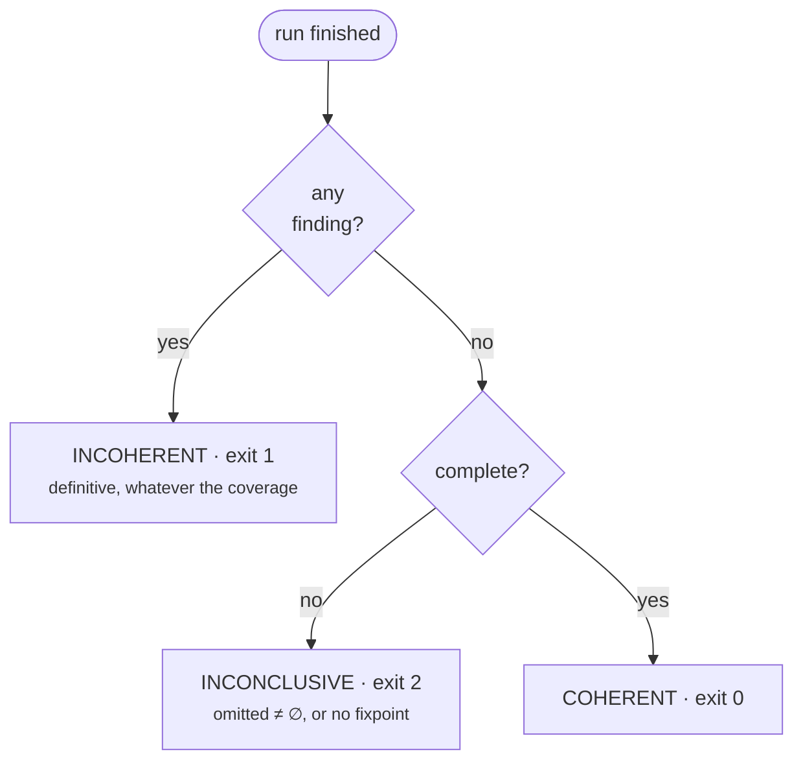
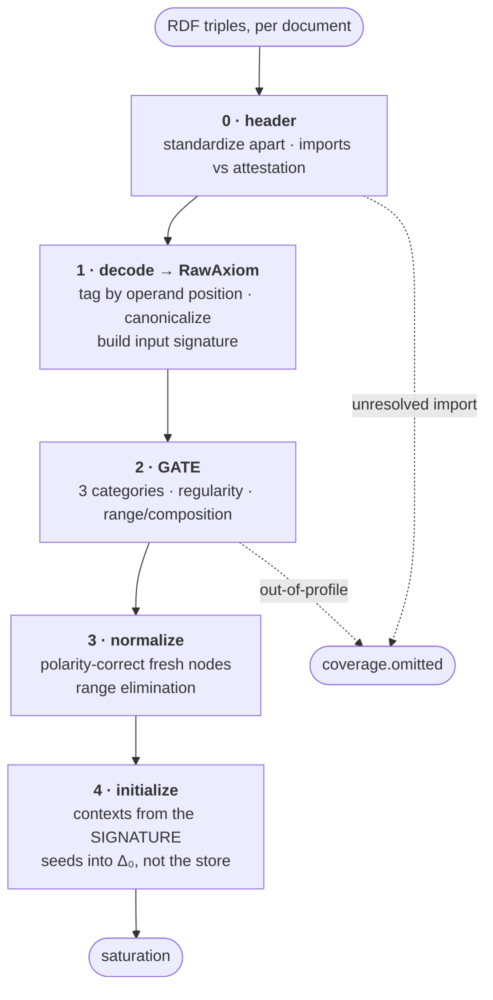
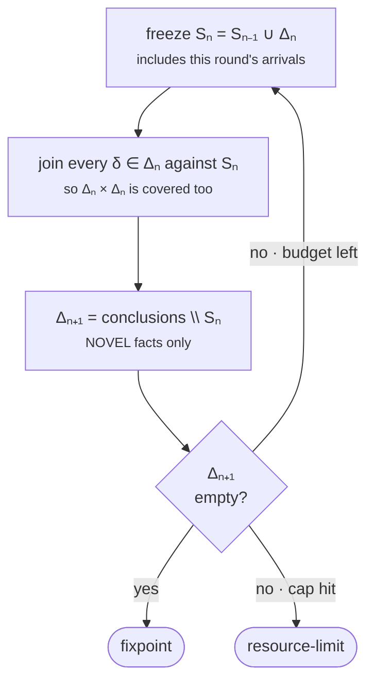
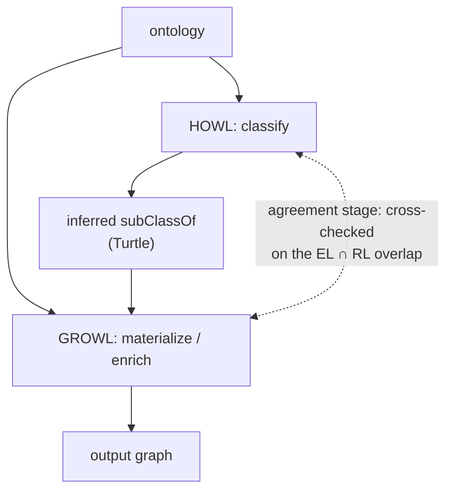
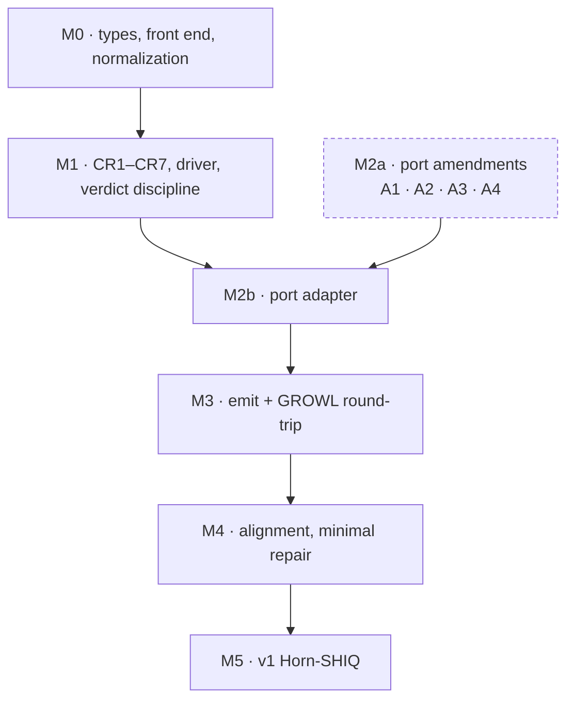

# What HOWL is

HOWL is a sound-and-complete, consequence-based description-logic reasoner, sibling to GROWL.
GROWL **materializes** an OWL 2 RL ontology; HOWL **classifies** a description logic — it computes
the complete subsumption hierarchy and coherence of a TBox, including entailments that
forward-chaining materialization structurally cannot see.

The two engines answer different questions over the same ontologies:

| | GROWL | HOWL |
|---|---|---|
| Service | **Materialization** — forward-chain sound consequences | **Classification** — complete hierarchy + coherence |
| Method | Semi-naive fixpoint over RDF triples | Consequence-based saturation over derived axioms |
| Logic | OWL 2 RL (a rule fragment) | A named description logic (EL → Horn-SHIQ → SROIQ) |
| Completeness | Sound; deliberately incomplete for OWL-DL | Sound **and complete** for its fragment |

RL cannot introduce existential successors, so it silently misses subsumptions that run *through*
an existential — exactly the shape a genus-differentia definition takes. That gap is HOWL's reason
to exist.

## Why now

The execution trigger has fired, and not from where this document originally expected. MOOSE's
Living Ontology validates arbitrary user ontologies through a frozen `TBoxReasoner` port, and ships
an honest bounded **stub** in place of a real engine. Two ceilings follow, removable by no other
means:

- **Instance-bearing changes cannot pass.** The stub reports every assertion-bearing delta
  inconclusive, restricting the promotion path to annotation-only edits.
- **Dual-engine attestation cannot exist.** The agreement stage needs a second real engine to
  cross-check against.

This is a stronger trigger than any originally listed, because the cost of not building is being
paid continuously by a shipped system rather than deferred until a pipeline stage matures.

---

# The v0 language

v0 is complete for exactly this, and no more:

```
C, D  ::=  ⊤ | ⊥ | A | C ⊓ D | ∃r.C

TBox   C ⊑ D  |  C ≡ D  |  DisjointClasses(C₁ … Cₙ)
RBox   r ⊑ s  |  r₁ ∘ … ∘ rₙ ⊑ t  (n ≥ 2)  |  domain(r) ⊑ C  |  range(r) ⊑ C
ABox   C(a)   |  r(a,b)
```

Named: **ELH<sub>⊥</sub><sup>R+</sup> with domain and range**. It is a strict subset of EL++ and —
subject to two RBox conditions — of the OWL 2 EL profile. The gap to EL++ is *not* just nominals:
concrete domains, `ObjectHasSelf`, reflexive role inclusions, and the two built-in object properties
are all out too.

**Everything else is enumerated, never dropped.** A construct outside the language goes into
`coverage.omitted` with a reference to the offending axiom. A dropped axiom is an incoherence the
reasoner subsequently cannot see — the fail-silent hazard this whole design is arranged against.

Three dispositions inside the gate, plus one settled before it:

| Disposition | Examples | Behaviour |
|---|---|---|
| **In-profile** | the grammar above | classified |
| **Inert** | annotation assertions with a declared annotation property | ignored |
| **Out-of-profile** | unions, cardinalities, nominals, datatypes, inverses | enumerated |
| **Consumed** *(pre-gate)* | declarations | no axiom, but **read** — supplies entity typing and the input signature |

Getting the inert/out-of-profile boundary backwards is fatal in either direction: permissive drops
logical axioms silently, strict returns *inconclusive* on every documented ontology.

---

# The verdict rule

This is the single most load-bearing invariant in the design. Everything else — the port's fault
precedence, the CLI exit codes — is this rule in another dialect.



A run is **complete** exactly when `coverage.omitted` is empty *and* the saturation reached a
fixpoint. Two consequences, pulling in opposite directions, and both are the point:

- **A finding is definitive even under partial coverage.** Inference is monotone, so restoring an
  omitted axiom can only *add* conclusions. A `⊥` derived from part of the ontology is a `⊥` in all
  of it. Reporting that as inconclusive would discard a sound result.
- **The absence of a finding means nothing unless the run was complete.** This is why exit `2`
  exists, and why a CI configuration treating `2` as success reintroduces exactly the hazard the
  status discipline was built to close.

Status is therefore **three independent axes**, not one enum — a run can be both out-of-profile
*and* budget-capped, and collapsing them forces the report to lie about one:

- `coverage` — which axioms were omitted, and why
- `termination` — fixpoint, or resource-limit
- `findings` — what was actually derived

Cancellation is not on this scale at all: it yields a fault with **no result**, because a cancelled
partial state is not reproducible and must not be serialized or hashed.

---

# How it works

## The front end

Stage order is load-bearing, and two of its constraints pull against each other: the RBox gates must
see property chains *before* decomposition, but must also compare *class expressions*, which only
exist after RDF is decoded. Decoding first resolves both — on the observation that **decoding an
axiom is not accepting it**.



Three details that are easy to get wrong and silent when you do:

- **Identity is tagged, not bare.** OWL permits punning, so `class(:x)`, `individual(:x)` and
  `fresh(n)` are disjoint by construction. Without that, a class `:x ⊑ ⊥` and an unrelated
  individual `:x` merge and the encoding manufactures a **false inconsistency**.
- **Contexts come from the input signature, not from the axioms.** A class that is declared and
  otherwise unmentioned still gets a context — otherwise the reasoner silently does not know it
  exists.
- **Normalization is polarity-sensitive.** A subexpression replaced by fresh `X` needs `E ⊑ X` in
  negative position and `X ⊑ E` in positive. Get it wrong and `Mother ⊑ Parent` — the single test
  that defines the project — is never derived.

## Saturation

The calculus is CR1–CR7 in the CEL formulation (HOWL's local numbering; the published paper numbers
role hierarchy and composition CR10/CR11). Ranges add no rule — they are removed by the published
elimination construction during normalization.

State is **context-owned**: one context per concept, holding its own subsumers, successors,
predecessors and inbox. A worker mutates only the context it holds; everything else leaves as a
message. Global `S(·)`/`R(·)` maps would make every rule firing a write to shared state, which is
what the decomposition exists to avoid.



Every clause of that loop is load-bearing:

- **The snapshot includes `Δₙ`.** If both premises of a two-premise rule arrive in the same round,
  scanning `Sₙ₋₁` means neither sees the other and neither is in the next delta — the conclusion is
  never derived, by any handler, ever.
- **Novel facts only.** Without subtracting the accumulated store, `A ⊑ B, B ⊑ A` re-derives two
  stored facts every round forever, and an ordinary cyclic hierarchy burns its budget and returns
  inconclusive.
- **Every rule fires on every premise.** A multi-premise rule needs one handler per premise; a
  single handler loses every conclusion whose second premise arrives later, and *which* order occurs
  is a scheduling artifact.
- **Rounds are deterministic.** `iteration` counts completed global rounds with a barrier, so
  `max-iterations` cuts at the same point at any worker count. Confluence already covers the
  complete case; the exposure is entirely in the non-complete outcomes, whose partial state would
  otherwise be a function of thread timing.

---

# Verification, honestly

The dividing line is **structural vs. model-theoretic**, not soundness vs. completeness. A
weakest-precondition checker reasons about program states: it can prove the code implements the
calculus it claims to, and cannot prove the calculus's conclusions are entailed.

| Property | Z3-reachable? |
|---|---|
| Per-rule faithfulness — only licensed conclusions are emitted, **and every licensed one is** | **Yes** |
| Dispatch coverage — every rule invoked against every axiom, in every trigger direction | **Yes** |
| Initialization — empty store, seeds in the **queue**, every context active | **Yes** |
| Termination (v0) | **Yes** |
| Per-rule *soundness* — each conclusion is entailed | **No** — proof-inherited |
| Range-elimination preservation; ABox reduction correctness | **No** |
| Global completeness | **No** — meta-theoretic |

All three structural obligations are needed together. Drop any one and a **disabled engine passes
verification**: with only the soundness direction, rules returning the empty list satisfy
everything; without the initialization obligation, seeds written to the store leave the frontier
empty and the driver reports `fixpoint` before firing a rule.

So the honest claim is *verified faithful to a proven calculus* — not "verified sound", not
"verified complete".

**One obligation is currently owed.** The direct-edge ABox encoding is HOWL's own construction, not
lifted from a published proof, and M1 acceptance requires it be discharged. Until then ABox support
ships *outside* the sound-and-complete v0 claim.

---

# Integration

HOWL is the unbuilt engine behind MOOSE's `TBoxReasoner`. **The port, not the CLI, is the
deliverable.**



Note this is stronger than one-directional composition: the two engines are also **independent
oracles checked against each other in production**, where disagreement is an engine fault, never
resolved by preferring one.

## Four port amendments are prerequisites

`TBoxInput` is `{ triples: Vec<Triple> }` — that is the whole of it. Four capabilities this design
relies on cannot cross it as it stands:

| | Amendment | Without it |
|---|---|---|
| **A1** | per-document provenance | axiom identity and blank-node separation are lost when documents flatten |
| **A2** | import closure attestation | a dangling import yields a **false coherent** |
| **A3** | baseline channel + `Option` delta | no baseline can be identified; `classify` is pure |
| **A4** | probe-set entailment readback | the agreement stage fails closed — landing HOWL makes the pipeline *less* usable |

**An unlanded amendment means the capability is not delivered — never approximated.** The adapter
never fabricates a value the interface cannot carry.

Two behavioural notes for the swap: HOWL registers as `BoundedDl`, not `ElPlusPlus`, because
claiming the latter while implementing a subset is the overclaim this project keeps guarding
against. And two of the stub's checks are **deliberately not preserved** — it reports `consistent =
false` for subclass cycles and for properties with disjoint domains, neither of which is a DL
contradiction. They become modelling lints; a verdict that used to Fail will now Pass with a lint.

---

# Milestones



**M1 is where HOWL becomes a DL reasoner**, and its acceptance is specific: derives
`Mother ⊑ Parent` from the litmus; matches a capability-probed complete oracle as *entailments*
rather than serialized taxonomies; meets a pinned benchmark protocol; **never reports coherent from
an incomplete run** while still reporting incoherent whenever a contradiction was proven; produces
byte-identical reports across worker counts; and discharges the ABox proof obligation.

**M5 is where the first consumer's coverage gap actually closes** — 33 `owl:inverseOf` uses in its
corpus stay out-of-profile until Horn-SHIQ lands. v0 buys instance-bearing verdicts and range
coherence, not a clean pass on that consumer's own theory.

---

# What this design refuses to do

- **Guess.** Every unsupported construct is enumerated. Coverage travels on a field the consumer
  already has to read, never in prose telling someone to check something.
- **Approximate a missing capability.** No baseline channel means no delta — not a delta computed
  against nothing.
- **Claim more than the proof covers.** Gates match the cited condition exactly; a relaxation that
  looks semantically fine still needs its own proof, because completeness rests on implementing a
  calculus someone has proved complete.
- **Report success it did not establish.** The three ways to reach *inconclusive* — out-of-profile,
  budget, cancellation — are structurally unable to become *coherent*.

The recurring failure mode this document is arranged against is a mechanism that fails silently in
the direction that looks like success. Most of the design's apparent over-caution is one instance or
another of closing that door.
